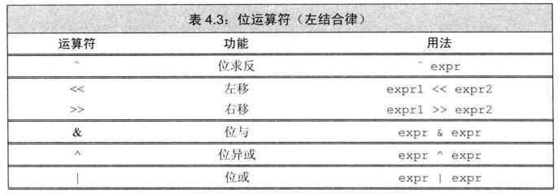
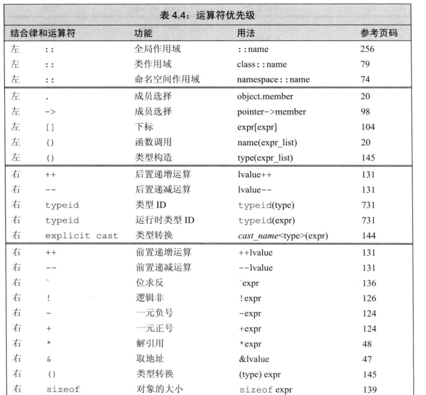
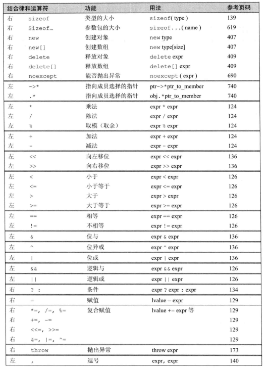
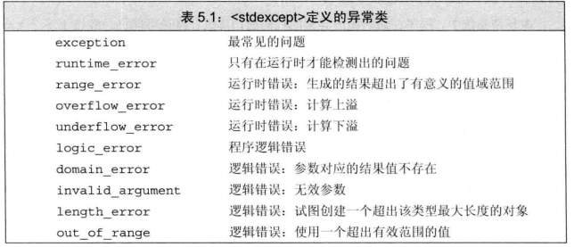
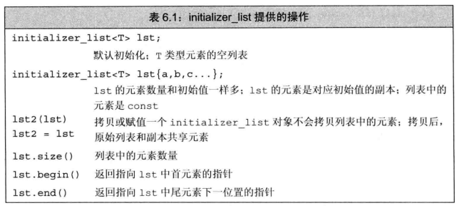

## 第1章 开始

### 1.1 编写一个简单的C++程序

main 函数的返回类型必须为 int，一般返回 0 代表成功

### 1.2 初识输入输出

术语 流 的意思是随着时间的推移，字符是顺序生成或消耗的

标准输入输出对象

-   cin       标准输入

-   cout    标准输出

-   cerr     标准错误，输出警告和错误信息

-   clog     输出程序运行时的一般性信息

## 第2章 变量和基本类型

### 2.1 基本数据类型

在算术表达式中不要使用char或bool，因为char在不同编译器上的表现形式不同

```c++
// 下面都是 20
int value = 20;		// 十进制
int value = 024;	// 八进制
int value = 0x14;	// 十六进制

// \ 后面最多跟3位八进制数，\x 后面可跟任意多个十六进制数
cout << "\x41" << "\012a" << "\1011" << "\12";
cout << "A" << "\na" << "A1" << "\n";
```

```c++
// 分多行书写的字符串字面值
char ch[] = "aaaaaaaaaaaaaa"
    		"bbbbbbbbbbbbb";
cout << ch << endl;
```

```c++
前缀			含义				类型
u			 Unicode16字符	 char16_t
U			 Unicode32字符	 char32_t
L			 宽字符	 		 char32_t
U			 Unicode32字符	 char32_t
```

| 前缀 | 含义                             | 类型     |
| ---- | -------------------------------- | -------- |
| u    | Unicode16字符                    | char16_t |
| U    | Unicode32字符                    | char32_t |
| L    | 宽字符                           | char32_t |
| u8   | UTF-8（仅用于字符串常量 u8"hi"） | char     |

| 后缀     | 最小匹配类型 |
| -------- | ------------ |
| u or U   | unsigned     |
| l or L   | long         |
| ll or LL | long long    |
| f or F   | float        |
| l or L   | long double  |

### 2.2 变量

变量声明及定义

```c++
extern int i;		// 声明i
int i;				// 定义i
extern int i = 1;	// 任何包含了显式初始化的声明即为定义
```

变量只能被定义一次，却可以被多次声明。如果其他文件需要用到某个变量，只需要对其声明即可。

```c++
// 空指针
int *p1 = nullptr;
int *p2 = 0;
int *p3 = NULL;
```

### 2.4 const限定符

常量表达式：值不会发生改变且在编译过程中就能得到计算结果的表达式

```c++
int i;
cin >> i;
const int j = i;		// 这里 j 就不是常量表达式
cout << j << endl;
```

在复杂系统中，很难确定一个初始值是否为常量表达式，C++11规定，将变量声明为 constexpr 类型以便由编译器来验证变量的值是否为一个常量表达式。尽管不能用普通函数作为 constexpr 变量的初始值，但允许定义一种特殊的 constexpr函数

### 2.5 处理类型

#### 2.5.1 类型别名

类型别名指对类型起一个别名，一般可以用 typedef ,  `typedef int wages;`

C++11 规定一种新的方法，使用别名声明 `using wages = int;`

#### 2.5.2 auto类型说明符

C++11 引入auto类型说明符，让编译器自己去分析表达式所属的类型    

#### 2.5.3 decltype类型指示符

有时需要从表达式的类型推断出要定义的变量的类型，但是不想用该表达式的值初始化变量，C++11 引入了 decltype ，它的作用是选择并返回操作数的数据类型。在此过程中，编译器分析表达式并得到它的类型，但不实际计算表达式的值

```c++
const int a = 0, &b = a;
decltype(a) x = 0;			// x的类型是const int
decltype(b) y = x;			// y的类型是const int &
decltype(b) z;				// 错误：z是一个引用，必须初始化
```

decltype((variable))的结果永远是引用，而decltype(variable)结果只有当variable本身就是一个引用时才是引用

## 第3章 字符串、向量和数组

### 3.1 命名空间的 using 声明

作用域操作符（`::`）的含义是编译器应该从操作符左侧名字所示的作用域中寻找右侧那个名字

```c++
using namespace::name;		// using 声明格式
using std::cin;
```

位于头文件的代码一般来说不应该使用 using 声明，因为头文件里面的内容会拷贝到所有引用它的文件中，即如果头文件里有某个 using 声明，那么所有使用了该头文件的文件就都会有这个声明

### 3.2 标准库类型 string

作为标准库的一部分，string 定义在命名空间 std 中

cin >> string 时，string对象会自动忽略开头的空白（即空格符、换行符、制表符等），并从第一个真正的字符开始读起，直到遇见下一处空白为止

如果期望最终获取到的字符串中保留输入时的空白，这时候可以采用 `getline` 函数代替标准输入。`getline` 函数的两个参数分别是输入流和string对象，从给定的输入流中读取内容，直到遇到换行符为止（不存换行符）。 `getline` 函数同样返回其流参数，所以可以用返回值作为 while 循环的条件

```c++
string line;
while(getline(cin, ))
```

```c++
#include <boost/type_index.hpp>
// 打印 string 中的 size_type 类型
string line;
auto len = line.size();
cout << boost::typeindex::type_id_with_cvr<decltype(len)>().pretty_name() << endl;
```

```c++
#include <cctype>
char c;
isalnum(c);     // 当 c 是字母或数字时为真
isalpha(c);     // 字母
iscntrl(c);     // 控制字符
isdigit(c);     // 数字
isgraph(c);     // 不是空格但可打印
islower(c);     // 小写字母
isupper(c);     // 大写字母
isprint(c);     // 可打印字符（空格或具有可视性）
ispunct(c);     // 标点符号
isspace(c);     // 空白（空格、制表、回车、换行等等）
isxdigit(c);    // 十六进制数字
tolower(c);     // 输出对应的小写字母
toupper(c);     // 输出对应的大写字母
```

C++11 提供的范围 for（range for）语句，可以遍历给定序列中的每个元素并对序列中的每个值执行某种操作

```c++
for (declaration : expression)
    statement
```

### 3.3 标准库类型vector

```c++
// 如果初始化提供的值无法用来列表初始化，编译器会尝试使用构造函数
vector<string> v{10};
cout << v.size() << endl;	// 10
```

如果循环体内部包含向 vector 对象添加元素的语句，就不能使用范围 for 循环，范围 for语句内部不应该改变其遍历序列的大小

emplace_back 的具体用例：如果需要创建一个临时对象，然后将其推送到容器中，请使用 emplace_back 而不是 push_back。emplace_back 将在容器内就地创建对象。而push_back 将创建一个临时对象并将其移动到容器中。一般来说，在所有情况下都可以使用 emplace_back 而不是 push_back，不会有太大问题。

### 3.4 迭代器介绍

如果容器为空，则 begin 和 end 返回的都是尾后迭代器

如果需要返回 const_iterator 类型的返回值，C++11引入了两个新函数 cbegin 和 cend

### 3.5 数组

标准库函数 begin 和 end，定义在头文件 iterator 中，获取数组的首元素和尾元素

```c++
int num[] = {0, 1, 2, 3, 4};
auto beg = begin(num), last = end(num);
cout << *beg << " " << *(--last) << endl;
```

## 第4章 表达式

### 4.1 基础

C++表达式不是左值，就是右值，判断是左值还是右值，看能不能取地址。能取地址就是左值，否则是右值，即右值一般是临时对象。当一个对象被用作右值时，用的是对象的值；被用作左值时，用的是对象的身份（在内存中的位置）

复合表达式需要考虑优先级和结合律以及求值顺序

### 4.2 算术运算符


算术运算符都能作用于任意算术类型，以及任意能转换成算术类型的类型，其运算对象和求值结果都是右值

在表达式求值之前，小整数类型会被提升为较大的整数类型，所有运算对象最终会被转换成同一类型

```c++
bool b = true;
bool b1 = -b;	// 1 * -1
cout << b << " " << b1 << endl;	// 1 1
```

对大多数的运算符来说，bool类型的运算对象被提升为int类型，求负为-1，再转换为bool值结果应该为1

C++11规定商一律向0取整，即直接切除小数部分

参与取余的运算对象必须为整数，根据取余运算的定义：`(m / n) * n + m % n = m`，则取余结果的符号应该与m一致

### 4.3 逻辑与关系运算符


关系运算符作用于算术类型或指针类型，逻辑运算符作用于任意能转换成布尔值的类型。两者返回值都是布尔类型，且运算对象和求值结果都是右值

### 4.4 赋值运算符

赋值运算符的左侧运算对象必须是一个可修改的左值，赋值运算符的结果是其左侧运算对象，并且是一个左值

赋值运算符满足右结合律

### 4.5 递增和递减运算符

这两种运算符可应用于迭代器，作用于左值运算对象。前置版本将对象本身作为左值返回，后置版本将对象原始值的副本作为右值返回。建议使用递增递减运算符的前置版本，减少花销

### 4.6 成员访问运算符

箭头运算符作用于一个指针类型的运算对象，结果是一个左值。点运算符的结果与成员所属的对象的类型一致，如果成员所属的对象是左值，那结果就是左值

### 4.7 条件运算符

```c++
cond ? expr1 : expr2
```

当条件运算符的两个表达式都是左值或者能转换成同一个左值类型时，运算结果是左值，否则为右值。条件运算符满足右结合律

### 4.8 位运算符

##### 

如果运算对象是带符号的且其值为负，那么位运算符如何处理运算对象的符号位取决于机器。所以建议仅仅将位运算符用于处理无符号类型

移位运算符，左移或者右移，其移出边界之外的位被舍弃

取反运算符和移位运算符，运算对象如果是char或者short，首先会将对象提升为int类型，再进行处理

### 4.9 sizeof运算符

sizeof运算符满足右结合律，返回的值是一个size_t的常量表达式

### 4.10 逗号运算符

对于逗号运算符，首先对左侧的表达式求值，然后将求值结果丢弃。逗号运算符真正的结果是右侧表达式的值，如果右侧运算对象是左值，那么最终的求值结果也是左值

### 4.11 类型转换

```c++
// type: 强转类型
// expression 要转换的值
// castname: static_cast, dynamic_cast, const_cast, reinterpret_cast 中一种
cast-name<type>(expression);
```

-   static_cast: 只要不包含底层const，都可以用static_cast 进行强制转换

-   const_cast: 只能改变运算对象的底层const，用于将常量对象转为非常量对象，只能改变常量属性，不能改变类型

-   reinterpret_cast: 通常为运算对象的位模式提供较低层次上的重新解释，将数据以二进制存在形式的重新解释，转换前后没有数位损失

### 4.12 运算符优先级表





## 第5章 语句

### 5.1 简单语句

```c++
// 空语句
;
```

语法上需要语句，但逻辑不需要，这时候就可以添上空语句，如在循环条件里将所有工作执行完就不需要在循环体里执行操作时

复合语句，即用花括号括起来的语句和声明的序列

### 5.4 循环语句

```c++
vector<int> v;
for(auto &r : v) ;
// 等价于下面的循环，所以在范围循环里不可以修改容器的大小，以防end失效
for(auto beg = v.begin(), end = v.end(); beg != end; ++beg) {
    auto &r = *beg;
}
```

### 5.6 try语句块和异常处理

异常处理

-   throw表达式：异常检测部分使用了throw表达式来表示它遇到了无法处理的问题
-   try语句块：异常处理部分使用try语句块处理异常。try语句块以关键字try开始，并以一个或多个catch子句结束。try语句块中代码抛出的异常通常被某个catch子句处理
-   一套异常类：用于在throw表达式和相关的catch子句之间传递异常的具体信息

```c++
string s1 = "hello", s2 = "";
cin >> s2;
if (s1 != s2)
{
    throw runtime_error("s1 != s2");
}
cout << "end" << endl;
```

```c++
string s1 = "hello", s2 = "";
try
{
    cin >> s2;
    if (s1 != s2)
    {
        throw runtime_error("s1 != s2");
    }
}
catch (runtime_error err)
{
    cout << err.what() << endl;
}
cout << "end" << endl;
```

异常类主要定义在四个头文件中

-   exception：定义了最通用的异常类exception，只报告异常的发生，不提供额外信息
-   stdexcept：定义了几种常用的异常类，如下表
-   new：定义了bad_alloc异常类型
-   type_info：定义了bad_cast异常类型



## 第6章 函数

### 6.1 函数基础

函数的返回类型不能是数组类型或函数类型，但可以是指向数组或函数的指针

局部静态对象：在程序执行路径第一次经过对象定义语句时初始化（仅初始化一次），并且直到程序终止时才被销毁，在此期间该对象所在的函数结束执行也不会对其有影响

### 6.2 参数传递

使用引用避免拷贝，如果函数无须改变引用形参的值，最好将其声明为常量引用

当用实参初始化形参时会忽略掉顶层const，即形参的顶层const被忽略了，传给它常量对象或者非常量对象都没有问题

```c++
void fun (const int i) {}
void fun (int i) {}	// 错误，重定义
```

由于顶层的const被忽略了，所以在上面的代码中传入两个fun的参数可以完全一样。尽管形式上有差异，但是实际上它的形参和第一个fun的形参没有区别

因为不能拷贝数组，所以我们无法以值传递的方式使用数组参数。因为数组会被转换成指针，所以当我们为函数传递一个数组时，实际上传递的是指向数组首元素的指针

```c++
// 尽管形式不同，但这三个函数是等价的
void print(const int*);
void print(const int[]);	// 可以表示函数的意图是作用于一个数组
void print(const int[10]);	// 这里的维度表示我们期望数组含有多少元素，实际不一定
```

```c++
// 数组的引用传递
void fun(int (&arr)[10]);	// arr是具有10个整数的整型数组的引用
void fun(int &arr[10]);		// arr是10个引用的数组
```

```c++
// 多维数组传递
void fun(int (*matrix)[10], int rowSize);
void fun(int matrix[][10], int rowSize);

int *matrix[10];	// 10个指针构成的数组
int (*matrix)[10];	// 指向含有10个整数的数组的指针
```

main函数的参数用于处理命令选项

```c++
int main(int argc, char *argv[])	// 也可以用 char **argv
{
    cout << argc << endl;
    for (int i = 0; i < argc; ++i)
    {
        cout << argv[i] << " ";		// 可选项从 argv[1]开始，argv[0]是执行文件
    }
    cout << endl;
}
```

为了编写能处理不同数量的实参的函数，C++11提供了两种主要方法

-   所有实参类型相同，传递一个名为 initializer_list 的标准库类型
-   实参类型不同，编写可变参数模板

initializer_list 类型定义在同名的头文件中，提供的操作如下所示



```c++
// 经过测试，用vector可以实现类似效果，实际上vector的构造参数{}用了initializer_list
void fun(string s, initializer_list<int> li, int a)
{
    cout << s << endl;
    for (auto arg : li)
    {
        cout << arg << endl;
    }
    cout << a << endl;
}

int main()
{
    fun("a", {1, 2, 3, 4}, 5);	// 需要把参数序列存在花括号里面
    return 0;
}
```

### 6.3 返回类型和return语句

允许main函数无return语句直接结束，因为没有return的话编译器将隐式插入一条返回0的return语句

```c++
#include <cstdlib>

if (flag)
    return EXIT_SUCCESS;	// 预处理变量，main函数返回，表示成功
else
    return EXIT_FAILURE;
```

返回数组指针

```c++
int *fun();		// 只返回数组的首部指针，可用++方式遍历数组，但无长度，也不能用begin、end
```

```c++
int (&getArray())[SIZE]
{
    static int array[SIZE] = {0, 1, 2, 3, 4}; // 静态数组
    return array;
}

int main()
{
    int(&array)[SIZE] = getArray();
    for (int i : array)
    {
        std::cout << i << " ";
    }
}
```

```c++
int (*createArray())[SIZE]
{
    static int array[SIZE] = {1, 2, 3, 4, 5}; // 静态数组，生命周期贯穿整个程序
    return &array;                            // 返回数组的地址
}
int main()
{
    int(*arrayPtr)[SIZE] = createArray();
    for (int i = 0; i < SIZE; ++i)
    {
        std::cout << (*arrayPtr)[i] << " ";
    }
}
```

```c++
auto getArray() -> int (&)[SIZE]
{
    static int array[SIZE] = {1, 2, 3, 4, 5}; // 静态数组
    return array;                             // 返回数组的引用
}

int main()
{
    auto &arrayRef = getArray();
    for (int i = 0; i < SIZE; ++i)
    {
        std::cout << arrayRef[i] << " ";
    }
}
```

### 6.4 函数重载

```c++
Record lookup(Phone);
Record lookup(const Phone);		// 重复声明

Record lookup(Phone*);
Record lookup(Phone* const);	// 重复声明

Record lookup(Phone&);
Record lookup(const Phone&);	// 新函数，作用于常量引用

Record lookup(Phone*);
Record lookup(const Phone*);	// 新函数，作用于指向常量的指针
```

### 6.5 特殊用途函数

内联函数可以避免函数调用的开销

assert 是一种预处理宏，assert(expr)，如果expr为假，assert输出信息并停止程序的执行

NDEBUG是预处理变量，如果宏定义了NDEBUG，则assert什么都不做，需要在include\<cassert>之前宏定义

### 6.7 函数指针

函数指针指向的是函数而非对象

```c++
bool lengthCompare(const string&, const string&);

// 用指针替换函数名即可声明一个指向该函数的指针
// pf 指向一个函数，该函数的参数是两个const string&的引用，返回值是bool类型
bool (*pf)(const string&, const string&);	// 未初始化
decltype(lengthCompare) *pr = lengthCompare;

pf = lengthCompare;			// pf 指向名为lengthCompare的函数
pf = &lengthCompare;		// 等价赋值语句

bool b1 = pf("a", "b");	 	// 调用lengthCompare函数
bool b2 = (*pf)("a", "b");	// 与上式等价
```

```c++
typedef decltype(lengthCompare)
```

## 第7章 函数

### 7.1 定义抽象数据类型

定义在类内部的函数是隐式的inline函数

紧跟在参数列表后面的const表示this是一个指向常量的指针，这样的成员函数称为常量成员函数

即使是类成员变量被定义在成员函数后面，也不会有什么问题，因为编译器首先处理成员变量的声明，再处理成员函数

由于IO类属于不能被拷贝的类型，因此只能通过引用来传递它们。且读取和写入的操作都会改变流的内容，因此只能是普通引用，而非常量引用

在C++11中，如果需要编译器生成默认构造函数，可以在参数列表后面加上  =default，如 类名( ) = default;

### 7.3 类的其他特性

如果希望在const成员函数内修改类的某个成员变量，可以在该成员变量的声明前加入mutable关键字


