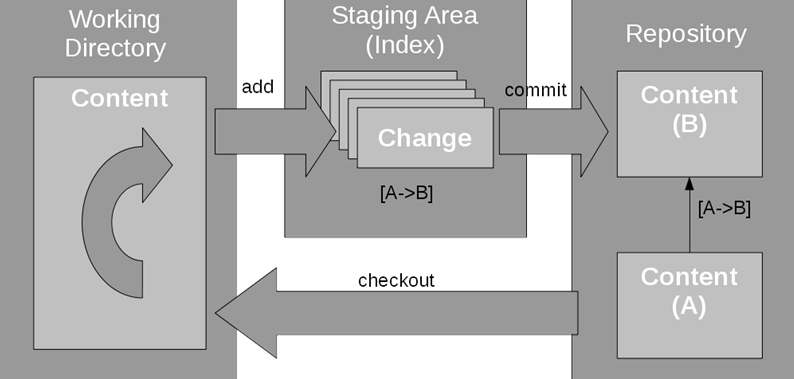

#### Git简介



Git本地版本库结构如上，主要分为工作区、暂存区和仓库

#### 查看

```bash
git status				# 查看工作区和暂存区的状态
git rev-parse <name>	# 查看hash值，name可以是HEAD, master, HEAD^^(父父节点)==HEAD~2
git log					# 显示提交历史
git log --pretty=format:"%H %s"	# 自定义输出格式。%H 是提交哈希，%s 是提交信息
git log --graph --oneline --all --decorate -n 10	# 图形化方式展示log，展示10行
git reflog				# 查看 Git 仓库中的历史日志，用于恢复
git config --list		# 显示所有 Git 配置项
git remote -v			# 显示已配置的远程仓库及其 URL
git show [<commit>]		# 用于显示 Git 对象（如提交、标签、树等）详细信息
```

#### 查看差异

```bash
git diff			# 查看工作区和暂存区之间的差异，新建文件无法比较
git diff --cached	# 暂存区和仓库
git diff --staged	# 暂存区和仓库
git diff HEAD		# 工作区和仓库
git diff <commit1> <commit2>	# 两个提交之间的差异
git diff <branch1> <branch2>	# 两个分支之间的差异
git diff <file>					# 指定特定文件查看差异，可结合上述命令
git cherry -v origin[/HEAD] test1		# 查看本地test1分支与远程仓库的差异，即commit是否push
```

#### 回退版本

```bash
git checkout <commit_hash>		# 将HEAD指针指向commit_hash，但此时HEAD不指向任何分支

# 假设 A -- B -- C (HEAD, master)，下面的commit-hash都是B
git reset --soft <commit-hash>	# 注销commit操作，add操作不变
git reset --mixed <commit-hash>	# 默认,工作目录不变，但注销commit, add
git reset --hard <commit-hash>	# 丢弃所有更改，可视作把当前节点删除，HEAD指向父节点
```

#### 分支操作

```bash
git branch 		# 查看分支
git branch -r	# 查看远程分支
git branch <branch>		# 创建分支
git branch -d <branch>	# 删除分支，-D强制删除
git switch <branch>		# 切换分支，且HEAD指针指向相应分支
git checkout <branch>	# 切换分支，且HEAD指针指向相应分支
git branch -m main master # 重命名本地分支，main重命名为master

# master 分支将会跟踪 origin/master 分支，这意味着在执行 git pull 或 git push 时，Git 会知道应该将更改推送到或从哪个远程分支获取更改
git branch -u origin/master master

```

#### 其他操作

```bash
# 将本地HEAD指向节点推送到远程仓库origin
# refs/for/前缀是Gerrit的约定，用于将提交发送到代码审查系统进行审查。master是目标分支的名称
# 在Gerrit中，这表示你将提交推送到master分支，并将其提交到Gerrit进行审查，而不是直接推送到master
git push origin HEAD:refs/for/master

git pull [<remote> [<branch>]]	# 拉取远程仓库
git pull --rebase	# 使用--rebase选项可以将远程分支的提交应用到你当前分支的顶部，而不是进行合并

git fetch origin # 从远程仓库（这里是 origin）获取最新的更新（提交、分支等），但不会自动合并这些更新到当前分支

# 用于设置远程仓库 origin 的默认分支（HEAD）
# set-head 是用于设置 HEAD 引用的命令
# -a 表示“自动”设置 HEAD。这将根据远程分支的情况自动确定 origin 的 HEAD 分支
git remote set-head origin -a

git commit --amend		#用于修改最近一次提交，修改的是上一次提交，而不是创建新的提交
```

