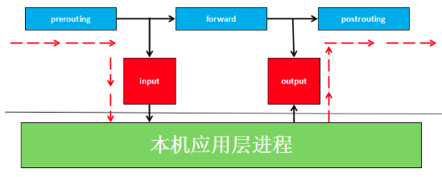
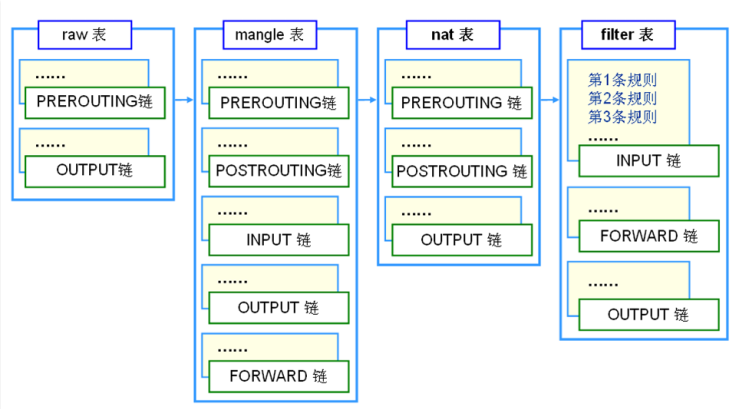
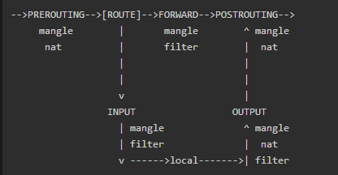
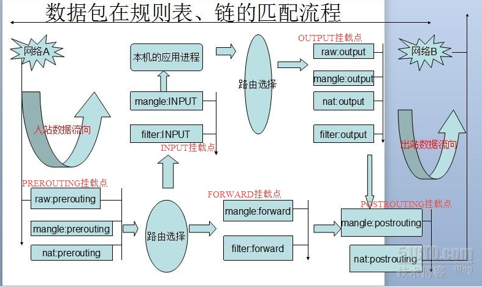
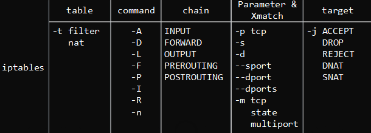
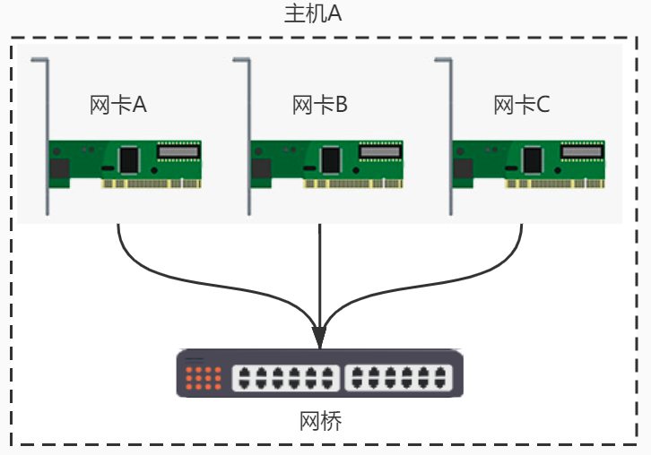
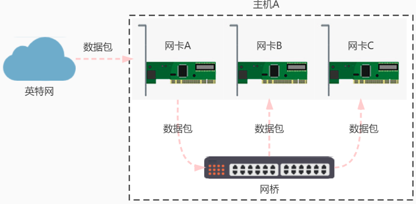

### 类unix系统目录结构

- bin：系统可执行程序存放目录
- boot：内核和启动程序的相关文件都在此目录下
- lib：库目录，主要存放系统最基本的动态共享库
- media：挂载设备媒体——U盘、光驱等
- mnt：用于用户挂载别的文件系统
- usr：应用安装的目录
- sbin：超级管理员的执行程序root
- proc：系统内存的映射，保留进程运行的一些信息
- etc：系统软件的启动和配置目录
- dev：设备文件所在目录
- home：用户目录

### 快捷键

tab：命令补全

tab+tab：给出命令候选项

/+内容：可以在man页面快速找到关键字，类似于crtl+f，n转到下一个匹配项，shift+n转到上一个匹配项

crtl+shift+c：复制

crtl+shift+v：黏贴

### 配置

1. 关闭终端提示音

```bash
sudo vi /etc/inputrc
# set bell-style none		# 找到当前行，去掉注释即可
```

2. 设置终端tab宽度

```bash
tabs -4
```

3. 关闭vim编辑器提示音

```bash
vi ~/.vimrc
set visualbell		# t
```


### 常用命令

#### man

manual，用于查看各种命令、函数和配置文件的手册页面

etc: man ls

#### ls

 list directory contents，用于显示指定工作目录下之内容

```bash
-a		# 显示所有文件及目录 (**.** 开头的隐藏文件也会列出)
-d		# 只列出目录（不递归列出目录内的文件）。
-l		# 以长格式显示文件和目录信息，包括权限、所有者、大小、创建时间等。
-r		# 倒序显示文件和目录。
-t		# 将按照修改时间排序，最新的文件在最前面。
-A		# 同 -a ，但不列出 "." (目前目录) 及 ".." (父目录)
-F		# 在列出的文件名称后加一符号；例如可执行档则加 "*", 目录则加 "/"
-R		# 递归显示目录中的所有文件和子目录
-lh		# 以人类可读的方式显示当前目录中的文件和目录大小

通配符 * ？
	* 任意多个字符
	？ 任意一个字符
ls *.c	# 查看.c文件
```

#### cd

change directory，用于改变当前工作目录的命令，切换到指定的路径

若目录名称省略，则变换至使用者的 home 目录

**~** 表示为 home 目录 的意思

**.** 则是表示目前所在的目录

**..** 则表示目前目录位置的上一层目录

$HOME 可以直接切换到环境变量的目录

#### pwd

print work directory，用于显示目前所在的工作目录的绝对路径名称

#### mkdir

make directory，用于创建目录。

```bash
mkdir [-p] dirname 		# -p 确保目录名称存在，不存在创建一个
mkdir -p test1/test2	# 如果当前目录下不存在test1则创建该目录
```

#### tree

用于列出指定目录下的所有文件，包括子目录里的文件

不存在需要安装，sudo apt-get install tree

#### rmdir

remove directory，删除空的目录

#### which

在环境变量$PATH设置的目录里查找符合条件的文件，一般用于查询命令位置

```bash
which ls	# 查询ls命令位置
```

#### touch

用于创建文件，文件存在则修改文件访问时间

#### rm

remove，用于删除一个文件或者目录。

```bash
rm [options] name...
-i		# 删除前逐一询问确认。
-f		# 即使原档案属性设为唯读，亦直接删除，无需逐一确认。
-r 		# 将目录及以下之档案亦逐一删除。
```

#### cp

copy file，主要用于复制文件或目录

```bash
cp [options] source dest	# dest是目录，将source拷贝到dest下面，否则将source复制到dest上级目录下，且重命名为dest
cp file.txt /path/to/destination/	# 将file.txt复制到/path/to/destination/下
-r		# 用于复制目录及其所有的子目录和文件，如果要复制目录，需要使用该选项
```

#### mv

move file，用来为文件或目录改名、或将文件或目录移入其它位置

```bash
mv [options] source dest
# 将源文件名 source_file 改为目标文件名 dest_file
mv source_file(文件) dest_file(文件)
# 将文件 source_file 移动到目标目录 dest_directory 中
mv source_file(文件) dest_directory(目录)
# 目录名 dest_directory 已存在，将 source_directory 移动到目录名 dest_directory 中；目录名 dest_directory 不存在则 source_directory 改名为目录名 dest_directory
mv source_directory(目录) dest_directory(目录)
# 出错
mv source_directory(目录) dest_file(文件)
```

#### cat

concatenate，用于连接文件并打印到标准输出设备上

#### more

类似 cat ，不过会以一页一页的形式显示，更方便使用者逐页阅读，而最基本的指令就是按空白键（space）就往下一页显示，按 b 键就会往回（back）一页显示

#### head

查看文件头，默认显示10行

```bas
head -n 5 filename	# 显示5行内容
```

#### tail

查看文件尾，默认显示10行

```bash
-n		# 控制显示内容
-f		# 追踪文件末尾，用于调试
```

#### wc

word count，可以计算文件的Byte数、字数、或是列数，若不指定文件名称、或是所给予的文件名为"-"，则wc指令会从标准输入设备读取数据。

```bash
$ wc testfile           # testfile文件的统计信息  
3 92 598 testfile       # testfile文件的行数为3、单词数92、字节数598
-l						# 行数
-w						# 单词数
-c						# 字节数
```

#### du

disk usage，命令用于显示目录或文件的大小

#### df

disk free，显示磁盘空间信息

#### ln

link files，为某一个文件在另外一个位置建立一个同步的链接

链接又可分为两种 : 硬链接(hard link)与软链接(symbolic link)，硬链接的意思是一个档案可以有多个名称，而软链接的方式则是产生一个特殊的档案，该档案的内容是指向另一个档案的位置。硬链接是存在同一个文件系统中，而软链接却可以跨越不同的文件系统。不论是硬链接或软链接都不会将原本的档案复制一份，只会占用非常少量的磁碟空间

**软链接**：

- 软链接，以路径的形式存在。类似于Windows操作系统中的快捷方式
- 软链接可以 跨文件系统 ，硬链接不可以
- 软链接可以对一个不存在的文件名进行链接
- 软链接可以对目录进行链接

**硬链接**：

- 硬链接，以文件副本的形式存在。但不占用实际空间。
- 不允许给目录创建硬链接
- 硬链接只有在同一个文件系统中才能创建

```bash
ln -s log2013.log link2013	# 给文件创建软链接，为log2013.log文件创建软链接link2013，如果log2013.log丢失，link2013将失效
ln log2013.log ln2013		# 给文件创建硬链接，为log2013.log创建硬链接ln2013，log2013.log与ln2013的各项属性相同
```

#### unlink

删除软硬连接

#### chmod

change mode，控制用户对文件的权限的命令

```bash
chmod mode file...
mode格式：[ugoa...][[+-=][rwxX]...][,...]
chmod ug+w,o-w file1.txt file2.txt		# 将文件 file1.txt 与 file2.txt 设为该文件拥有者，与其所属同一个群体者可写入，但其他以外的人则不可写入
chmod 777 file		# 所有用户都可读可写可执行
```

#### chown

change owner，用于设置文件所有者和文件关联组的命令

```bash
chown [-cfhvR] [--help] [--version] user[:group] file...
-c : 显示更改的部分的信息
-f : 忽略错误信息
-h :修复符号链接
-v : 显示详细的处理信息
-R : 处理指定目录以及其子目录下的所有文件
chown -R runoob:runoobgroup *		# 将当前前目录下的所有文件与子目录的拥有者皆设为 runoob，群体的使用者 runoobgroup
chown :512 /home/runoob				# 把 /home/runoob 的关联组设置为 512 （关联组ID），不改变所有者
```

#### chgrp

change group，修改文件所属组，用法和chown类似

```bash
chgrp bin log2012.log 		# 将log2012.log所属组改为bin
```

#### find

用于在指定目录下查找文件和目录。它可以使用不同的选项来过滤和限制查找的结果

```bash
find [路径] [匹配条件] [动作]

匹配条件 中可使用的选项有二三十个之多，以下列出最常用的部份：
-name pattern：按文件名查找，支持使用通配符 * 和 ?
-type type：按文件类型查找，可以是 f（普通文件）、d（目录）、l（符号链接）等
-size [+-]size[cwbkMG]：按文件大小查找，支持使用 + 或 - 表示大于或小于指定大小，单位可以是 c（字节）、w（字数）、b（块数）、k（KB）、M（MB）或 G（GB）
-mtime days：按修改时间查找，支持使用 + 或 - 表示在指定天数前或后，days 是一个整数表示天数
-user username：按文件所有者查找
-group groupname：按文件所属组查找

find ./ -name "*.c"		# 查找当前目录及子目录下.c文件
find ./ -maxdepth 1 -name "*.c"	# 查找当前目录下.c文件
find ./ -size +1M -size -5M		# 查找当前目录及子目录下文件大小在1-5M的文件
find ./ -maxdepth 1 -type d -exec ls -ld {} \;	# -exec 选项用于在 find 命令找到匹配项时执行指定的命令。{} 是一个占位符，会被 find 命令找到的每个匹配项所替代。\; 是用来告诉 find 命令，这是 -exec 选项的结束，并且在每次执行命令之后需要在此处放置它。所以 {} \; 的组合告诉 find 命令在执行 -exec 后的命令时用匹配的文件名或目录名替换 {}，然后使用 \; 告诉 find 在每次执行完命令后进行结束。
find ./ -maxdepth 1 -type f -not -name ".*" -ok rm -rf {} \;	# 查找当前文件下普通文件（不包括隐藏文件），且执行删除操作，每次操作都询问
find ./ -maxdepth 1 -type f -not -name ".*" | xargs wc			# 使用管道+xargs可以进行统计

```

#### grep

内容过滤，常与管道符配合

```bash
-v：反向查找，只打印不匹配的行。
-n：显示匹配行的行号
-r：递归子目录

ls -l | grep txt			# 过滤有txt字符的输出
cat a.txt | grep -n main	# 查找a.txt文件中main字符出现的位置

grep "hello"				# 阻塞住，等待标准输入，标准输入y
```

#### bc

计算器，quit退出

#### time

计算运行程序的时间

```c
time ./a.out
```

#### kill

给进程发送信号，常用于杀死进程

```bash
kill -9 PID

# 杀死多个进程
ps -aux | grep a.out | grep -v grep | cut -c 9-16	# 获取a.out的PID，其中cut用来截取对应列
ps -aux | grep a.out | grep -v grep | cut -c 9-16 | xargs kill -9	# 批量杀死进程
```

### 文件权限

```bash
-rw-rw-r-- 1 doraemon doraemon    0  2月 15 15:05 a.txt
-rw-rw-r-- 1(硬链接计数) doraemon(用户) doraemon(用户组)    0(文件大小)  2月 15 15:05(最近修改时间) a.txt(文件名)

-rw-rw-r-- 文件权限位
-(文件类型 -普通文件 d目录文件 l软链接 c字符设备 b块设备 p管道设备 s本地套接字)
rw-(归属用户的权限) rw-(归属组的权限) r--(其他用户的权限)
r可读 w可写 x可执行

权限位数字表示法（8进制计数）
-rw-rw-r--: 664
```

### 文件压缩与解压

#### .zip

```bash
-r 递归处理，将指定目录下的所有文件和子目录一并处理
-d 从压缩文件内删除指定的文件

zip -r a.zip a a.txt		# 将目录a与a.txt一起打包成a.zip文件
zip -dv cp.zip a.c			# 从压缩文件 cp.zip 中删除文件 a.c

unzip a.zip					# 解压
```

#### .tar.gz

```bash
-c 压缩文件
-v 显示信息
-f 指定压缩包名字
-z gz格式压缩
-t 列出压缩包内容
-x 解压

tar -czvf a.tar.gz a a.txt   	# 将目录a与a.txt一起打包成a.tar.gz
tar -tzvf a.tar.gz				# 查看a.tar.gz
tar -xzvf a.tar.gz				# 解压
```

#### .rar

```bash
rar a -r 压缩包名（可以无后缀）原材料			  # 压缩
rar x 压缩包名								# 解压
```

### 软件安装与卸载

```bash
sudo apt-get update			# 更新源
sudo apt-get install tree	# 安装tree命令
sudo apt-get remove tree	# 卸载tree命令

sudo dpkg -i xxx.deb		# 安装软件包 .deb文件
sudo dpkg -r xxx.deb 		# 移除软件包
```

### 用户管理

#### 创建用户

```bash
-s 指定shell
-g 指定组
-d 指定家目录
-m 家目录不存在时，自动创建
sudo useradd -s /bin/bash -g doraemon  -d /home/doraemon -m doraemon
```

创建用户组

```bash
sudo groupadd doraemon 		# 创建doraemon用户组
```

设置密码

```bash
sudo passwd doraemon
```

切换用户

```bash
su doraemon
su - doraemon		# 切换到doraemon用户，且带有环境变量
sudo su				# 切换到root用户
```

删除用户

```bash
sudo userdel -r(删除家目录) doraemon
```

### vim

#### 安装

sudo apt-get install vim

vimtutor可以查看教程

#### 移动光标

```bash
h-左 j-下 k-上 l-右
0 		行首
$		行尾
gg 		文件开头
G		文件尾
nG 		移动到n行
```

#### 删除操作

```bash
x 		删除当前光标字符
X 		删除光标前字符
dw 		删除单词，从光标开始
d0		删除行首到光标前的内容
d$(D)	删除行尾到光标的内容
dd		删除光标所在行，实际上是剪贴操作
ndd		删除光标所在行起n行
```

#### 撤销操作

```bash
u		撤销操作
crtl+r	反撤销
```

#### 复制黏贴

```bash
nyy		复制光标所在行起n行
P		将剪切板内容黏贴到光标上一行
p	 	将剪切板内容黏贴到光标下一行
r		替换当前字符
```

#### 可视模式

```bash
v		进入可视模式，移动光标选中内容
y		复制内容
p/P		黏贴
```

#### 查找操作

```bash
/str	查找str出现位置
?str	查找str出现位置
#		查找光标所在位置的字符串
n		转到下一个匹配项
N		转到上一个匹配项
```

#### 格式调整

```bash
gg=G	文件整体调整格式
n>>		所在位置n行向右移动tab
n<< 	所在位置n行向左缩进tab
```

#### 帮助查看（man文档）

```bash
K		跳转到man文档第一页
n+K		跳转到man文档的特定页，函数上用2K可以查看函数原型
```

#### 编辑模式

```bash
进入编辑模式
i|I		光标前|行首
a|A		光标后|行尾
o|O		下一行|上一行
s|S		删除当前字母|删除当前行

退出编辑模式
esc
```

#### 末行模式

```bash
进入末行模式
:
:!ls -l			# 执行命令
:s/src/des		# 替换当前行第一个匹配的src为des
:s/src/des/g	# 替换当前行所有匹配的src为des
:%s/src/des		# 替换所有行第一个匹配的src为des
:%s/src/des/g	# 替换所有匹配的src为des

:q				# 退出
:q!				# 强制退出
:w				# 保存
:wq				# 保存退出
:wq!			# 强制保存退出
:w				# 保存退出
ZZ				# 保存退出

退出末行模式
esc
```

#### 分屏模式

```bash
:sp filename		# 打开filename，横分屏
:vsp filename 		# 打开filename，竖分屏
crtl+w+w			# 切换到其他分屏，crtl按着不放
:wqall				# 全部文件保存退出，没有all的话只退出当前
```

#### 设置bash快捷键

```bash
cd ~/.bashrc
添加
set -o vi
可以直接使用vim快捷键，首先用esc退出到命令模式，然后输入快捷键即可
```

### GCC

#### 编译流程


```bash
gcc -E		# 预编译：预处理、头文件展开、宏替换 gcc -E hello.c > hello.i
gcc -S		# 编译：生成汇编代码 gcc -S hello.i
gcc -c		# 汇编：将汇编代码编译成二进制文件 gcc -c hello.s
ld			# 链接：链接.o文件，生成可执行程序 gcc hello.o
```

#### 编译参数

```bash
-I			# 包含头文件路径
-D			# 指定宏编译，后面加上宏定义
-O			# 优化选项，1-3越高优先级越高
-o			# 目标文件
-L			# 包含的库路径
-l			# 指定库名（通常 libxxx.so 或者 libxxx.a），假设库名为 libxxx.a 则 -lxxx 即可
-g			# 用于gdb调试
-Wall		# 显示更多警告
-lstdc++	# 编译c++代码

gcc add.c -I ./Include/ -D DEBUG -o add -g -O3 -Wall
```

### 静态库和动态库

库是写好的现有的，成熟的，可以复用的代码。现实中每个程序都要依赖很多基础的底层库，不可能每个人的代码都从零开始，因此库的存在意义非同寻常。本质上来说库是一种可执行代码的二进制形式，可以被操作系统载入内存执行。库有两种：静态库（.a、.lib）和动态库（.so、.dll）。所谓静态、动态是指链接。

#### 静态库

##### 简介

之所以成为静态库，是因为在链接阶段，会将汇编生成的目标文件.o与引用到的库一起链接打包到可执行文件中。因此对应的链接方式称为静态链接，即静态库在链接阶段已经被整合到可执行文件中了。试想一下，静态库与汇编生成的目标文件一起链接为可执行文件，那么静态库必定跟.o文件格式相似。其实一个静态库可以简单看成是一组目标文件（.o/.obj文件）的集合，即很多目标文件经过压缩打包后形成的一个文件。静态库特点总结：

- 静态库对函数库的链接是放在编译时期完成的。

- 程序在运行时与函数库再无瓜葛，移植方便。

- 浪费空间和资源，因为所有相关的目标文件与牵涉到的函数库被链接合成一个可执行文件

##### 制作及使用步骤

1. 生成.o文件，即汇编阶段后的文件
2. 生成libxxx.a文件

```c
/* add.c */
#include "head.h"
int add(int a, int b){
        return a + b;
}

/* div.c */
#include "head.h" 
int div(int a, int b){
        return a / b;
}

/* mul.c */
#include "head.h" 
int mul(int a, int b){
        return a * b;
}

/* sub.c */
#include "head.h"
int sub(int a, int b){
        return a - b;
}

/* head.h */
#include <stdio.h>
int add(int a, int b);
int div(int a, int b);
int mul(int a, int b);
int sub(int a, int b);

/* main.c */
#include <stdio.h>
#include "head.h"
int main(void){
        int sum = add(2, 24);
        printf("sum = %d\n", sum);
        return 0;
}
```

```bash
gcc -c add.c div.c mul.c sub.c -I ../include/	# 生成.o文件，如果都是该目录下的.c文件，直接*.c即可
ar -rcs libCalc.a add.o div.o mul.o sub.o		# 生成.a静态库文件，静态库命名规则 libxxx.a，后面那些.o可以 *.o
nm libCalc.a									# 查看静态库文件
 
# 文件结构
├── include
│   └── head.h
├── lib
│   └── libCalc.a
├── main.c
└── src
    ├── add.c
    ├── div.c
    ├── mul.c
    └── sub.c

gcc main.c -o out -I include/ -L lib/ -lCalc	# 使用静态库
```

#### 动态库

##### 简介

静态库存在空间浪费问题，因为生成可执行文件需要链接静态库。如果有n个可执行程序需要链接静态库a，那么静态库a在这n个可执行程序运行时需要载入内存n次，造成空间浪费。另一个问题是静态库对程序的更新、部署和发布页会带来麻烦。如果静态库liba.a更新了，所以使用它的应用程序都需要重新编译、发布给用户（对于玩家来说，可能是一个很小的改动，却导致整个程序重新下载，全量更新）。

而动态库在程序编译时并不会被链接到目标代码中，而是在程序运行是才被载入。不同的应用程序如果调用相同的库，那么在内存里只需要有一份该共享库的实例，规避了空间浪费问题。动态库在程序运行是才被载入，也解决了静态库对程序的更新、部署和发布页会带来麻烦。用户只需要更新动态库即可，增量更新。

动态库特点：

- 动态库把对一些库函数的链接载入推迟到程序运行的时期。

- 可以实现进程之间的资源共享。（因此动态库也称为共享库）

- 将一些程序升级变得简单。

- 甚至可以真正做到链接载入完全由程序员在程序代码中控制（显示调用）。

##### 制作及使用步骤

```bash
gcc -fPIC -c *.c -I ../include/		# 编译与位置无关的代码，生成.o文件，关键参数 -fPIC 位置无关
gcc -shared -o libCalc.so *.o		# 打包生成动态库文件，命名规则 libxxx.so

# 文件结构
├── include
│   └── head.h
├── lib
│   └── libCalc.so
├── main.c
└── src
    ├── add.c
    ├── div.c
    ├── mul.c
    └── sub.c
    
gcc main.c -o out -I include/ -L lib/ -lCalc	# 使用动态库
ldd out											# 查看out链接的库

这时候运行out提示找不到库文件
1. 拷贝到系统库路径，在/lib中创建软链接
sudo ln -s /home/doraemon/Code/Calc/lib/libCalc.so /lib/libCalc.so
2. 修改环境变量 LD_LIBRARY_PATH，添加库路径
export LD_LIBRARY_PATH=/home/doraemon/Code/Calc/lib/:$LD_LIBRARY_PATH
3. 配置/etc/ld.so.conf文件，添加库路径 /home/doraemon/Code/Calc/lib (推荐)
sudo vi /etc/ld.so.conf
sudo ldconfig
```

### makefile

#### 命名规则

- makefile
- Makefile

#### 三要素

- 目标
- 依赖
- 规则命令

#### 写法

```bash
目标：依赖
tab键规则命令

文件结构
├── add.c
├── div.c
├── include
│   └── head.h
├── main.c
├── makefile
├── mul.c
└── sub.c

make 				# 默认生成 makefile 第一个目标
make app 			# 指定生成 makefile 中 app 目标
make -f fileName 	# 指定 makefile 文件为 fileName

# makefile 第一版
app:main.c add.c sub.c div.c mul.c
	gcc main.c add.c sub.c div.c mul.c -o app -I ./include

依赖文件比目标文件新，重新生成目标文件
如果更改其中一个文件，所有的源码都重新编译
可以考虑编译过程分解，先生成.o文件，然后使用.o文件得到结果

# makefile 第二版
app:main.o add.o sub.o div.o mul.o
	gcc main.o add.o sub.o div.o mul.o -o app -I ./include
main.o:main.c
	gcc -c main.c -I ./include
add.o:add.c
	gcc -c add.c -I ./include
sub.o:sub.c
	gcc -c sub.c -I ./include
mul.o:mul.c
	gcc -c mul.c -I ./include
div.o:div.c
	gcc -c div.c -I ./include
	
# makefile 第三版
# ObjFiles 定义目标文件
ObjFiles = main.o add.o sub.o div.o mul.o
# 目标文件用法 $(var)
app: $(ObjFiles)
	gcc main.o add.o sub.o div.o mul.o -o app -I ./include
main.o: main.c
	gcc -c main.c -I ./include
add.o: add.c
	gcc -c add.c -I ./include
sub.o: sub.c
	gcc -c sub.c -I ./include
mul.o: mul.c
	gcc -c mul.c -I ./include
div.o: div.c
	gcc -c div.c -I ./include

函数：
	wildcard 可以进行文件替换
	patsubst 内容替换
变量：
	$@ 代表目标
	$^ 代表全部依赖
	$< 第一个依赖
	$? 第一个变化的依赖

# makefile 第四版
# 获取 *.c 文件
SrcFiles = $(wildcard *.c)
# *.c --> *.o
ObjFiles = $(patsubst %.c, %.o, $(SrcFiles))
# 目标文件用法 $(var)
app: $(ObjFiles)
	gcc $(ObjFiles) -o app -I ./include
# $@ $< 这样的变量只能在规则中出现
%.o: %.c
	gcc -c $< -o $@ -I ./include

@ 在规则前代表不输出该规则的命令
- 在规则前代表该规则报错，仍然执行接下来步骤
.PHONY: fileName 定义无需生成的目标，防止有歧义（该目录下存在与目标同名的文件时）

# makefile 第五版
# 获取 *.c 文件，wildcard 可以进行文件替换
SrcFiles = $(wildcard *.c)
# *.c --> *.o，patsubst 内容替换
ObjFiles = $(patsubst %.c, %.o, $(SrcFiles))

# 第一个目标，make 默认生成第一个目标
# 之后需要多生成什么，直接在all里面添加依赖即可
all: app

# 目标文件用法 $(var)
app: $(ObjFiles)
        gcc $(ObjFiles) -o app -I ./include
%.o: %.c
        gcc -c $< -o $@ -I ./include

# 定义伪目标，防止有歧义
# 如果 ./ 下存在clean文件，make clean 显示 clean 文件最新，出现歧义
.PHONY: clean all

# 清理文件 make clean
clean:
	-@rm -f *.o
	-@rm -f app
```

### GDB

编译时候需要加 -g

```bash
gdb out(可执行程序名)

enter					# 重复使用上一条指令
run|r [args]			# 启动，可设置启动参数
start					# 启动-停留在main函数，分步调试
next|n					# 下一条指令
step|s					# 下一条指令，可以进入函数内部，库函数不能进入
quit|q					# 退出gdb
set args var1 var2 ...	# 设置启动参数
set var=x				# 调试过程中设置var值
list|l file.c:1			# 从file.c文件第一行开始查看
list|l [func]			# 可查看函数信息，不加则显示main函数
break|b n				# 在第n行设置断点
break|b [func]			# 在函数设置断点
break|b file.c:n		# 在file.c第n行设置断点
break|b file.c:func		# 在file.c中func函数设置断点
break|b n if var == x	# 当var == x 时，在第n行设置断点
info break|b			# 查看设置的断点
del|d n					# 删除第n个断点，断点信息由info b获取
continue|c				# 执行到下一个断点处
print var				# 查看变量var的值
ptype var				# 查看变量var的类型
display var				# 追踪变量
info display			# 查看追踪的变量
undisplay n				# 删除第n个追踪的变量，由 info display 获取追踪信息
```

调试core文件

```bash
ulimit -c unlimited 		# 设置生成core
ulimit -c 0					# 取消生成core

gdb app core				# 调试core文件，可以查看错误
where						# gdb中使用where可以快速转到错误位置

sudo su
echo "core-%e-%t" > /proc/sys/kernel/core_pattern	# 设置core格式为 core-可执行程序名-时间戳
```

### 文件IO

#### fd

`fd` 是 `File descriptor` 的缩写，中文名叫做：文件描述符。文件描述符是一个非负整数，本质上是一个索引值。PCB进程控制块里面有一张文件描述符表（数组形式），管理着该进程打开的文件，fd就是指向文件的索引

当打开一个文件时，内核向进程返回一个文件描述符（ `open` 系统调用得到 ），后续 `read`、`write` 这个文件时，则只需要用这个文件描述符来标识该文件，将其作为参数传入 `read`、`write` 

在 POSIX 语义中，0，1，2 这三个 fd 值已经被赋予特殊含义，分别是标准输入（ STDIN_FILENO ），标准输出（ STDOUT_FILENO ），标准错误（ STDERR_FILENO ）

```c
#include <stdio.h>
#include <fcntl.h>
#include <sys/types.h>
#include <unistd.h>

int main(void) {
    // 关闭STDOUT_FILENO
    close(1);
    // 此时获取的fd为1，标准输出
    int fd = open("1.log", O_CREAT|O_TRUNC|O_WRONLY, 0644);
    // printf 输出到标准输出里面，即上面创建的文件
    printf("hello world\n");
    // 将缓冲区数据手动刷新，这时候数据存到文件里了
    fflush(stdout);
    close(fd);
    return 0;
}
```

#### open

```c
#include <sys/types.h>
#include <sys/stat.h>
#include <fcntl.h>

// 打开文件，并获取文件描述符
int open(const char *pathname, int flags);
int open(const char *pathname, int flags, mode_t mode);

pathname	// 文件名
flags
    // 必选项
    - O_RDONLY		// 只读
    - O_WRONLY		// 只写
    - O_RDWR		// 可读可写
    // 可选项
    - O_TRUNC		// 文件存在对文件进行截断为空
    - O_APPEND		// 追加
    - O_CREAT		// 创建文件
    	- O_EXCL 与 O_CREAT 配合使用，文件存在则报错
    - O_NONBLOCK	// 非阻塞
mode 权限位，最终文件权限为 mode & ~unmask, unmask = 0002，~unmask = 0775，即默认其他用户无执行权限
返回值 返回最小的可用文件描述符，-1代表失败，可以用来判断文件是否存在，并将错误信息写入errno
```

#### close

```c
#include <unistd.h>

// 根据文件描述符，获取文件
int close(int fd);

返回值 文件关闭成功返回 0，否则返回-1，并将错误信息写入errno
```

```c
/*
	打开一个a.txt文件
	打开失败则创建该文件
	然后使用文件描述符关闭该文件
*/
#include <stdio.h>
#include <sys/types.h>
#include <sys/stat.h>
#include <fcntl.h>
#include <unistd.h>

int main(void) {
	if (open("a.txt", O_RDWR) == -1){
		int fd = open("a.txt", O_RDONLY | O_CREAT | O_EXCL, 0644);
		printf("当前最小的可用文件描述符：%d\n", fd);
		if (close(fd) == 0){
			printf("文件 %d 关闭成功\n", fd);
		}
		if (close(fd + 1) == -1){
			printf("文件 %d 关闭失败\n", fd + 1);
		}
	}
	return 0;
}
```

#### read

```c
#include <unistd.h>

// 根据文件描述符，读取文件到缓冲区
ssize_t read(int fd, void *buf, size_t count);

fd		// 文件描述符
buf		// 缓冲区
count	// 缓冲区大小

返回值
    失败返回-1，设置errno
    成功返回读到的字节数
    0代表读到文件末尾

size_t
// size_t和unsigned int有所不同,size_t的取值range是目标平台下最大可能的数组尺寸
// 在32位系统上被定义为 unsigned int，64位为 unsigned long
// 目的是提供一种可移植的方法来声明与系统可寻址的内存区域一致的长度，便于跨平台
ssize_t
// 有符号整型，在32位机器上等同与int，在64位机器上等同与long int
```

```c
// 调用read函数后，程序就回去缓存中拿数据，如果没有数据，程序就会一直阻塞在read函数处等待信息

// 阻塞
#include <stdio.h>
#include <sys/types.h>
#include <sys/stat.h>
#include <fcntl.h>
#include <unistd.h>

int main(void) {
    // /dev/tty 是Linux系统中的一个特殊设备文件，它代表当前正在使用的控制终端设备
    // 它可以是物理终端、虚拟终端（例如，通过SSH连接到远程系统时）或者串行终端
    // /dev/tty 通常用于与用户进行交互，接收用户输入和输出结果
    int fd = open("/dev/tty", O_RDONLY);
    char buf[256];
    int ret = 0;
    while (1) {
        // 会一直阻塞在这里，直到输入信息
        ret = read(fd, buf, sizeof(buf));
        if (ret > 0) {
            printf("buf is %s\n", buf);
        }
    }
    return 0;
}


// 非阻塞
#include <stdio.h>
#include <sys/types.h>
#include <sys/stat.h>
#include <fcntl.h>
#include <unistd.h>

int main(void) {
    // 设置为非阻塞 方法1
    // int fd = open("/dev/tty", O_RDONLY | O_NONBLOCK);
    
    // 设置为非阻塞 方法2
    int fd = open("/dev/tty", O_RDONLY);
    // 获取文件的标志位，并添加非阻塞标志位，重新设置文件标志位
    int flags = fcntl(fd, F_GETFL);
    flags |= O_NONBLOCK;
    fcntl(fd, F_SETFL, flags);

    char buf[256];
    int ret = 0;
    while (1) {
        ret = read(fd, buf, sizeof(buf));
        if (ret < 0) {
            // 输出错误信息
            perror("read err: ");
            printf("ret is %d\n", ret);
        }
        if (ret > 0) {
            printf("buf is %s\n", buf);
        }
        printf("message!\n");
        sleep(2);
    }
    return 0;
}
```

#### write

```c
#include <unistd.h>

# 写文件，用法与read相似
ssize_t write(int fd, const void *buf, size_t count);

返回值
    失败返回-1，设置errno
    成功返回写入的字节数
    0代表未写入
```

```c
#include <stdio.h>
#include <sys/types.h>
#include <sys/stat.h>
#include <fcntl.h>
#include <unistd.h>

int main(void) {
    int fd = open("open.c", O_RDWR);
    char buf[16];
    int ret = 0;
    // 判断是否读取到文件末尾
    while ((ret = read(fd, buf, sizeof(buf))) != 0){
        write(STDOUT_FILENO, buf, ret);
    }
    close(fd);
    return 0;
}
```

#### lseek

```c
#include <sys/types.h>
#include <unistd.h>

// 移动文件读写位置
off_t lseek(int fd, off_t offset, int whence);

offset			// 偏移量
whence			// 起始位置
    SEEK_SET	// 文件开始位置
    SEEK_CUR	// 当前位置
    SEEK_END	// 文件结尾
   
返回值
    成功：返回当前位置到文件开始位置的长度
    失败：返回-1，设置errno

off_t
// off_t类型用于指示文件的偏移量，常就是long类型，其默认为一个32位的整数
// 在gcc编译中会被编译为long int类型，在64位的Linux系统中则会被编译为long long int，这是一个64位的整数，其定义在unistd.h头文件中可以查看
```

```c
#include <stdio.h>
#include <sys/types.h>
#include <sys/stat.h>
#include <fcntl.h>
#include <unistd.h>

int main(void) {
    int fd = open("open.c", O_RDWR);
    int fd1 = open("open1.c", O_RDWR | O_CREAT, 0664);
    char buf[16];
    int ret = 0;
    // 移动到文件头
    lseek(fd, 0, SEEK_SET);
    // 移动到文件尾
    lseek(fd1, 0, SEEK_END);
    while ((ret = read(fd, buf, sizeof(buf))) != 0){
        write(fd1, buf, ret);
    }
    // 计算文件大小
    printf("open1.c 大小：%ld\n", lseek(fd1, 0, SEEK_END));
    // 扩展文件
    lseek(fd1, 1024, SEEK_END);
    // 至少写一次，否则不能保存
    write(fd1, "a", 1);
    // 重新输出文件大小
    printf("open1.c 扩展后大小: %ld\n", lseek(fd1, 0, SEEK_END));
    close(fd1);
    close(fd);
    return 0;
}
```

#### stat

```c
#include <sys/types.h>
#include <sys/stat.h>
#include <unistd.h>

// 获取文件状态
int stat(const char *pathname, struct stat *statbuf);
int fstat(int fd, struct stat *statbuf);
int lstat(const char *pathname, struct stat *statbuf);

/*
stat 与 lstat 区别：
	stat 碰到软链接，会追溯到源文件，即输出的文件变更为源文件
	而 lstat 不会追溯
*/

/*
返回值：
	成功返回 0
    失败返回 -1
*/

struct stat {
    dev_t     st_dev;         /* ID of device containing file 设备编号 */
    ino_t     st_ino;         /* Inode number inode节点 */
    mode_t    st_mode;        /* File type and mode 类型与权限 */
    nlink_t   st_nlink;       /* Number of hard links 硬链接计数 */
    uid_t     st_uid;         /* User ID of owner 用户ID */
    gid_t     st_gid;         /* Group ID of owner 组ID */
    dev_t     st_rdev;        /* Device ID (if special file) 设备ID */
    off_t     st_size;        /* Total size, in bytes 文件大小 */
    blksize_t st_blksize;     /* Block size for filesystem I/O 块大小 */
    blkcnt_t  st_blocks;      /* Number of 512B blocks allocated 块数 */

    /* Since Linux 2.6, the kernel supports nanosecond
                  precision for the following timestamp fields.
                  For the details before Linux 2.6, see NOTES. */

    struct timespec st_atim;  /* Time of last access 最近访问时间 */
    struct timespec st_mtim;  /* Time of last modification 最近修改时间 */
    struct timespec st_ctim;  /* Time of last status change 最近状态变化时间 */

    #define st_atime st_atim.tv_sec      /* Backward compatibility */
    #define st_mtime st_mtim.tv_sec
    #define st_ctime st_ctim.tv_sec
};

struct timespec {
    __kernel_old_time_t tv_sec;     /* seconds 时间戳*/
    long            tv_nsec;    /* nanoseconds */
};
```

```c
#include <sys/types.h>
#include <pwd.h>

// 获取用户信息
struct passwd *getpwnam(const char *name);
struct passwd *getpwuid(uid_t uid);

struct passwd {
    char   *pw_name;       /* username */
    char   *pw_passwd;     /* user password */
    uid_t   pw_uid;        /* user ID */
    gid_t   pw_gid;        /* group ID */
    char   *pw_gecos;      /* user information */
    char   *pw_dir;        /* home directory */
    char   *pw_shell;      /* shell program */
};

#include <sys/types.h>
#include <grp.h>

// 获取组信息
struct group *getgrnam(const char *name);
struct group *getgrgid(gid_t gid);

struct group {
    char   *gr_name;        /* group name */
    char   *gr_passwd;      /* group password */
    gid_t   gr_gid;         /* group ID */
    char  **gr_mem;         /* NULL-terminated array of pointers to names of group members */
};

#include <time.h>

// 获取当地时间
struct tm *localtime(const time_t *timep);

struct tm {
    int tm_sec;    /* Seconds (0-60) */
    int tm_min;    /* Minutes (0-59) */
    int tm_hour;   /* Hours (0-23) */
    int tm_mday;   /* Day of the month (1-31) */
    int tm_mon;    /* Month (0-11) */
    int tm_year;   /* Year - 1900 */
    int tm_wday;   /* Day of the week (0-6, Sunday = 0) */
    int tm_yday;   /* Day in the year (0-365, 1 Jan = 0) */
    int tm_isdst;  /* Daylight saving time */
};

```

```c
// 实现 ls 功能

#include <stdio.h>
#include <sys/types.h>
#include <sys/stat.h>
#include <fcntl.h>
#include <unistd.h>
#include <pwd.h>
#include <grp.h>
#include <time.h>

/*
 * 获取文件类型
 * statbuf 文件状态
 * 返回值：文件类型 -普通文件 d目录文件 l软链接 c字符设备 b块设备 p管道设备 s本地套接字
 * */
char getFileType(struct stat *statbuf) {
    char fileType = '0';
    if (S_ISREG(statbuf->st_mode)) {
        fileType = '-';
    }
    else if (S_ISDIR(statbuf->st_mode)) {
        fileType = 'f';
    }
    else if (S_ISCHR(statbuf->st_mode)) {
        fileType = 'c';
    }
    else if (S_ISBLK(statbuf->st_mode)) {
        fileType = 'b';
    }
    else if (S_ISFIFO(statbuf->st_mode)) {
        fileType = 'p';
    }
    else if (S_ISLNK(statbuf->st_mode)) {
        fileType = 'l';
    }
    else if (S_ISSOCK(statbuf->st_mode)) {
        fileType = 's';
    }
    return fileType;
}

/* 
 * 获取文件对应位置的权限位
 * modeField: 对应9位权限位，0400获取用户的读权限，0400获取组的读权限
 * */
int getFileMode(struct stat *statbuf, unsigned int modeField) {
    return statbuf->st_mode & modeField;
}

int main(int argc, char *argv[]) {
    if (argc != 2) {
        printf("./a.out filename\n");
        return 1;
    }
    struct stat statbuf;
    // 使用lstat，碰到软链接不会进行追溯
    lstat(argv[1], &statbuf);
    // 文件权限
    char stMode[10] = {0};
    // 获取文件类型
    stMode[0] = getFileType(&statbuf);
    for (int i = 0; i < 9; i++) {
        if (i % 3 == 0) stMode[i + 1] = getFileMode(&statbuf, 0400 >> i) ? 'r' : '-';
        else if (i % 3 == 1) stMode[i + 1] = getFileMode(&statbuf, 0400 >> i) ? 'w' : '-';
        else stMode[i + 1] = getFileMode(&statbuf, 0400 >> i) ? 'x' : '-';
    }
    printf("%s ", stMode);
    // 硬链接计数
    int hardLinkNum = statbuf.st_nlink;
    printf("%d ", hardLinkNum);
    // 用户名及组名
    char *userName = getpwuid(statbuf.st_uid)->pw_name;
    char *groupName = getgrgid(statbuf.st_gid)->gr_name;
    printf("%s ", userName);
    printf("%s ", groupName);
    // 文件大小
    int fileSize = statbuf.st_size;
    printf("%d  ", fileSize);
    // 时间
    struct tm *atime = localtime(&statbuf.st_atime);
    printf("%d月 %d %02d:%02d ", atime->tm_mon + 1, atime->tm_mday, atime->tm_hour, atime->tm_min);
    // 文件名
    printf("%s", argv[1]);
    // 判断是否软链接，是的话指向源文件
    if (stMode[0] == 'l'){
        char srcFile[256];
        readlink(argv[1], srcFile, sizeof(srcFile));
        printf("->%s", srcFile);
    }
    printf("\n");
    return 0;
}
```

#### access

```c
#include <unistd.h>

// 判断文件是否存在某权限，当前用户权限
int access(const char *pathname, int mode);

mode 可选项：
    R_OK, W_OK, X_OK, F_OK(文件是否存在)，用 | 同时判断多个
    
返回值
    成功返回 0， 失败返回 -1，设置errno
```

#### truncate

```c
#include <unistd.h>
#include <sys/types.h>

// 以特定长度，截断文件。如果长度对于原文件，则扩展文件
int truncate(const char *path, off_t length);
int ftruncate(int fd, off_t length);

返回值
    成功返回 0， 失败返回 -1，设置errno
```

#### link | symlink | readlink | unlink

```c
#include <unistd.h>
// 创建硬链接
int link(const char *oldpath, const char *newpath);

返回值
	成功返回 0，失败返回 -1，设置errno

// 创建软链接
int symlink(const char *target, const char *linkpath);

返回值
	成功返回 0，失败返回 -1，设置errno

// 读取软链接指向的文件名，并设置给buf
ssize_t readlink(const char *pathname, char *buf, size_t bufsiz);

返回值
    成功返回填充的buf的长度，失败返回 -1，设置errno

// 删除软链接或硬链接，实际是删除文件
int unlink(const char *pathname);

返回值
	成功返回 0，失败返回 -1，设置errno
```

#### chmod | chown

```c
#include <sys/stat.h>

// 修改文件权限，用法与 chmod 命令一致
int chmod(const char *pathname, mode_t mode);
int fchmod(int fd, mode_t mode);

返回值
    成功返回 0，失败返回 -1，设置errno
    
#include <unistd.h>

int chown(const char *pathname, uid_t owner, gid_t group);
int fchown(int fd, uid_t owner, gid_t group);
int lchown(const char *pathname, uid_t owner, gid_t group);	
// lchown不会追溯到软链接指向的源文件，即修改的是软链接本身，而chown遇到软链接则追溯，修改源文件本身

owner	// 用户ID，参考 /etc/passwd
group	// 组ID，参考 /etc/group
    
返回值
    成功返回 0，失败返回 -1，设置errno
```

#### getcwd | chdir | mkdir | rmdir

```c
#include <unistd.h>

// 获取当前目录，pwd，写入buf中
// 成功返回目录，失败返回NULL，设置errno
char *getcwd(char *buf, size_t size);

#include <unistd.h>

// 改变进程当前工作目录
// 成功返回0，失败返回-1，设置errno
int chdir(const char *path);
int fchdir(int fd);

#include <sys/stat.h>
#include <sys/types.h>

// 创建目录
// 成功返回0，失败返回-1，设置errno
int mkdir(const char *pathname, mode_t mode);

#include <unistd.h>

// 删除空目录
// 成功返回0，失败返回-1，设置errno
int rmdir(const char *pathname);

#include <sys/types.h>
#include <dirent.h>

// 打开目录
// 成功返回DIR指针
DIR *opendir(const char *name);
DIR *fdopendir(int fd);

// 关闭目录
// 成功返回0，失败返回-1，设置errno
int closedir(DIR *dirp);

#include <dirent.h>

// 读目录，opendir获取的DIR*不用修改，d
// 返回下一个目录项，返回NULL时达到目录尾部，或者出错
struct dirent *readdir(DIR *dirp);

struct dirent {
    ino_t          d_ino;       /* Inode number */
    off_t          d_off;       /* Not an offset; see below */
    unsigned short d_reclen;    /* Length of this record */
    unsigned char  d_type;      /* Type of file; not supported
                                              by all filesystem types */
    char           d_name[256]; /* Null-terminated filename */
};

/*
DT_BLK      This is a block device.
DT_CHR      This is a character device.
DT_DIR      This is a directory.
DT_FIFO     This is a named pipe (FIFO).
DT_LNK      This is a symbolic link.
DT_REG      This is a regular file.
DT_SOCK     This is a UNIX domain socket.
DT_UNKNOWN  The file type could not be determined.
*/
```

```c
// 实现 find dirName -type f | wc -l
// 递归获取目录下面的普通文件数目
#include <stdio.h>
#include <sys/types.h>
#include <sys/stat.h>
#include <fcntl.h>
#include <unistd.h>
#include <string.h>
#include <dirent.h>

int getFileNumber(const char *pathName) {
    int ret = 0;
    DIR *d = opendir(pathName);
    struct dirent *dir = NULL;
    while ((dir = readdir(d)) != NULL) {
        if (dir->d_type == DT_REG) {
            ret += 1;
        }
        else if (dir->d_type == DT_DIR) {
            if (strcmp(".", dir->d_name) == 0 || strcmp("..", dir->d_name) == 0) {
                continue;
            }
            // 使用pathName链接下一级目录
            char newDir[1024] = {0};
            // 拼接字符
            snprintf(newDir, sizeof(newDir), "%s/%s", pathName, dir->d_name);
            ret += getFileNumber(newDir);
        }
    }
    closedir(d);
    return ret;
}

int main(int argc, char *argv[]) {
    if (argc != 2) {
        printf("./a.out dirName\n");
        return 1;
    }
    printf("%d\n", getFileNumber(argv[1]));
    return 0;
}
```

#### dup | dup2

```c
#include <unistd.h>

// 复制文件描述符，新返回一个文件描述符指向oldfd指向的文件
int dup(int oldfd);
// 重定向，将newfd指向oldfd对应的文件
int dup2(int oldfd, int newfd);
```

```c
// 两次 printf，一次输出到hello中，一次输出屏幕
#include <stdio.h>
#include <sys/types.h>
#include <sys/stat.h>
#include <fcntl.h>
#include <unistd.h>

int main(void) {
    // 获取hello的fd，3
    int fd = open("hello", O_RDWR | O_CREAT, 0666); 
    // 复制标准输出fd，这时候printfFd为4，指向p
    int printfFd = dup(STDOUT_FILENO);
    // 标准输出fd指向fd对应的hello文件
    dup2(fd, STDOUT_FILENO);
    // 这时候标准输出指向hello文件，printf输入到文件里面
    printf("hello world\n");
    fflush(stdout);
    // 将标准输出fd重新指向屏幕
    dup2(printfFd, STDOUT_FILENO);
    printf("hello world\n");
    close(fd);
    return 0;
}
```

#### getenv

```c
#include <stdlib.h>

// 获取环境变量，echo $name，返回环境变量
char *getenv(const char *name);

// getenv("HOME")
```

### iptables原理

#### netfilter与iptables

Netfilter是由Rusty Russell提出的Linux 2.4内核防火墙框架，也是Linux操作系统核心层内部的一个数据包处理模块，它具有如下功能：

-   网络地址转换(Network Address Translate)
-   数据包内容修改
-   数据包过滤防火墙

Netfilter 平台中制定了数据包的五个挂载点（Hook Point，我们可以理解为回调函数点，数据包到达这些位置的时候会主动调用我们的函数，使我们有机会能在数据包路由的时候改变它们的方向、内容），这5个挂载点分别是`PRE_ROUTING`、`INPUT`、`OUTPUT`、`FORWARD`、`POST_ROUTING`



Netfilter 所设置的规则是存放在内核内存中的，而 iptables 是一个应用层的应用程序，它通过 Netfilter 放出的接口来对存放在内核内存中的 XXtables（Netfilter的配置表）进行修改。这个XXtables由表`tables`、链`chains`、规则`rules`组成，iptables在应用层负责修改这个规则文件。类似的应用程序还有 firewalld

#### 四表五链

netfilter的配置表有四种，分别是filter表，nat表，mangle表和raw表

-   filter表：主要用于对数据包进行过滤，根据具体的规则决定是否放行该数据包（如DROP、ACCEPT、REJECT、LOG）
-   nat表：进行网络地址转换
-   mangle表：主要用于修改数据包的TOS（Type Of Service，服务类型）、TTL（Time To Live，生存周期）、为数据包设置Mark标记以实现Qos(Quality Of Service，服务质量)调整，以及策略路由等应用，由于需要相应的路由设备支持，因此应用并不广泛
-   raw表：用于决定数据包是否被状态跟踪机制处理。在匹配数据包时，raw表的规则要优先于其他表

四张表包含的规则链如图所示：



netfilter的五条规则链：

-   INPUT链：当接收到防火墙本机地址的数据包（入站）时，应用此链中的规则

-   OUTPUT链：当防火墙本机向外发送数据包（出站）时，应用此链中的规则

-   FORWARD链：当接收到需要通过防火墙发送给其他地址的数据包（转发）时，应用此链中的规则

-   PREROUTING链：在对数据包作路由选择之前，应用此链中的规则，如DNAT

-   POSTROUTING链：在对数据包作路由选择之后，应用此链中的规则，如SNAT



其中中INPUT、OUTPUT链更多的应用在“主机防火墙”中，即主要针对服务器本机进出数据的安全控制；而FORWARD、PREROUTING、POSTROUTING链更多的应用在“网络防火墙”中，特别是防火墙服务器作为网关使用时的情况

#### 数据包路由

网口数据包由底层的网卡NIC接收，通过数据链路层的解包之后(去除数据链路帧头)，就进入了TCP/IP协议栈(本质就是一个处理网络数据包的内核驱动)和Netfilter混合的数据包处理流程中了。数据包的接收、处理、转发流程构成一个有限状态向量机，经过一些列的内核处理函数、以及Netfilter Hook点，最后被转发、或者本次上层的应用程序消化掉



从上图中，我们可以总结出以下规律：

-   当一个数据包进入网卡时，数据包首先进入**PREROUTING链**，在PREROUTING链中我们有机会修改数据包的DestIP(目的IP)，然后内核的"路由模块"根据"数据包目的IP"以及"内核中的路由表"判断是否需要转发出去(注意，这个时候数据包的DestIP有可能已经被我们修改过了)
-   如果数据包就是进入本机的(即数据包的目的IP是本机的网口IP)，数据包就会沿着图向下移动，到达**INPUT链**。数据包到达INPUT链后，任何进程都会-收到它
-   本机上运行的程序也可以发送数据包，这些数据包经过**OUTPUT链，**然后到达**POSTROTING链输出**(注意，这个时候数据包的SrcIP有可能已经被我们修改过了)
-   如果数据包是要转发出去的(即目的IP地址不在当前子网中)，且内核允许转发，数据包就会向右移动，经过**FORWARD链**，然后到达**POSTROUTING链输出**(选择对应子网的网口发送出去)

#### iptables编写规则

命令格式 `iptables [-t 表名] command [链名] [参数] [-j 动作]`



```bash
[-t 表名] # 该规则所操作的哪个表，可以使用filter、nat等，如果没有指定则默认为filter
command:
	-A chain            # 将规则追加到指定链的末尾
    -C chain            # 检查规则是否存在于指定链中
    -D chain            # 从指定链中删除匹配的规则
    -D chain rulenum    # 删除指定链中编号为 rulenum 的规则（1 = 第一条）
    -I chain [rulenum]  # 在指定链的指定位置插入规则（默认是1，即第一条）
    -R chain rulenum    # 替换指定链中的第 rulenum 条规则
    -L [chain [rulenum]]# 列出指定链或所有链中的规则
    -S [chain [rulenum]]# 打印指定链或所有链中的规则
    -F [chain]          # 删除指定链或所有链中的所有规则
    -Z [chain [rulenum]]# 将指定链或所有链的计数器归零
parameter:
	-i|o 网卡名称		  # i是指定数据包从哪块网卡进入，o是指定数据包从哪块网卡输出
	-p 	 协议类型		  # 可以指定规则应用的协议，包含tcp、udp和icmp等
	-s 	 源IP地址		   # 源主机的IP地址或子网地址
	-d	 目标IP地址		  # 目标主机的IP地址或子网地址
target:
	ACCEPT				# 允许数据包通过
	DROP				# 直接丢弃数据包，不给任何回应信息
	REJECT				# 拒绝数据包通过，必要时会给数据发送端一个响应的信息。
	SNAT				# 源地址转换
	DNAT				# 目标地址转换
```


### 网桥

Linux 的网桥是一种虚拟设备（使用软件实现），可以将 Linux 内部多个网络接口连接起来，如下图所示：



而将网络接口连接起来的结果就是，一个网络接口接收到网络数据包后，会复制到其他网络接口中，如下图所示：



如上图所示，当网络接口A接收到数据包后，`网桥` 会将数据包复制并且发送给连接到 `网桥` 的其他网络接口（如上图中的网卡B和网卡C）

#### brctl用法

```bash
Usage: brctl [commands]
commands:
        # 添加一个新的桥接接口
        # 示例: brctl addbr br0 创建名为 br0 的桥接接口
        addbr           <bridge>                
        
        # 删除指定的桥接接口
        # 示例: brctl delbr br0 删除名为 br0 的桥接接口
        delbr           <bridge>                

        # 将指定的网络接口添加到桥接接口中
        # 示例: brctl addif br0 eth0 将 eth0 添加到 br0 桥接接口
        addif           <bridge> <device>       

        # 从桥接接口中删除指定的网络接口
        # 示例: brctl delif br0 eth0 将 eth0 从 br0 桥接接口移除
        delif           <bridge> <device>       

        # 启用或禁用“发夹”模式
        # 示例: brctl hairpin br0 1 on 在 br0 的端口 1 上启用发夹模式
        hairpin         <bridge> <port> {on|off} 

        # 设置桥接接口的老化时间
        # 示例: brctl setageing br0 300 设置 br0 的老化时间为 300 秒
        setageing       <bridge> <time>         

        # 设置桥接接口的优先级
        # 示例: brctl setbridgeprio br0 32768 设置 br0 的优先级为 32768
        setbridgeprio   <bridge> <prio>         

        # 设置桥接的转发延迟时间
        # 示例: brctl setfd br0 15 设置 br0 的转发延迟为 15 秒
        setfd           <bridge> <time>         

        # 设置桥接的 hello 时间
        # 示例: brctl sethello br0 2 设置 br0 的 hello 时间为 2 秒
        sethello        <bridge> <time>         

        # 设置桥接接口的最大消息年龄
        # 示例: brctl setmaxage br0 20 设置 br0 的最大消息年龄为 20 秒
        setmaxage       <bridge> <time>         

        # 设置指定端口的路径成本值
        # 示例: brctl setpathcost br0 1 100 设置 br0 的端口 1 的路径成本为 100
        setpathcost     <bridge> <port> <cost>  

        # 设置指定端口的优先级
        # 示例: brctl setportprio br0 1 128 设置 br0 的端口 1 的优先级为 128
        setportprio     <bridge> <port> <prio>  

        # 显示系统中所有桥接接口的列表
        # 示例: brctl show 列出所有桥接接口
        show            [ <bridge> ]            

        # 显示指定桥接接口的 MAC 地址列表
        # 示例: brctl showmacs br0 显示 br0 的 MAC 地址
        showmacs        <bridge>                

        # 显示指定桥接接口的生成树协议（STP）信息
        # 示例: brctl showstp br0 显示 br0 的 STP 配置信息
        showstp         <bridge>                

        # 启用或禁用指定桥接接口的生成树协议
        # 示例: brctl stp br0 on 在 br0 上启用 STP
        stp             <bridge> {on|off}       
```

```bash
brctl show	# 显示系统中所有桥接接口的列表

# bridge name（桥接名称）
# bridge id（桥接 ID）：前两位 80 表示协议类型（IEEE 802），后面的部分是桥接设备的 MAC 地址
# STP enabled（STP 启用状态）：生成树协议（Spanning Tree Protocol, STP）
# interfaces（接口）：列出了与该桥接关联的网络接口
bridge name     bridge id               STP enabled     interfaces
br0             8000.428a81d90e59       no
```

