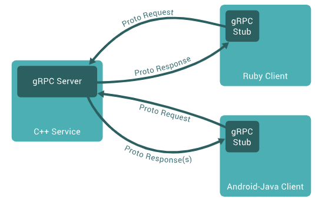

### Protocol Buffers

#### 概述

Protocol Buffers 是一种与语言无关、与平台无关的可扩展机制，用于序列化结构化数据

它类似于 JSON，但体积更小、速度更快，并且会生成本机语言绑定。只需定义一次希望如何对数据进行结构化，然后即可特殊生成的源代码轻松地将结构化数据写入各种数据流并从中读取数据

#### C++使用

```bash
# 安装
sudo apt install protobuf-compiler
```

定义addressbook.proto，存放数据结构

```c++
syntax = "proto2";

// 类似命名空间
package tutorial;

// optional 可选字段
// repeated 可重复字段
message Person {
	optional string name = 1;
	optional int32 id = 2;
	optional string email = 3;

	enum PhoneType {
		MOBILE = 0;
		HOME = 1;
		WORK = 2;
	}

	message PhoneNumber {
		optional string number = 1;
		optional PhoneType type = 2 [default = HOME];
	}

	repeated PhoneNumber phones = 4;
}

message AddressBook {
	repeated Person people = 1;
}
```

```c++
#include <iostream>
#include <fstream>
#include <string>
#include "addressbook.pb.h"

using namespace std;

// 该函数根据用户输入填充 Person 消息。
void PromptForAddress(tutorial::Person *person)
{
	cout << "Enter person ID number: ";
	int id;
	cin >> id;
	person->set_id(id);	   // 设置ID到 Person 对象中
	cin.ignore(256, '\n'); // 忽略换行符

	cout << "Enter name: ";
	getline(cin, *person->mutable_name()); // 读取姓名并设置到 Person 对象中

	cout << "Enter email address (blank for none): ";
	string email;
	getline(cin, email);
	if (!email.empty())
	{
		person->set_email(email); // 设置电子邮件
	}

	while (true) // 循环输入电话号码
	{
		cout << "Enter a phone number (or leave blank to finish): ";
		string number;
		getline(cin, number);
		if (number.empty())
		{
			break; // 退出循环
		}

		tutorial::Person::PhoneNumber *phone_number = person->add_phones(); // 创建并添加 PhoneNumber 对象
		phone_number->set_number(number);									// 设置电话号码

		cout << "Is this a mobile, home, or work phone? ";
		string type;
		getline(cin, type);
		if (type == "mobile")
		{
			phone_number->set_type(tutorial::Person::MOBILE);
		}
		else if (type == "home")
		{
			phone_number->set_type(tutorial::Person::HOME);
		}
		else if (type == "work")
		{
			phone_number->set_type(tutorial::Person::WORK);
		}
		else
		{
			cout << "Unknown phone type.  Using default." << endl;
		}
	}
}

// 输出联系人信息
void PrintAddressBook(const tutorial::AddressBook &address_book)
{
	for (int i = 0; i < address_book.people_size(); ++i)
	{
		const tutorial::Person &person = address_book.people(i);
		cout << "Person ID: " << person.id() << endl; // 输出ID
		cout << "Name: " << person.name() << endl;	  // 输出姓名
		if (person.has_email())
		{
			cout << "Email: " << person.email() << endl; // 输出电子邮件
		}

		// 输出电话号码
		for (int j = 0; j < person.phones_size(); ++j)
		{
			const tutorial::Person::PhoneNumber &phone_number = person.phones(j);
			cout << "Phone #" << j + 1 << ": " << phone_number.number() << " (";
			switch (phone_number.type())
			{
			case tutorial::Person::MOBILE:
				cout << "mobile";
				break;
			case tutorial::Person::HOME:
				cout << "home";
				break;
			case tutorial::Person::WORK:
				cout << "work";
				break;
			default:
				cout << "unknown";
				break;
			}
			cout << ")" << endl; // 输出电话号码类型
		}
		cout << endl; // 分隔不同联系人的输出
	}
}

// 主函数：从文件读取整个地址簿，
// 添加一个基于用户输入的联系人，然后将其写回到同一个文件。
int main(int argc, char *argv[])
{
	GOOGLE_PROTOBUF_VERIFY_VERSION; // 确认 Protobuf 版本匹配

	if (argc != 2)
	{
		cerr << "Usage:  " << argv[0] << " ADDRESS_BOOK_FILE" << endl;
		return -1;
	}

	tutorial::AddressBook address_book; // 创建 AddressBook 对象

	{
		// 读取现有地址簿。
		fstream input(argv[1], ios::in | ios::binary); // 打开输入文件流
		if (!input)
		{
			cout << argv[1] << ": File not found.  Creating a new file." << endl;
		}
		else if (!address_book.ParseFromIstream(&input)) // 解析地址簿文件
		{
			cerr << "Failed to parse address book." << endl;
			return -1;
		}
	}

	// 输出读取到的联系人信息
	PrintAddressBook(address_book);

	// 允许用户输入新的联系人信息
	PromptForAddress(address_book.add_people()); // 调用函数，添加用户输入的地址信息

	{
		fstream output(argv[1], ios::out | ios::trunc | ios::binary);
		if (!address_book.SerializeToOstream(&output)) // 将地址簿序列化并写入文件
		{
			cerr << "Failed to write address book." << endl;
			return -1;
		}
	}

	google::protobuf::ShutdownProtobufLibrary(); // 清理 Protobuf 库的全局对象

	return 0; // 正常结束程序
}
```

```cmake
# 指定构建项目所需的最小 CMake 版本为 2.8
cmake_minimum_required(VERSION 2.8)

# 定义项目名称为 Person
project(Person)

# 查找 Protobuf 库，如果未找到，则停止构建
find_package(Protobuf REQUIRED)

# 检查 Protobuf 库是否被找到
if (PROTOBUF_FOUND)
	message(STATUS "protobuf library found")  # 输出消息，表明 Protobuf 库已找到
else ()
	message(FATAL_ERROR "protobuf library is needed but cant be found")  # 如果未找到，输出致命错误消息并停止构建
endif ()

# 包含 Protobuf 的头文件目录和当前二进制目录（通常是构建目录）
include_directories(${PROTOBUF_INCLUDE_DIRS})
include_directories(${CMAKE_CURRENT_BINARY_DIR})

# 根据 addressbook.proto 文件生成 C++ 源文件和头文件
protobuf_generate_cpp(PROTO_SRCS PROTO_HDRS addressbook.proto)

# 输出生成的源文件和头文件的列表，便于调试
message(${PROTO_SRCS} ${PROTO_HDRS})

# 定义可执行文件目标 Person，包含 Person.cpp 和生成的 proto 文件
add_executable(Person Person.cpp ${PROTO_SRCS} ${PROTO_HDRS})

# 将 Protobuf 库链接到可执行文件 Person
target_link_libraries(Person ${PROTOBUF_LIBRARIES})
```

### gRPC

在聊聊什么是gRPC前，我们先来聊聊什么是RPC。

RPC，全称`Remote Procedure Call`，中文译为远程过程调用。通俗地讲，使用RPC进行通信，调用远程函数就像调用本地函数一样，RPC底层会做好数据的序列化与传输，从而能使我们更轻松地创建分布式应用和服务。

而gRPC，则是RPC的一种，它是免费且开源的，由谷歌出品。使用gRPC，我们只需要定义好每个API的Request和Response，剩下的gRPC这个框架会帮我们自动搞定。

另外，gRPC的典型特征就是使用protobuf（全称protocol buffers）作为其接口定义语言（Interface Definition Language，缩写IDL），同时底层的消息交换格式也是使用protobuf

#### 基本通信流程



1.gRPC通信的第一步是定义IDL，即我们的接口文档（后缀为.proto）

2.第二步是编译proto文件，得到存根（stub）文件，即上图深绿色部分。

3.第三步是服务端（gRPC Server）实现第一步定义的接口并启动，这些接口的定义在存根文件里面

4.最后一步是客户端借助存根文件调用服务端的函数，虽然客户端调用的函数是由服务端实现的，但是调用起来就像是本地函数一样。

以上就是gRPC的基本流程，从图中还可以看出，由于我们的proto文件的编译支持多种语言（Go、Java、Python等），所以gRPC也是跨语言的

#### gRPC VS Restful

**文档规范**

gRPC使用proto文件编写接口（API），文档规范比Restful更好，因为proto文件的语法和形式是定死的，所以**更为严谨、风格统一清晰**；而Restful由于可以使用多种工具进行编写（只要人看得懂就行），每家公司、每个人的攥写风格又各有差异，难免让人觉得**比较混乱**。

另外，Restful文档的过时相信很多人深有体会，因为维护一份不会过时的文档需要很大的人力和精力，而公司往往都是业务为先；而gRPC文档即代码，接口的更改也会体现到代码中不用花很多精力去维护文档。

**消息编码**

消息编码这块，gRPC使用`protobuf`进行消息编码，而Restful一般使用`JSON`进行编码

**传输协议**

传输协议这块，gRPC使用`HTTP/2`作为底层传输协议，据说也可替换为其他协议，但目前还未考证；而RestFul则使用`HTTP`

**传输性能**

由于gRPC使用protobuf进行消息编码（即序列化），而经protobuf序列化后的消息体积很小（传输内容少，传输相对就快）；再加上HTTP/2协议的加持（HTTP1.1的进一步优化），使得gRPC的传输性能要优于Restful

**传输形式**

传输形式这块，gRPC最大的优势就是**支持流式传输**，传输形式具体可以分为四种（unary、client stream、server stream、bidirectional stream），这个后面我们会讲到；而Restful是不支持流式传输的

**浏览器的支持度**

目前浏览器对gRPC的支持度并不是很好，而对Restful的支持可谓是密不可分，这也是gRPC的一个劣势

**消息的可读性和安全性**

由于gRPC序列化的数据是二进制，且如果你不知道定义的Request和Response是什么，你几乎是没办法解密的，所以gRPC的安全性也非常高，但随着带来的就是可读性的降低，调试会比较麻烦；而Restful则相反（现在有HTTPS，安全性其实也很高）

**代码的编写**

由于gRPC调用的函数，以及字段名，都是使用stub文件的，所以从某种角度看，代码更不容易出错，联调成本也会比较低，不会出现低级错误，比如字段名写错、写漏
