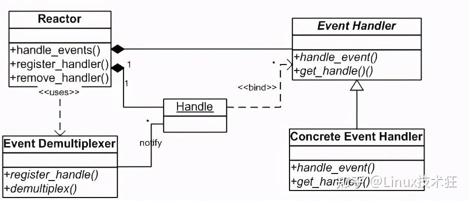
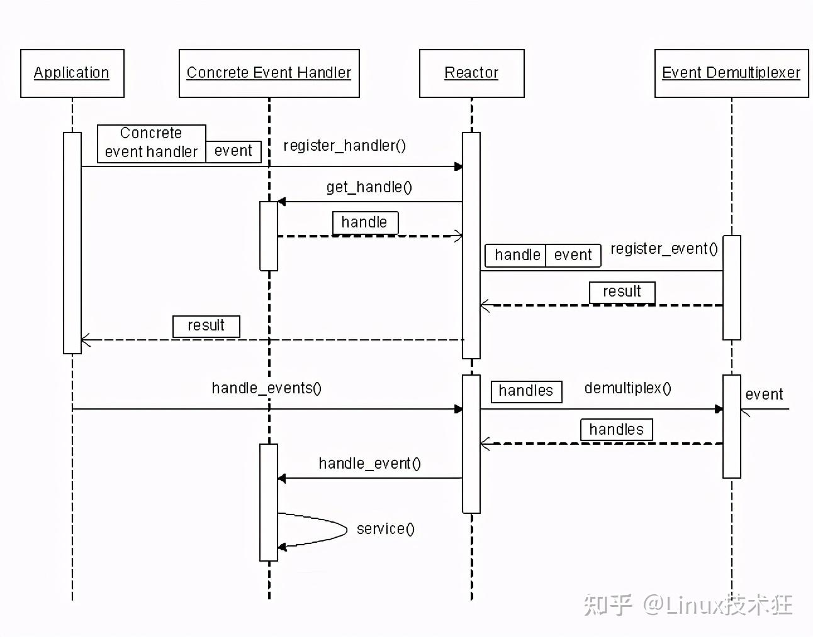
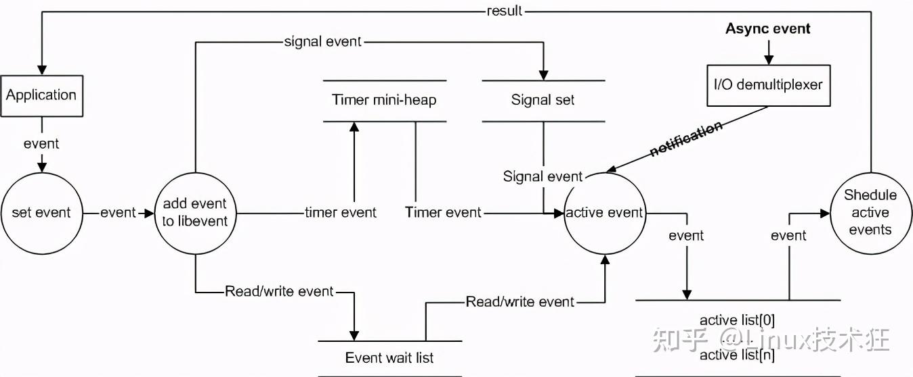
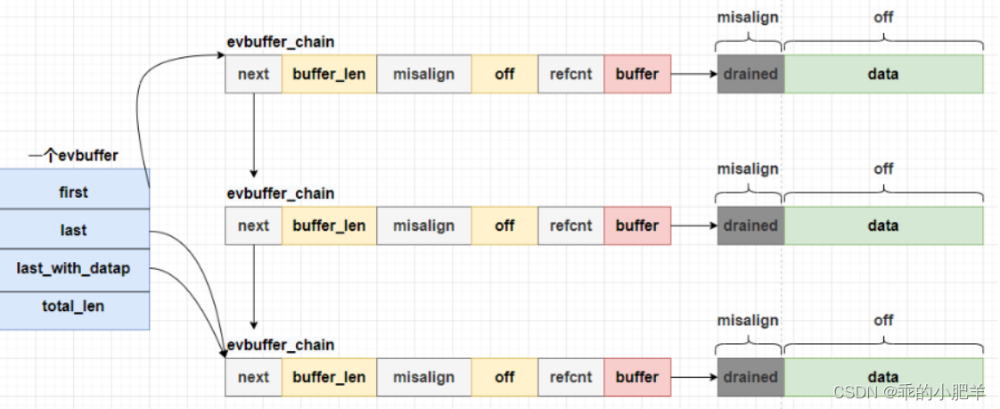

#### libevent

Libevent本身就是一个典型的Reactor模型，理解Reactor模式是理解libevent的基石

#### Reactor模式

##### 事件处理机制

Reactor释义“反应堆”，是一种事件驱动机制

和普通函数调用的不同之处在于：应用程序不是主动的调用某个API完成处理，而是恰恰相反，Reactor逆置了事件处理流程，应用程序需要提供相应的接口并注册到Reactor上，如果相应的事件发生，Reactor将主动调用应用程序注册的接口，这些接口又称为“回调函数”

##### 优点

-   响应快，不必为单个同步事件所阻塞，虽然Reactor本身依然是同步的；
-   编程相对简单，可以最大程度的避免复杂的多线程及同步问题，并且避免了多线程/进程的切换开销
-   可扩展性，可以方便的通过增加Reactor实例个数来充分利用CPU资源
-   可复用性，reactor框架本身与具体事件处理逻辑无关，具有很高的复用性

##### Reactor模式框架

使用Reactor模型，必备的几个组件：事件源、Reactor框架、多路复用机制和事件处理程序，先来看看Reactor模型的整体框架，接下来再对每个组件做逐一说明



**事件源**

Linux上是文件描述符，Windows上就是Socket或者Handle了，这里统一称为“句柄集”；程序在指定的句柄上注册关心的事件，比如I/O事件

**event demultiplexer——事件多路分发机制**

由操作系统提供的I/O多路复用机制，比如select和epoll。

程序首先将其关心的句柄（事件源）及其事件注册到event demultiplexer上；当有事件到达时，event demultiplexer会发出通知“在已经注册的句柄集中，一个或多个句柄的事件已经就绪”；程序收到通知后，就可以在非阻塞的情况下对事件进行处理了。

对应到libevent中，依然是select、poll、epoll等，但是libevent使用结构体eventop进行了封装，以统一的接口来支持这些I/O多路复用机制，达到了对外隐藏底层系统机制的目的

**Reactor——反应器**

Reactor，是事件管理的接口，内部使用event demultiplexer注册、注销事件；并运行事件循环，当有事件进入“就绪”状态时，调用注册事件的回调函数处理事件。

对应到libevent中，就是event_base结构体。

一个典型的Reactor声明方式

```c++
class Reactor
{
public:
	int register_handler(Event_Handler *pHandler, int event);
	int remove_handler(Event_Handler *pHandler, int event);
	void handle_events(timeval *ptv);
	// ...
};
```

**Event Handler——事件处理程序**

事件处理程序提供了一组接口，每个接口对应了一种类型的事件，供Reactor在相应的事件发生时调用，执行相应的事件处理。通常它会绑定一个有效的句柄。

对应到libevent中，就是event结构体

下面是两种典型的Event Handler类声明方式，二者互有优缺点

```c
class Event_Handler
{
public:
	virtual void handle_read() = 0;
	virtual void handle_write() = 0;
	virtual void handle_timeout() = 0;
	virtual void handle_close() = 0;
	virtual HANDLE get_handle() = 0;
	// ...
};
class Event_Handler
{
public:
	// events maybe read/write/timeout/close .etc
	virtual void handle_events(int events) = 0;
	virtual HANDLE get_handle() = 0;
	// ...
};
```

##### Reactor事件处理流程



#### 基本使用

使用livevent设置定时器，应用程序只需要执行下面几个简单的步骤即可

```c
#include <stdio.h>
#include <stdlib.h>
#include <event.h>

void time_cb(int fd, short event, void *arg)
{
	struct event *ev = (struct event *)arg;
	printf("timer wakeup\n");
	// 重置定时器
	struct timeval tv = {3, 0};
	event_add(ev, &tv);
}

int main()
{
	// 创建事件基础结构
	struct event_base *base = event_base_new();
	struct event ev;
	struct timeval tv = {3, 0};
	event_assign(&ev, base, -1, 0, time_cb, &ev);
	// 添加定时器事件
	event_add(&ev, &tv);
	// 开始事件循环
	event_base_dispatch(base);
	// 释放 event_base
	event_base_free(base);
	return 0;
}
```

##### 事件处理流程

-   首先应用程序准备并初始化event，设置好事件类型和回调函数
-   向libevent添加该事件event。对于定时事件，libevent使用一个小根堆管理，key为超时时间；对于Signal和I/O事件，libevent将其放入到等待链表（wait list）中，这是一个双向链表结构
-   程序调用event_base_dispatch()系列函数进入无限循环，等待事件，以select()函数为例；每次循环前libevent会检查定时事件的最小超时时间tv，根据tv设置select()的最大等待时间，以便于后面及时处理超时事件
-   Libevent将所有的就绪事件，放入到激活链表中。然后对激活链表中的事件，调用事件的回调函数执行事件处理



#### 事件event

##### event结构

```c
struct event_callback {
    // 事件回调队列中的下一个回调，用于将回调函数按优先级排序在链表中
    TAILQ_ENTRY(event_callback) evcb_active_next;

    // 用于标识事件回调的标志位，通常用于存储状态信息（例如是否已经激活等）
    short evcb_flags;

    // 事件优先级，数值越小优先级越高
    ev_uint8_t evcb_pri;  /* smaller numbers are higher priority */

    // 闭包类型，用于指示当前回调的类型
    ev_uint8_t evcb_closure;

    // 回调函数，使用 union 允许不同类型的事件回调使用同一结构体
    union {
        // 标准事件回调函数，参数为 socket、事件标志和用户传递的参数
        void (*evcb_callback)(evutil_socket_t, short, void *);

        // 用于事件自身的回调函数
        void (*evcb_selfcb)(struct event_callback *, void *);

        // 用于最终清理 `struct event` 的回调函数
        void (*evcb_evfinalize)(struct event *, void *);

        // 用于最终清理 `struct event_callback` 的回调函数
        void (*evcb_cbfinalize)(struct event_callback *, void *);
    } evcb_cb_union;

    // 用户自定义的参数，传递给回调函数
    void *evcb_arg;
};
```

```c
struct event {
    // 用于存储事件的回调函数和相关信息（如优先级、标志等）
    struct event_callback ev_evcallback;

    /* 用于管理事件的超时时间 */
    union {
        // 在带有公共超时的链表中指向下一个事件，使用 `TAILQ_ENTRY` 实现双向链表结构
        TAILQ_ENTRY(event) ev_next_with_common_timeout;
        // 在小顶堆中的索引，通常用于超时事件的排序
        size_t min_heap_idx;
    } ev_timeout_pos;

    // 文件描述符或信号（对于 I/O 事件，表示关联的 socket 或文件描述符）
    evutil_socket_t ev_fd;

    // 指向事件所属的 event_base（事件循环），每个事件都属于某个 event_base
    struct event_base *ev_base;

    // 根据事件的不同类型，使用不同的数据结构
    union {
        /* 用于 I/O 事件（如 socket 可读/写） */
        struct {
            // I/O 事件链表中的下一个事件
            LIST_ENTRY(event) ev_io_next;
            // I/O 事件的超时值
            struct timeval ev_timeout;
        } ev_io;

        /* 用于信号事件 */
        struct {
            // 信号事件链表中的下一个事件
            LIST_ENTRY(event) ev_signal_next;
            // 信号调用的计数器，记录信号回调被调用的次数
            short ev_ncalls;
            // 指向计数器的指针，允许在回调函数中删除信号事件
            short *ev_pncalls;
        } ev_signal;
    } ev_;
    
    // 事件类型（如可读、可写、超时等），使用位掩码来表示
    short ev_events;

    // 保存事件的结果信息，当事件触发时，将结果传递给回调函数
    short ev_res; /* result passed to event callback */

    // 通用的超时值，适用于所有事件类型
    struct timeval ev_timeout;
};
```

##### 事件设置的接口函数

```c
/**
 * @brief 赋值并初始化一个事件结构体。该函数用于将指定的事件与事件循环、文件描述符、事件类型及回调函数关联起来。
 * @param ev        指向待初始化的事件结构体的指针。
 * @param base      事件循环的指针，表示事件将在哪个事件循环中执行。
 * @param fd        事件监听的文件描述符或信号（I/O 或信号事件）。如果事件不涉及文件描述符，可以设置为 -1。
 * @param events    事件类型的位掩码，可以是以下值的组合：
 *                  - EV_READ: 监听可读事件。
 *                  - EV_WRITE: 监听可写事件。
 *                  - EV_TIMEOUT: 监听超时事件。
 *                  - EV_SIGNAL: 监听信号事件。
 * @param callback  当事件触发时要执行的回调函数，格式为 `void (*callback)(evutil_socket_t, short, void *)`。
 *                  回调函数的参数包括：
 *                  - 文件描述符或信号编号。
 *                  - 触发的事件类型。
 *                  - 用户提供的参数 `arg`。
 * @param arg       传递给回调函数的用户自定义参数。
 * @return 成功返回 0，失败返回 -1。
 */
int event_assign(struct event *ev, struct event_base *base, evutil_socket_t fd, short events, void (*callback)(evutil_socket_t, short, void *), void *arg);
```

```c
// 底层调用event_assign，其中event_base指向current_base
// current_base是event_init调用的时候设置的
void event_set(struct event *ev, evutil_socket_t fd, short events, void (*callback)(evutil_socket_t, short, void *), void *arg)
{
	int r;
	r = event_assign(ev, current_base, fd, events, callback, arg);
	EVUTIL_ASSERT(r == 0);
}

// 将ev绑定到指定的base，成功返回0，失败返回-1
int event_base_set(struct event_base *base, struct event *ev);

// 设置ev的优先级，成功返回0，失败返回-1
int event_priority_set(struct event *ev, int pri)
```

#### 事件处理框架

##### event_base结构体

```c
/**
 * @brief 事件循环的基础结构体，管理所有事件及其相关数据。
 */
struct event_base {
    /** 指向事件操作实现的函数指针和其他描述事件循环后端的数据 */
    const struct eventop *evsel;
    /** 指向后端特定数据的指针 */
    void *evbase;

    /** 要在下次调度时通知后端的变更列表，仅用于 O(1) 后端 */
    struct event_changelist changelist;

    /** 指向描述信号操作后端的函数指针 */
    const struct eventop *evsigsel;
    /** 实现通用信号处理代码的数据 */
    struct evsig_info sig;

    /** 虚拟事件的数量 */
    int virtual_event_count;
    /** 活动的最大虚拟事件数量 */
    int virtual_event_count_max;
    /** 添加到事件循环的事件总数 */
    int event_count;
    /** 添加到事件循环的最大事件总数 */
    int event_count_max;
    /** 当前活动事件的总数 */
    int event_count_active;
    /** 最大活动事件的总数 */
    int event_count_active_max;

    /** 设置是否在处理完事件后终止循环 */
    int event_gotterm;
    /** 设置是否立即终止循环 */
    int event_break;
    /** 设置是否立即开始新的循环实例 */
    int event_continue;

    /** 当前正在运行的事件优先级 */
    int event_running_priority;

    /** 设置是否正在运行事件循环函数，以防止递归调用 */
    int running_loop;

    /** 延迟回调队列的计数，用于防止饥饿现象 */
    int n_deferreds_queued;

    /* 活动事件管理 */
    /** 活动事件回调队列的数组，低优先级的事件更重要，处理时优先级高的事件会滞后 */
    struct evcallback_list *activequeues;
    /** 活动队列数组的长度 */
    int nactivequeues;
    /** 下次处理事件时应该激活的事件回调列表 */
    struct evcallback_list active_later_queue;

    /* 通用超时逻辑 */
    /** 存储所有已知公共超时值的超时队列数组 */
    struct common_timeout_list **common_timeout_queues;
    /** common_timeout_queues 中使用的条目数 */
    int n_common_timeouts;
    /** common_timeout_queues 的总大小 */
    int n_common_timeouts_allocated;

    /** 文件描述符到启用事件的映射 */
    struct event_io_map io;

    /** 信号编号到启用事件的映射 */
    struct event_signal_map sigmap;

    /** 带有超时的事件优先级队列 */
    struct min_heap timeheap;

    /** 存储时间值：用于避免过于频繁调用 gettimeofday/clock_gettime */
    struct timeval tv_cache;

    /** 单调定时器的存储结构 */
    struct evutil_monotonic_timer monotonic_timer;

    /** 内部时间（可能来自 clock_gettime）和 gettimeofday 之间的差值 */
    struct timeval tv_clock_diff;
    /** 上次更新时间差的秒数，使用单调时间 */
    time_t last_updated_clock_diff;

#ifndef EVENT__DISABLE_THREAD_SUPPORT
    /* 线程支持 */
    /** 当前运行事件循环的线程 ID */
    unsigned long th_owner_id;
    /** 防止对事件循环的冲突访问的锁 */
    void *th_base_lock;
    /** 完成事件处理后的条件变量，用于信号通知 */
    void *current_event_cond;
    /** 阻塞在当前事件条件变量上的线程数 */
    int current_event_waiters;
#endif

    /** 当前正在执行回调的事件 */
    struct event_callback *current_event;

#ifdef _WIN32
    /** IOCP 支持结构（如果启用 IOCP） */
    struct event_iocp_port *iocp;
#endif

    /** 配置事件循环时的标志 */
    enum event_base_config_flag flags;

    /** 最大调度时间 */
    struct timeval max_dispatch_time;
    /** 最大回调数 */
    int max_dispatch_callbacks;
    /** 在每个优先级之后的回调限制 */
    int limit_callbacks_after_prio;

    /* 通知主线程以唤醒中断等 */
    /** 如果事件循环已经有一个待处理的通知，则为真，不需要添加更多通知 */
    int is_notify_pending;
    /** 用于唤醒主线程的 socketpair */
    evutil_socket_t th_notify_fd[2];
    /** 用于唤醒主线程的事件 */
    struct event th_notify;
    /** 用于从其他线程唤醒主线程的函数 */
    int (*th_notify_fn)(struct event_base *base);

    /** 用于弱随机数生成器的保存种子。某些后端使用此种子在套接字间产生公平性。受 th_base_lock 保护。 */
    struct evutil_weakrand_state weakrand_seed;

    /** 尚未触发的 event_once 事件列表 */
    LIST_HEAD(once_event_list, event_once) once_events;
};
```

```c
/**
 * @brief 定义给定 `event_base` 的后端实现结构体。
 */
struct eventop {
    /** 后端的名称。 */
    const char *name;

    /** 设置 `event_base` 使用该后端的函数。
     * 该函数应创建一个新的结构体，包含运行该后端所需的信息，并返回该指针。
     * 返回的指针将存储在 `event_base.evbase` 字段中。
     * 如果失败，函数应返回 NULL。
     */
    void *(*init)(struct event_base *);

    /** 启用给定文件描述符（fd）或信号的读取/写入操作。
     * `events` 是我们尝试启用的事件，可能是 EV_READ、EV_WRITE、EV_SIGNAL 和 EV_ET 的一个或多个。
     * `old` 是该 fd 之前启用的事件。
     * `fdinfo` 是与 fd 关联的结构体，由 evmap 定义；其大小由 fdinfo 字段确定。
     * 第一次添加 fd 时，`fdinfo` 的大小设置为 0。
     * 函数应成功返回 0，出错返回 -1。
     */
    int (*add)(struct event_base *, evutil_socket_t fd, short old, short events, void *fdinfo);

    /** 类似于 `add`，但 `events` 包含要禁用的事件。
     */
    int (*del)(struct event_base *, evutil_socket_t fd, short old, short events, void *fdinfo);

    /** 实现事件循环核心的函数。
     * 它必须检查哪些已添加的事件已准备好，并为每个活动事件调用 `event_active`（通常通过 `event_io_active` 等）。
     * 应返回 0 表示成功，返回 -1 表示出错。
     */
    int (*dispatch)(struct event_base *, struct timeval *);

    /** 清理并释放 `event_base` 中的数据的函数。
     */
    void (*dealloc)(struct event_base *);

    /** 标志：如果我们在 fork 之后需要重新初始化事件基础，则设置为真。
     */
    int need_reinit;

    /** 后端可以提供的事件方法特性（event_method_features）的位数组。
     */
    enum event_method_feature features;

    /** 记录每个具有一个或多个活动事件的 fd 的额外信息的长度。
     * 这些信息作为 fd 的 evmap 条目的一部分记录，并作为参数传递给上述的 `add` 和 `del` 函数。
     */
    size_t fdinfo_len;
};
```

##### 创建和初始化event_base

```c
// 与event_base_new相比，event_init对current_base进行赋值，所以建议使用event_init
struct event_base *event_init(void);
struct event_base *event_base_new(void);
```

##### 接口函数

```c
/**
 * @brief 将事件添加到待处理事件集合中
 * @param ev 通过 event_assign() 或 event_new() 初始化的事件结构体
 * @param timeout 等待事件的最长时间，或 NULL 表示永远等待
 * @return 成功返回 0，发生错误返回 -1
 */
int event_add(struct event *ev, const struct timeval *tv);

/**
 * @brief 从监控事件集合中移除事件
 * @param ev 要从工作集合中移除的事件结构体
 * @return 成功返回 0，发生错误返回 -1
 */
int event_del(struct event *ev);

/**
 * @brief 进入循环等待事件
 * @param base 由 event_base_new() 或 event_base_new_with_config() 返回的 event_base 结构体
 * @param flags，可选值如下：
 				EVLOOP_ONCE 	只触发一次, 如果事件没有被触发, 阻塞等待
 				EVLOOP_NONBLOCK 非阻塞方式检测事件是否被触发, 不管事件触发与否, 都会立即返回
 * @return 成功返回 0，发生错误返回 -1，或者因为没有待处理或活跃的事件而退出时返回 1
 */
int event_base_loop(struct event_base *base, int flags);

/* 
等价于 event_base_loop(event_base, 0)
传递0意味着使用默认行为，即事件循环会持续运行，直到：
	1. 没有待处理的或活跃的事件，或者
	2. 调用了 event_base_loopbreak() 或 event_base_loopexit()
*/
int event_base_dispatch(struct event_base *event_base);

/**
 * @brief 对一个待处理的或未处理的事件使用此函数，使其变为活跃状态
 * @param ev 要激活的事件
 * @param res 要传递给事件回调函数的一组标志。
 * @param ncalls 一个已废弃的参数：该参数将被忽略
 */
void event_active(struct event *ev, int res, short ncalls);
```

#### 自带buffer的事件-bufferevent

bufferevent实际上也是一个event, 只不过比普通的event高级一些, 它的内部有两个缓冲区, 以及一个文件描述符（网络套接字）。一个网络套接字有读和写两个缓冲区, bufferevent同样也带有两个缓冲区

bufferevent有三个回调函数

-   读回调 – 当bufferevent将底层读缓冲区的数据读到自身的读缓冲区时触发读事件回调
-   写回调 – 当bufferevent将自身写缓冲的数据写到底层写缓冲区的时候触发写事件回调, 由于数据最终是写入了内核的写缓冲区中, 应用程序已经无法控制, 这个事件对于应用程序来说基本没什么用, 只是通知功能
-   事件回调 – 当bufferevent绑定的socket连接, 断开或者异常的时候触发事件回调

##### 常用函数

```c
/**
 * @brief bufferevent_socket_new 对已经存在socket创建bufferevent事件
 * @param base 对应根节点
 * @param fd 文件描述符
 * @param options bufferevent的选项
 * 				BEV_OPT_CLOSE_ON_FREE 当这个bufferevent被释放时，关闭其底层的文件描述符、bufferevent或其他资源
 * 				BEV_OPT_THREADSAFE 当启用了线程功能，则该bufferevent上的操作由锁保护。
 * 				BEV_OPT_DEFER_CALLBACKS 回调函数将在事件循环中延迟执行
 */
struct bufferevent *bufferevent_socket_new(struct event_base *base, evutil_socket_t fd, int options);

// 释放bufferevent
void bufferevent_free(struct bufferevent *bufev);

/**
 * @brief 使用基于socket的bufferevent发起connect尝试。当连接成功时，事件回调函数将被调用，并设置BEV_EVENT_CONNECTED标志
 * @param bev 已通过 bufferevent_socket_new() 分配的 bufferevent
 * @param serv 要连接的地址
 * @param socklen 地址的长度
 * @return 成功返回0，失败返回-1
 */
int bufferevent_socket_connect(struct bufferevent *bev, struct sockaddr *serv, int socklen);

/**
 * @brief 修改 bufferevent 的回调函数修改 bufferevent 的回调函数
 * @param bufev 要修改回调函数的 bufferevent 对象
 * @param readcb 当有数据可读取时调用的回调函数，或设置为 NULL 表示不需要回调
 * @param writecb 当文件描述符准备好写入时调用的回调函数，或设置为 NULL 表示不需要回调
 * @param eventcb 当文件描述符上有事件发生时调用的回调函数
 * @param cbarg 提供给每个回调函数（readcb、writecb 和 errorcb）的参数
 */
void bufferevent_setcb(struct bufferevent *bufev, bufferevent_data_cb readcb,
	bufferevent_data_cb writecb, bufferevent_event_cb eventcb, void *cbarg);

/**
 * @brief bufferevent的读或写回调函数。当输入缓冲区有新数据到达，并且可读取的数据量超过了低水位线（默认值为 0）时，
   将触发读回调函数。当写缓冲区已被耗尽或低于其低水位线时，将触发写回调函数
 * @param bev 触发回调的 bufferevent
 * @param ctx 为此 bufferevent 指定的用户上下文
 */
typedef void (*bufferevent_data_cb)(struct bufferevent *bev, void *ctx);

/**
 * @brief bufferevent 的事件/错误回调函数
 * @param bev 触发条件的 bufferevent
 * @param what 一个标志的结合体
 * 			BEV_EVENT_READING 或 BEV_EVENT_WRITING，表示错误发生在读取路径还是写入路径
 * 			BEV_EVENT_EOF-遇到文件结束指示
 * 			BEV_EVENT_ERROR-发生错误
 * 			BEV_EVENT_TIMEOUT-发生超时
 * 			BEV_EVENT_CONNECTED-请求的过程中连接已经完成
 * @param ctx 为此 bufferevent 指定的用户上下文
 */
typedef void (*bufferevent_event_cb)(struct bufferevent *bev, short what, void *ctx);

/**
 * @brief 将数据写入 bufferevent 缓冲区
 * @param bufev 要写入的 bufferevent
 * @param data 指向要写入的数据的指针
 * @param size 数据的长度，以字节为单位
 * @return 成功返回 0，发生错误返回 -1
 */
int bufferevent_write(struct bufferevent *bufev, const void *data, size_t size);

/**
 * @brief 从evbuffer写入数据到bufferevent缓冲区。操作完成后，evbuffer 会被清空
 * @param bufev 要写入的 bufferevent
 * @param buf 要写入的 evbuffer
 * @return 成功返回 0，发生错误返回 -1
 */
int bufferevent_write_buffer(struct bufferevent *bufev, struct evbuffer *buf);


/**
 * @brief 从 bufferevent 缓冲区读取数据
 * @param bufev 要读取的 bufferevent
 * @param data 指向将存储数据的缓冲区的指针
 * @param size 数据缓冲区的大小，以字节为单位
 * @return 读取的数据量，以字节为单位
 */
size_t bufferevent_read(struct bufferevent *bufev, void *data, size_t size);

/**
 * @brief 从 bufferevent 缓冲区读取数据到 evbuffer。这样可以避免内存复制
 * @param bufev 要读取的 bufferevent
 * @param buf 要添加数据的 evbuffer
 * @return 成功返回 0，发生错误返回 -1
 */
int bufferevent_read_buffer(struct bufferevent *bufev, struct evbuffer *buf);

/**
 * @brief 启用 bufferevent
 * @param bufev 要启用的 bufferevent
 * @param event EV_READ | EV_WRITE 的任意组合
 * @return 成功返回 0，发生错误返回 -1
 */
int bufferevent_enable(struct bufferevent *bufev, short event);

// 禁用 bufferevent
int bufferevent_disable(struct bufferevent *bufev, short event);


/**
 * @brief 返回输入缓冲区
 * @param bufev 要获取 evbuffer 的 bufferevent
 * @return 输入缓冲区的 evbuffer 对象
 */
struct evbuffer *bufferevent_get_input(struct bufferevent *bufev);

// 返回输出缓冲区
struct evbuffer *bufferevent_get_output(struct bufferevent *bufev);

/**
 * @brief 从 evbuffer 中读取一行数据
 * @param buffer 要读取的 evbuffer
 * @param n_read_out 如果非 NULL，指向一个size_t类型的变量，将被设置为返回字符串中的字符数量
 * @param eol_style 使用的行结束样式
 * @return 指向单行数据的指针，如果发生错误则返回 NULL
 */
char *evbuffer_readln(struct evbuffer *buffer, size_t *n_read_out, enum evbuffer_eol_style eol_style);

enum evbuffer_eol_style {
	/** 任何 CR 和 LF 字符的序列都可以作为 EOL。
	 *
	 * 注意，这种样式可能会产生模棱两可的结果：如果 "CRLF" 序列
	 * 在一次操作中全部存在于缓冲区中，它将被视为一个单一的 EOL；
	 * 但如果你先从网络读取 CR，再从网络读取 LF，它将被视为两个 EOL。
	 */
	EVBUFFER_EOL_ANY,

	/** EOL 是一个 LF，前面可以有一个 CR。此样式最适合实现基于文本的互联网协议。 */
	EVBUFFER_EOL_CRLF,

	/** EOL 是一个 CR 后跟一个 LF。 */
	EVBUFFER_EOL_CRLF_STRICT,

	/** EOL 是一个 LF。 */
	EVBUFFER_EOL_LF,

	/** EOL 是一个 NUL 字符（即，值为 0 的单个字节）。 */
	EVBUFFER_EOL_NUL
};

/**
 * @brief 从 evbuffer 中读取数据并清空读取的字节
 * @param buf 要读取的 evbuffer
 * @param data 存储结果的目标缓冲区
 * @param datlen 目标缓冲区的最大大小
 * @return 读取的字节数，如果无法清空缓冲区则返回 -1
 */
int evbuffer_remove(struct evbuffer *buf, void *data, size_t datlen);
```

##### bufferevent总结

对于bufferevent来说, 一个文件描述符, 2个缓冲区, 3个回调函数

-   文件描述符是用于和客户端进行通信的通信文件描述符, 并不是监听的文件描述符

-   2个缓冲区是指：一个bufferevent包括读缓冲区和写缓冲区
-   3个回调函数指: 读回调函数，写回调函数和事件回调函数

读回调函数的触发时机：当socket的内核socket读缓冲区中有数据的时候, bufferevent会将内核缓冲区中的数据读到自身的读缓冲区, 会触发bufferevent的读操作, 此时会调用bufferevent的读回调函数

写回调函数的触发时机：当往bufferevent的写缓冲区写入数据的时候, bufferevent底层会把缓冲区中的数据写入到内核的socket的写缓冲区中, 此时会触发bufferevent的写回调函数, 最后由内核的驱动程序将数据发送出去

事件(异常)回调函数的触发时机：客户端关闭连接或者是被信号终止进程会触发事件回调函数

#### 连接监听器-evconnlistener

连接监听器封装了底层的socket通信相关函数, 比如socket, bind, listen, accept这几个函数。连接监听器创建后实际上相当于调用了socket, bind, listen, 此时等待新的客户端连接到来, 如果有新的客户端连接, 那么内部先进行调用accept处理, 然后调用用户指定的回调函数

```c
/**
 * @brief 分配一个新的 evconnlistener 对象，以在给定地址上监听传入的 TCP 连接
 * @param base 要与监听器关联的事件基础
 * @param cb 新连接到达时调用的回调函数。如果回调函数为NULL，监听器将被视为禁用状态，直到设置了回调函数
 * @param ptr 传递给回调函数的指针
 * @param flags 任何数量的 LEV_OPT_* 标志，可选：
 				LEV_OPT_LEAVE_SOCKETS_BLOCKING   文件描述符为阻塞的
 				LEV_OPT_CLOSE_ON_FREE            关闭时自动释放
				LEV_OPT_REUSEABLE                端口复用
				LEV_OPT_THREADSAFE               分配锁, 线程安全
 * @param backlog 传递给listen()调用，以确定可接受的连接积压长度。设置为-1以使用合理的默认值
 * @param addr 要监听连接的地址
 * @param socklen 地址的长度
 */
struct evconnlistener *evconnlistener_new_bind(struct event_base *base,
    evconnlistener_cb cb, void *ptr, unsigned flags, int backlog,
    const struct sockaddr *sa, int socklen);

/**
 * @brief 当监听器有新的连接时调用的回调函数。
 * @param listener evconnlistener 对象
 * @param fd 新的文件描述符
 * @param addr 连接的源地址
 * @param socklen addr 的长度
 * @param arg 传递给 evconnlistener_new() 的指针
 */
typedef void (*evconnlistener_cb)(struct evconnlistener *listener, evutil_socket_t fd , struct sockaddr *addr, int socklen, void *arg);

// 销毁连接监听器
void evconnlistener_free(struct evconnlistener *lev);
```

##### 读写缓冲区evbuffer的实现

evbuffer 是 libevent 底层实现的一种链式缓冲区，当我们使用bufferevent来管理事件时，就会从每个事件的 evbuffer 中读写数据。每个 evbuffer 实质是一个缓冲区链表，其中的每个元素为 struct evbuffer_chain

```c
struct evbuffer {
	/** 该缓冲区链表中第一个 chain。*/
	struct evbuffer_chain *first;
	/** 该缓冲区链表中最后一个 chain。*/
	struct evbuffer_chain *last;
	/** 指针指向最后一个包含数据的 chain 的指针。*/
	struct evbuffer_chain **last_with_datap;
	/** 所有链中的数据总长度。*/
	size_t total_len;
	...... // 以上为关键成员
};

/** evbuffer 中的一个单项。*/
struct evbuffer_chain {
	/** 指向下一个 evbuffer_chain。*/
	struct evbuffer_chain *next;
	/** buffer 字段中可用的总分配长度。*/
	size_t buffer_len;
	/** buffer 起始的未使用空间，或用于 sendfile 缓冲区的文件偏移。*/
	ev_misalign_t misalign;
	/** 数据写入的起始位置，即 buffer + misalign 处开始写入。
	 * 换句话说，这个值表示 buffer 中实际存储的数据量。*/
	size_t off;
	/** 如果此 chain 需要特殊处理则设置此标志。*/
	/** 这个 chain 的引用计数。*/
	int refcnt;
	/** 通常指向属于该 chain 分配的可读写内存。
	 * 对于 mmap，可能是只读缓冲区，并且会设置 EVBUFFER_IMMUTABLE 标志。
	 * 对于 sendfile，可能指向 NULL。*/
	unsigned char *buffer;
};
```



misaligin是什么意思呢？是已经被读取的数据，下一段有效数据是从【buffer+misaligin ， buffer+misaligin +off】这一段off的长，是我们待取的有效数据。而【buffer，buffer+misaligin 】这一段是之前就已经被读取过了，所以这里是失效的数据。所以misaligin 就解决了数据移动频繁的问题。而我们的evbuffer_chain是链表形式，所以又解决了数据空间浪费的问题

**evbuffer的缺点**

我们的数据是存储在不连续的内存上面（例如我们读20B，结果着20B分别在两个chain里面），内存不连续会带来多次io，我们可能需要多次io才能把数据读完整。对于内存不连续的问题，Linux内核提供了一个接口，readv和writev，解决内存不连续的读写问题

```c
// 从文件描述符fd中读取数据，并将结果存入由IOVEC描述的缓冲区中
ssize_t readv(int fd, const struct iovec *iov, int iovcnt);

// 将IOVEC描述的缓冲区中的数据写入文件描述符fd，IOVEC是包含COUNT个 'struct iovec' 的向量。数据按照指定的顺序写入
ssize_t writev(int fd, const struct iovec *iov, int iovcnt);

struct iovec {
    void  *iov_base;    /* 起始地址 */
    size_t iov_len;     /* 长度 */
};
```

