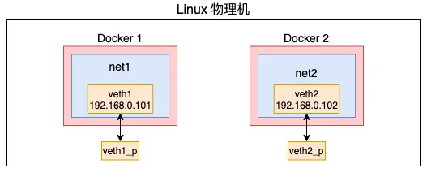
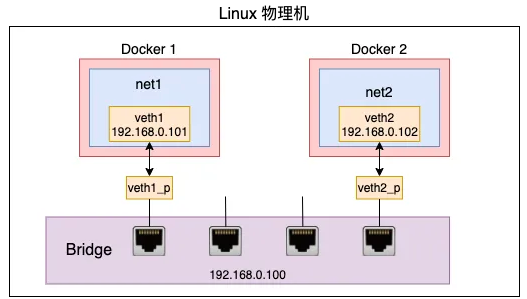

测试环境

```bash
root@doraemon-virtual-machine:~# hostnamectl
 Static hostname: doraemon-virtual-machine
       Icon name: computer-vm
         Chassis: vm
      Machine ID: aaf2113265314ee183ded36068d6dc54
         Boot ID: 4dea440b01e14638ac3c46d648cc2038
  Virtualization: vmware
Operating System: Ubuntu 22.04.5 LTS              
          Kernel: Linux 6.8.0-48-generic
    Architecture: x86-64
 Hardware Vendor: VMware, Inc.
  Hardware Model: VMware Virtual Platform
```


### 网络篇

在网络虚拟环境中，和物理网络中的交换机一样，也需要这样一个软件实现的设备。它需要有很多个虚拟端口，能够将更多的虚拟网卡连接在一起，通过自己的转发功能让这些虚拟网卡之间可以通信。在 Linux 环境下这个软件实现交换机的技术就叫做 bridge （纯软件实现的）

#### 如何使用 bridge

在了解原理之前，研究一下 bridge 的使用还是很有必要的，在 Linux 环境下创建一个小型的虚拟网络，并让它们之间互相通信

##### 创建两个不同的网络

bridge 是用来连接两个不同的虚拟网络，所以需要先使用 net namespace 构建出两个不同的网络空间



```bash
# 创建网络空间 net1
ip netns add net1

# 创建一对儿 veth 出来，且将其中的一头 veth1 放入到 net1 中
ip link add veth1 type veth peer name veth1_p
ip link set veth1 netns net1

# 为 veth1 配置 ip，且启动
ip netns exec net1 ip addr add 192.168.0.101/24 dev veth1
ip netns exec net1 ip link set veth1 up

# 查看配置是否成功
ip netns exec net1 ip link list
ip netns exec net1 ifconfig

# 同理，配置 net2
ip netns add net2

ip link add veth2 type veth peer name veth2_p
ip link set veth2 netns net2

ip netns exec net2 ip addr add 192.168.0.102/24 dev veth2
ip netns exec net2 ip link set veth2 up

ip netns exec net2 ip link list
ip netns exec net2 ifconfig
```

```bash
root@doraemon-virtual-machine:~# ip netns exec net1 ip link list
# 1：接口编号，通常是从1开始，依次递增
# lo：接口的名称，代表回环接口
# mtu 65536：最大传输单元，对于回环接口，mtu较大
# qdisc noop：qdisc（队列规则，Queueing Discipline）是指数据包排队的方式，这里使用的是 noop，表示没有特殊的排队策略
# state DOWN：接口的当前状态，处于关闭状态
# mode DEFAULT：接口模式
# group default：网络接口的组
# qlen 1000：接口的队列长度，表示在接口队列中可以排队的最大数据包数
# link/loopback 00:00:00:00:00:00：回环地址，mac地址
# brd 00:00:00:00:00:00：广播地址，回环接口的广播地址通常也是全零
1: lo: <LOOPBACK> mtu 65536 qdisc noop state DOWN mode DEFAULT group default qlen 1000
    link/loopback 00:00:00:00:00:00 brd 00:00:00:00:00:00
# veth1@if3：通过接口 @if3 连接到另一个网络命名空间。通常这种接口用于连接两个网络命名空间或桥接网络
# <NO-CARRIER,BROADCAST,MULTICAST,UP>：接口当前没有连接到物理网络设备，表示没有信号，支持广播，支持多播，接口当前已启用
# state LOWERLAYERDOWN: 状态为 "LOWERLAYERDOWN"，意味着物理连接层（如虚拟网卡和物理网卡）没有连接或者未启用。与之对应的状态是 "LOWER_UP"，表示网络的物理连接已就绪
# link-netnsid 0: 表示该接口属于网络命名空间的 ID，0 表示它属于当前命名空间
4: veth1@if3: <NO-CARRIER,BROADCAST,MULTICAST,UP> mtu 1500 qdisc noqueue state LOWERLAYERDOWN mode DEFAULT group default qlen 1000
    link/ether 46:6a:96:b5:01:cf brd ff:ff:ff:ff:ff:ff link-netnsid 0
```

##### 把两个网络连接到一起

在创建出两个独立的网络后，这两个网络还不能互相通信，需要创建一个虚拟交换机 bridge，来把这两个网络环境连接起来



```bash
# 创建一个 bridge 设置，将刚刚创建的两对 veth 剩下的两头插入到 bridge上
brctl addbr br0
brctl addif br0 veth1_p
brctl addif br0 veth2_p

# 为 br0 分配ip，但分配与否不影响两个网络的互联
# ip addr add 192.168.0.100/24 dev br0

# 将 bridge 启动，且插在其上的 veth 启动起来
ip link set veth1_p up
ip link set veth2_p up
ip link set br0 up

# 网络连通测试
ip netns exec net1 ping 192.168.0.102 -I veth1
```

##### 清理

```bash
ip link delete br0
ip link delete veth1_p
ip link delete veth2_p
ip link list
ip netns del net1
ip netns del net2
ip netns list
```


```bash
# 查看当前的路由表
root@doraemon-virtual-machine:~# ip route
# default：默认路由。意味着所有没有明确匹配其他路由的流量会被转发到这个路由
# via 192.168.137.2: 指定了流量转发的默认网关地址是 192.168.137.2
# dev ens33: 流量将通过 ens33 接口转发，ens33 是物理网络接口
# proto dhcp: 这个路由条目是通过 DHCP 协议动态分配的（通常是通过网络中的 DHCP 服务器自动配置的）
# metric 100: 路由的度量值（metric）。度量值越小，优先级越高，意味着低度量值的路由将优先被选用
default via 192.168.137.2 dev ens33 proto dhcp metric 100

# 169.254.0.0/16: 这是一个特殊的地址范围，称为 链路本地地址（Link-local Address）。当设备无法从 DHCP 服务器获取 IP 地址时，它会自动分配一个 169.254.x.x 地址来进行局部通信
# dev ens33: 这个地址段适用于通过 ens33 接口的流量
# scope link: 该路由是链路本地路由，意味着它仅适用于同一网络段中的设备之间的通信
169.254.0.0/16 dev ens33 scope link metric 1000

# proto kernel: 这个路由是由内核自动生成的，通常是在系统启动时自动配置的
# src 192.168.0.100: 表示通过该路由发送的数据包将使用源 IP 地址 192.168.0.100。这通常是 br0 接口的 IP 地址
192.168.0.0/24 dev br0 proto kernel scope link src 192.168.0.100

# src 192.168.137.128: 表示通过此路由发送的数据包将使用源 IP 地址 192.168.137.128，即 ens33 接口的 IP 地址
192.168.137.0/24 dev ens33 proto kernel scope link src 192.168.137.128 metric 100
```

#### brctl 原理

```c
// bridge-utils-1.7.1/libbridge/libbridge_if.c
int br_add_bridge(const char *brname)
{
    ...
	ret = ioctl(br_socket_fd, SIOCBRADDBR, brname);
    ...
}

int br_del_bridge(const char *brname)
{
	...
	ret = ioctl(br_socket_fd, SIOCBRDELBR, brname);
    ...
}

int br_add_interface(const char *bridge, const char *dev)
{
    ...
	err = ioctl(br_socket_fd, SIOCBRADDIF, &ifr);
    ...
}

int br_del_interface(const char *bridge, const char *dev)
{
    ...
	err = ioctl(br_socket_fd, SIOCBRDELIF, &ifr);
    ...
}
```

综上，bridge-utils 采用 ioctl 函数来向内核发出控制命令，对桥进行各种操作，主要的request如下

```c
// /include/uapi/linux/sockios.h  v5.10.228
/* bridge calls */
#define SIOCBRADDBR     0x89a0		/* create new bridge device     */
#define SIOCBRDELBR     0x89a1		/* remove bridge device         */
#define SIOCBRADDIF	0x89a2		/* add interface to bridge      */
#define SIOCBRDELIF	0x89a3		/* remove interface from bridge */
```

然后研究 ioctl 调用的实际函数，如下

```c
// /net/bridge/br_private.h

int br_add_bridge(struct net *net, const char *name);
int br_del_bridge(struct net *net, const char *name);
int br_add_if(struct net_bridge *br, struct net_device *dev,
	      struct netlink_ext_ack *extack);
int br_del_if(struct net_bridge *br, struct net_device *dev);
```

##### 创建

```bash
brctl addbr br0
```

内核中创建 bridge 的关键代码是 br_add_bridge，位于 /net/bridge/br_if.c 中

```c
// /net/bridge/br_if.c
int br_add_bridge(struct net *net, const char *name)
{
	struct net_device *dev;
	// 申请网桥设备，并且设置启动函数为 br_dev_setup
	dev = alloc_netdev(sizeof(struct net_bridge), name, NET_NAME_UNKNOWN,
			   br_dev_setup);


	dev_net_set(dev, net);
	dev->rtnl_link_ops = &br_link_ops;
	
    // 注册网桥设备
	res = register_netdev(dev);
	return res;
}
```

上述关键代码是 `alloc_netdev` 这一行。在这函数里，将申请网桥的内核对象

需要注意的参数是

-   sizeof(struct net_bridge)：网桥设备的大小
-   br_dev_setup：启动函数

接下来我们将研究 `alloc_netdev` 函数的实现

```c
// /include/linux/netdevice.h
#define alloc_netdev(sizeof_priv, name, name_assign_type, setup) \
	alloc_netdev_mqs(sizeof_priv, name, name_assign_type, setup, 1, 1)
```

```c
// /net/core/dev.c
struct net_device *alloc_netdev_mqs(int sizeof_priv, const char *name,
		unsigned char name_assign_type,
		void (*setup)(struct net_device *),
		unsigned int txqs, unsigned int rxqs)
{
	struct net_device *dev;
	unsigned int alloc_size;
	struct net_device *p;

    // 首先分配固定大小 sizeof(struct net_device)，然后分配 sizeof_priv
	alloc_size = sizeof(struct net_device);
	if (sizeof_priv) {
		/* 确保私有区域的 32 字节对齐 */
		alloc_size = ALIGN(alloc_size, NETDEV_ALIGN);
		alloc_size += sizeof_priv;
	}
	/* 确保整个结构体的 32 字节对齐 */
	alloc_size += NETDEV_ALIGN - 1;

    // 正式分配内核空间
	p = kvzalloc(alloc_size, GFP_KERNEL | __GFP_RETRY_MAYFAIL);
	dev = PTR_ALIGN(p, NETDEV_ALIGN);
    
    // dev 设备的一系列初始化流程，这部分初始化流程是通用的，意味着网桥的初始化不是这部分负责
	dev->padded = (char *)dev - (char *)p;
	dev->pcpu_refcnt = alloc_percpu(int);
    ...
	
    // 对 dev 设备使用 setup 函数进行网桥部分的初始化
	setup(dev);

	...

	return dev;
}
```

```c
// /net/bridge/br_device.c
// 对网桥设备进行更进一步的初始化操作
void br_dev_setup(struct net_device *dev)
{
	struct net_bridge *br = netdev_priv(dev);

	dev->netdev_ops = &br_netdev_ops;
    ...
        
    br->
    ...
}
```

综上，`alloc_netdev` 函数对网桥设备进行初始化，对其源码研究，网桥设备的存储类型是 net_device + net_bridge 的结合体，这意味着一个网桥设备同时也可以被当作一个普通的网络设备来使用，也说明了为什么网桥可以进行 add addr 等一系列操作

##### 添加设备

```bash
brctl addif br0 veth0
```

内核中添加设备的函数是

```c
// /net/bridge/br_if.c
int br_add_if(struct net_bridge *br, struct net_device *dev,
	      struct netlink_ext_ack *extack)
{
    // 申请一个 net_bridge_port
	struct net_bridge_port *p;
	int err = 0;
	unsigned br_hr, dev_hr;
	bool changed_addr, fdb_synced = false;

	/* 不允许桥接非以太网设备。 */
	if ((dev->flags & IFF_LOOPBACK) ||
	    dev->type != ARPHRD_ETHER || dev->addr_len != ETH_ALEN ||
	    !is_valid_ether_addr(dev->dev_addr))
		return -EINVAL;

	/* 也不允许桥接作为 DSA 主设备的网络设备，因为桥接层的 rx_handler 会阻止 DSA 虚拟以太网类型处理程序的调用，从而无法去除并解析 DSA 交换机标签协议头（桥接层会直接返回 RX_HANDLER_CONSUMED，停止对这些帧的 RX 处理）。
	 * 唯一不会产生问题的情况是当桥接操作可以被卸载时，例如当 DSA 主设备本身就是 DSA 或普通的 switchdev 端口，且仅与同一硬件设备中的其他端口进行桥接时。
	 */
	if (netdev_uses_dsa(dev)) {
		list_for_each_entry(p, &br->port_list, list) {
			if (!netdev_port_same_parent_id(dev, p->dev)) {
				NL_SET_ERR_MSG(extack,
					       "Cannot do software bridging with a DSA master");
				return -EINVAL;
			}
		}
	}

	/* 不允许桥接 桥接 */
	if (dev->netdev_ops->ndo_start_xmit == br_dev_xmit) {
		NL_SET_ERR_MSG(extack,
			       "Can not enslave a bridge to a bridge");
		return -ELOOP;
	}

	/* 设备有上层主设备 */
	if (netdev_master_upper_dev_get(dev))
		return -EBUSY;

	/* 不允许桥接那些不支持此操作的设备（例如无线设备） */
	if (dev->priv_flags & IFF_DONT_BRIDGE) {
		NL_SET_ERR_MSG(extack,
			       "Device does not allow enslaving to a bridge");
		return -EOPNOTSUPP;
	}

   	// 将 net_bridge_port 对象与br dev关联
	p = new_nbp(br, dev);
    
    // 为添加到桥接设备的以太网设备添加 sysfs 条目。创建一个 brport 子目录并包含桥接属性。
    // 在桥接设备的 brif 子目录中创建一个符号链接
    // ls -l /sys/class/net/br0/brif/
	br_sysfs_addif(p);
    
    // 注册设备帧接收函数，设置 dev 上的 rx_handler 为 br_get_rx_handler
    // 后面在接收包的时候会回调到它
	netdev_rx_handler_register(dev, br_get_rx_handler(dev), p);
    
	... 
}
```

```c
// /net/bridge/br_if.c
static struct net_bridge_port *new_nbp(struct net_bridge *br,
				       struct net_device *dev)
{
	struct net_bridge_port *p;

    // 找到 br 可用的端口
	index = find_portno(br);
	if (index < 0)
		return ERR_PTR(index);
	
    // 分配内存
	p = kzalloc(sizeof(*p), GFP_KERNEL);
	if (p == NULL)
		return ERR_PTR(-ENOMEM);
	
    // 设置关联对象
	p->br = br;
	p->dev = dev;
    p->port_no = index;
	...

	return p;
}
```

```c
// /net/core/dev.c
int netdev_rx_handler_register(struct net_device *dev,
			       rx_handler_func_t *rx_handler,
			       void *rx_handler_data)
{
    // 注册钩子函数
	rcu_assign_pointer(dev->rx_handler_data, rx_handler_data);
	rcu_assign_pointer(dev->rx_handler, rx_handler);
}
```

##### 数据包处理过程

首先，所有设备的接收都一样，会进入

```c
// /net/core/dev.c

static int __netif_receive_skb_core(struct sk_buff **pskb, bool pfmemalloc,
				    struct packet_type **ppt_prev)
{
	...
    // 获取 dev 的 rx_handler，并且使用 rx_handler 处理帧
	rx_handler = rcu_dereference(skb->dev->rx_handler);
	if (rx_handler) {
		if (pt_prev) {
			ret = deliver_skb(skb, pt_prev, orig_dev);
			pt_prev = NULL;
		}
		switch (rx_handler(&skb)) {
		case RX_HANDLER_CONSUMED:
			ret = NET_RX_SUCCESS;
			goto out;	// 处理成功后退出
		case RX_HANDLER_ANOTHER:
			goto another_round;
		case RX_HANDLER_EXACT:
			deliver_exact = true;
		case RX_HANDLER_PASS:
			break;
		default:
			BUG();
		}
	}
	...
	// 交付给协议栈
}
```

那么，我们接下来就需要看一下 rx_handler 内部的实现细节，首先，回溯前文，研究一下 rx_handler 是什么

```c
// /net/bridge/br_if.c
int br_add_if(struct net_bridge *br, struct net_device *dev,
	      struct netlink_ext_ack *extack)
{
    // 注册设备帧接收函数，设置 dev 上的 rx_handler 为 br_get_rx_handler
    // 后面在接收包的时候会回调到它
	netdev_rx_handler_register(dev, br_get_rx_handler(dev), p);
    
	... 
}
```

`br_get_rx_handler` 判断设备是否使用dsa，不使用的话返回实际的处理函数 `br_handle_frame`

```c
// /net/bridge/br_input.c
rx_handler_func_t *br_get_rx_handler(const struct net_device *dev)
{
	if (netdev_uses_dsa(dev))
		return br_handle_frame_dummy;

	return br_handle_frame; // 不使用 DSA，返回实际处理函数
}
```

接下来就是网桥对于数据的实际处理函数 `br_handle_frame` 了

```c
// /net/bridge/br_input.c
static rx_handler_result_t br_handle_frame(struct sk_buff **pskb)
{
	... 一系列处理 环回、本地地址

	return nf_hook_bridge_pre(skb, pskb);
}
```

```c
// /net/bridge/br_input.c
static int nf_hook_bridge_pre(struct sk_buff *skb, struct sk_buff **pskb)
{
   ...
// 主要数据处理逻辑
frame_finish:
	net = dev_net(skb->dev);
	br_handle_frame_finish(net, NULL, skb);
}
```

```c
int br_handle_frame_finish(struct net *net, struct sock *sk, struct sk_buff *skb)
{
    // 根据网桥设备获取对应的端口
	struct net_bridge_port *p = br_port_get_rcu(skb->dev);
	enum br_pkt_type pkt_type = BR_PKT_UNICAST;
	struct net_bridge_fdb_entry *dst = NULL;
	struct net_bridge_mdb_entry *mdst;
	bool local_rcv, mcast_hit = false;
	struct net_bridge *br;
	u16 vid = 0;
	u8 state;
	
    // 如果端口不存在 或者 当前端口状态为 disabled
	if (!p || p->state == BR_STATE_DISABLED)
		goto drop;

	state = p->state;
	if (!br_allowed_ingress(p->br, nbp_vlan_group_rcu(p), skb, &vid,
				&state))
		goto out;

	nbp_switchdev_frame_mark(p, skb);

	/* insert into forwarding database after filtering to avoid spoofing */
	br = p->br;
	if (p->flags & BR_LEARNING)
		br_fdb_update(br, p, eth_hdr(skb)->h_source, vid, 0);

	local_rcv = !!(br->dev->flags & IFF_PROMISC);
	if (is_multicast_ether_addr(eth_hdr(skb)->h_dest)) {
		/* by definition the broadcast is also a multicast address */
		if (is_broadcast_ether_addr(eth_hdr(skb)->h_dest)) {
			pkt_type = BR_PKT_BROADCAST;
			local_rcv = true;
		} else {
			pkt_type = BR_PKT_MULTICAST;
			if (br_multicast_rcv(br, p, skb, vid))
				goto drop;
		}
	}

	if (state == BR_STATE_LEARNING)
		goto drop;

	BR_INPUT_SKB_CB(skb)->brdev = br->dev;
	BR_INPUT_SKB_CB(skb)->src_port_isolated = !!(p->flags & BR_ISOLATED);

	if (IS_ENABLED(CONFIG_INET) &&
	    (skb->protocol == htons(ETH_P_ARP) ||
	     skb->protocol == htons(ETH_P_RARP))) {
		br_do_proxy_suppress_arp(skb, br, vid, p);
	} else if (IS_ENABLED(CONFIG_IPV6) &&
		   skb->protocol == htons(ETH_P_IPV6) &&
		   br_opt_get(br, BROPT_NEIGH_SUPPRESS_ENABLED) &&
		   pskb_may_pull(skb, sizeof(struct ipv6hdr) +
				 sizeof(struct nd_msg)) &&
		   ipv6_hdr(skb)->nexthdr == IPPROTO_ICMPV6) {
			struct nd_msg *msg, _msg;

			msg = br_is_nd_neigh_msg(skb, &_msg);
			if (msg)
				br_do_suppress_nd(skb, br, vid, p, msg);
	}

	switch (pkt_type) {
	case BR_PKT_MULTICAST:
		mdst = br_mdb_get(br, skb, vid);
		if ((mdst || BR_INPUT_SKB_CB_MROUTERS_ONLY(skb)) &&
		    br_multicast_querier_exists(br, eth_hdr(skb))) {
			if ((mdst && mdst->host_joined) ||
			    br_multicast_is_router(br)) {
				local_rcv = true;
				DEV_STATS_INC(br->dev, multicast);
			}
			mcast_hit = true;
		} else {
			local_rcv = true;
			DEV_STATS_INC(br->dev, multicast);
		}
		break;
	case BR_PKT_UNICAST:
		dst = br_fdb_find_rcu(br, eth_hdr(skb)->h_dest, vid);
	default:
		break;
	}

	if (dst) {
		unsigned long now = jiffies;

		if (test_bit(BR_FDB_LOCAL, &dst->flags))
			return br_pass_frame_up(skb);

		if (now != dst->used)
			dst->used = now;
		br_forward(dst->dst, skb, local_rcv, false);
	} else {
		if (!mcast_hit)
			br_flood(br, skb, pkt_type, local_rcv, false);
		else
			br_multicast_flood(mdst, skb, local_rcv, false);
	}

	if (local_rcv)
		return br_pass_frame_up(skb);

out:
	return 0;
drop:
	kfree_skb(skb);
	goto out;
}
```

