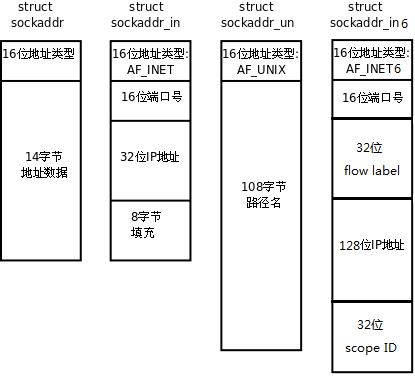
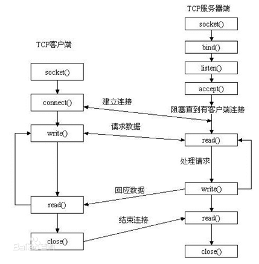
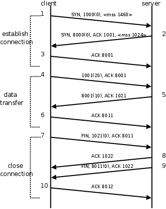
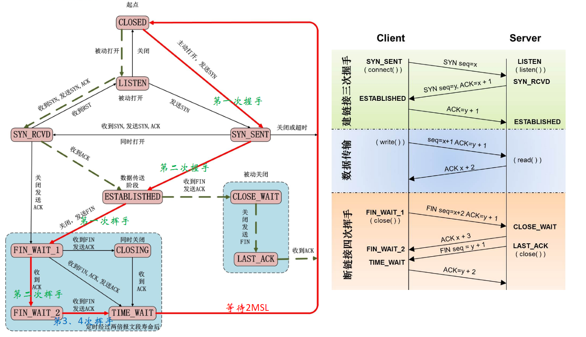
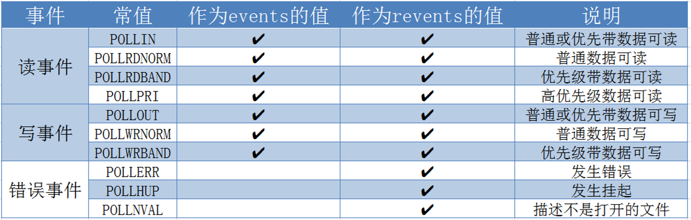

### 网络编程基础

#### 大端-小端

大端和小端实际上是字节顺序与存储地址顺序相对应的两种模式，但是不管是大端还是小端，**数据一定是从内存的低地址依次向高地址读取和写入**。

比如向内存地址为0X1000的地址写入0X12345678这个四字节16进制数

对于大端模式，即低地址存放高字节数：

| 存放数据 | 0x12   | 0x34   | 0x56   | 0x78   |
| -------- | ------ | ------ | ------ | ------ |
| 内存地址 | 0x1000 | 0x1001 | 0x1002 | 0x1003 |

对于小端存储，即低地址存储低字节数：

| 存放数据 | 0x78   | 0x56   | 0x34   | 0x12   |
| -------- | ------ | ------ | ------ | ------ |
| 内存地址 | 0x1000 | 0x1001 | 0x1002 | 0x1003 |

```c
// 判断大端还是小端
#include <stdio.h>

char isBigEndian(){
    int a = 0x12345678;
    char *b = (char*)&a;
    for(int i = 0; i < 4; i++){
        printf("%04x\n", *b);
        b++;
    }
}

int main(void) {
    isBigEndian();
    return 0;
}
```

#### 网络字节序

我们已经知道，内存中的多字节数据相对于内存地址有大端和小端之分，磁盘文件中的多字节数据相对于文件中的偏移地址也有大端小端之分。网络数据流同样有大端小端之分，那么如何定义网络数据流的地址呢？发送主机通常将发送缓冲区中的数据按内存地址从低到高的顺序发出，接收主机把从网络上接到的字节依次保存在接收缓冲区中，也是按内存地址从低到高的顺序保存，因此，网络数据流的地址应这样规定：先发出的数据是低地址，后发出的数据是高地址。

TCP/IP协议规定，网络数据流应采用**大端字节序**，即低地址高字节。例如上一节的UDP段格式，地址0-1是16位的源端口号，如果这个端口号是1000（0x03e8），则地址0是0x03，地址1是0xe8，也就是先发0x03，再发0xe8，这16位在发送主机的缓冲区中也应该是低地址存0x03，高地址存0xe8。但是，如果发送主机是小端字节序的，这16位被解释成0xe803，而不是0x03e8。因此，发送主机把0xe803填到发送缓冲区之前需要做字节序的转换。同样地，接收主机如果是小端字节序的，接到16位的源端口号也要做字节序的转换。如果主机是大端字节序的，发送和接收都不需要做转换。同理，32位的IP地址也要考虑网络字节序和主机字节序的问题。

为使网络程序具有可移植性，使同样的C代码在大端和小端计算机上编译后都能正常运行，可以调用以下库函数做**网络字节序和主机字节序**的转换。

```c
#include <arpa/inet.h>

/**
  * @brief  主机字节序和网络字节序之间的转换，h---host, n---netword, l---32, s---16
  * @param  hostlong 需要转换的字节序
  * @retval 转换后的字节序
  */
uint32_t htonl(uint32_t hostlong);
uint16_t htons(uint16_t hostshort);
uint32_t ntohl(uint32_t netlong);
uint16_t ntohs(uint16_t netshort);
```

#### IP地址转换函数

```c
#include <arpa/inet.h>

/**
  * @brief  将IPv4和IPv6地址从文本形式转换为二进制形式
  * @param  af		选择转换的IP协议，可选值如下
  					AF_INET		IPv4
  					AF_INET6	IPv6
  * @param  src		IP地址的文本形式
  					IPv4(32)	ddd.ddd.ddd.ddd, eg. 127.0.0.1
  					IPv6(128)	x:x:x:x:x:x:x:x, eg. FFFF:FFFF::FFFF
  * @param  dst		IP地址的二进制形式存放位置， sockaddr结构
  * @retval 成功返回1。如果src不是指定IP协议中有效网络地址，则返回0。如果af选值错误，则返回-1，并设置errno
  */
int inet_pton(int af, const char *src, void *dst);

/**
  * @brief  将IPv4和IPv6地址从二进制形式转换为文本形式
  * @param  af		选择转换的IP协议，可选值如下
  					AF_INET		IPv4
  					AF_INET6	IPv6
  * @param  src		IP地址的网络地址结构， sockaddr结构
  * @param  dst		IP地址的文本形式存放缓冲区
  * @param  size	缓冲区dst的长度
  * @retval 成功返回指向dst的非空指针。出错则返回NULL，并设置errno
  */
const char *inet_ntop(int af, const void *src, char *dst, socklen_t size);
```

#### sockaddr数据结构

strcut sockaddr 很多网络编程函数诞生早于IPv4协议，那时候都使用的是sockaddr结构体。为了向前兼容IPv6，现在sockaddr退化成了（void *）的作用，传递一个地址给函数，至于这个函数是sockaddr_in还是sockaddr_in6，由地址族确定，然后函数内部再强制类型转化为所需的地址类型



```c
// IPv4
struct sockaddr_in {
  __kernel_sa_family_t  sin_family; /* Address family       */
  __be16        sin_port;   /* Port number          */
  struct in_addr    sin_addr;   /* Internet address     */

  /* Pad to size of `struct sockaddr'. */
  unsigned char     __pad[__SOCK_SIZE__ - sizeof(short int) -
            sizeof(unsigned short int) - sizeof(struct in_addr)];
};

struct in_addr {						/* Internet address. */
	__be32 s_addr;
};
```

```c
// IPv6
struct sockaddr_in6 {
	unsigned short int sin6_family; 		/* AF_INET6 */
	__be16 sin6_port; 					/* Transport layer port # */
	__be32 sin6_flowinfo; 				/* IPv6 flow information */
	struct in6_addr sin6_addr;			/* IPv6 address */
	__u32 sin6_scope_id; 				/* scope id (new in RFC2553) */
};
```

#### socket

socket本身有“插座”的意思，在Linux环境下，用于表示进程间网络通信的特殊文件类型。本质为内核借助缓冲区形成的伪文件。

既然是文件，那么理所当然的，我们可以使用文件描述符引用套接字。与管道类似的，Linux系统将其封装成文件的目的是为了统一接口，使得读写套接字和读写文件的操作一致。区别是管道主要应用于本地进程间通信，而套接字多应用于网络进程间数据的传递。

在TCP/IP协议中，“IP地址+TCP或UDP端口号”唯一标识网络通讯中的一个进程。“IP地址+端口号”就对应一个socket。欲建立连接的两个进程各自有一个socket来标识，那么这两个socket组成的socket pair就唯一标识一个连接。因此可以用socket来描述网络连接的一对一关系。

在网络通信中，套接字一定是成对出现的。一端的发送缓冲区对应对端的接收缓冲区。我们使用同一个文件描述符索发送缓冲区和接收缓冲区。



```c
#include <sys/types.h> /* See NOTES */
#include <sys/socket.h>

/**
  * @brief  socket()打开一个网络通讯端口，如果成功的话，就像open()一样返回一个文件描述符，应用程序可以像读写文件一样用read/write在网络上收发数据
  * @param  domain	选择转换的IP协议，可选值如下
  					AF_INET 这是大多数用来产生socket的协议，使用TCP或UDP来传输，用IPv4的地址
					AF_INET6 与上面类似，不过是来用IPv6的地址
					AF_UNIX 本地协议，使用在Unix和Linux系统上，一般都是当客户端和服务器在同一台及其上的时候使用
  * @param  type	传输协议
  					SOCK_STREAM 这个协议是按照顺序的、可靠的、数据完整的基于字节流的连接。这是一个使用最多的socket类					 型，这个socket是使用TCP来进行传输。
					SOCK_DGRAM 这个协议是无连接的、固定长度的传输调用。该协议是不可靠的，使用UDP来进行它的连接。
					SOCK_SEQPACKET该协议是双线路的、可靠的连接，发送固定长度的数据包进行传输。必须把这个包完整的接受才					能进行读取。
					SOCK_RAW socket类型提供单一的网络访问，这个socket类型使用ICMP公共协议。（ping、traceroute使用					  该协议）
					SOCK_RDM 这个类型是很少使用的，在大部分的操作系统上没有实现，它是提供给数据链路层使用，不保证数据包					  的顺序
  * @param	protocol	传0 表示使用默认协议。
  * @retval 成功：返回指向新创建的socket的文件描述符，失败：返回-1，设置errno
  */
int socket(int domain, int type, int protocol);

/**
  * @brief  将参数sockfd和addr绑定在一起，使sockfd这个用于网络通讯的文件描述符监听addr所描述的地址和端口号
  * @param  sockfd	socket文件描述符
  * @param  addr	构造出IP地址加端口号
  * @param	addrlen	sizeof(addr)长度
  * @retval 成功返回0，失败返回-1, 设置errno
  */
int bind(int sockfd, const struct sockaddr *addr, socklen_t addrlen);

/**
  * @brief  声明sockfd处于监听状态，并且最多允许有backlog个客户端处于连接状态，如果接收到更多的连接请求就忽略。
  * @param  sockfd	socket文件描述符
  * @param  backlog	sockfd的挂起连接队列可以增长到的最大长度
  * @retval 成功返回0，失败返回-1, 设置errno
  */
int listen(int sockfd, int backlog);

/**
  * @brief  阻塞等待client发起三次握手，当3次握手完成的时候，accept解除阻塞，并从全连接队列中取出一个socket，就可以对这个socket连接进行读写操作
  * @param  sockfd	socket文件描述符
  * @param  addr	传出参数，返回链接客户端地址信息，含IP地址和端口号
  * @param  addrlen	传入传出参数（值-结果）,传入sizeof(addr)大小，函数返回时返回真正接收到地址结构体的大小
  * @retval 成功返回一个新的socket文件描述符，用于和客户端通信，失败返回-1，设置errno
  */
int accept(int sockfd, struct sockaddr *addr, socklen_t *addrlen);

/**
  * @brief  建立连接
  * @param  sockfd	socket文件描述符
  * @param  addr	传入参数，指定服务器端地址信息，含IP地址和端口号
  * @param  addrlen	传入参数,传入sizeof(addr)大小
  * @retval 成功返回0，失败返回-1，设置errno
  */
int connect(int sockfd, const struct sockaddr *addr, socklen_t addrlen);
```

### TCP

#### TCP时序图



#### C/S模型-TCP

下图是基于TCP协议的客户端/服务器程序的一般流程：


服务器调用socket()、bind()、listen()完成初始化后，调用accept()阻塞等待，处于监听端口的状态，客户端调用socket()初始化后，调用connect()发出SYN段并阻塞等待服务器应答，服务器应答一个SYN-ACK段，客户端收到后从connect()返回，同时应答一个ACK段，服务器收到后从accept()返回。TCP连接建立成功

建立连接后，TCP协议提供全双工的通信服务，但是一般的客户端/服务器程序的流程是由客户端主动发起请求，服务器被动处理请求，一问一答的方式。因此，服务器从accept()返回后立刻调用read()，读socket就像读管道一样，如果没有数据到达就阻塞等待，这时客户端调用write()发送请求给服务器，服务器收到后从read()返回，对客户端的请求进行处理，在此期间客户端调用read()阻塞等待服务器的应答，服务器调用write()将处理结果发回给客户端，再次调用read()阻塞等待下一条请求，客户端收到后从read()返回，发送下一条请求，如此循环下去。

如果客户端没有更多的请求了，就调用close()关闭连接，就像写端关闭的管道一样，服务器的read()返回0，这样服务器就知道客户端关闭了连接，也调用close()关闭连接。注意，任何一方调用close()后，连接的两个传输方向都关闭，不能再发送数据了。如果一方调用shutdown()则连接处于半关闭状态，仍可接收对方发来的数据。

##### 服务端

```c
// server
#include <stdio.h>
#include <stdlib.h>
#include <unistd.h>
#include <string.h>
#include <sys/socket.h>
#include <netinet/in.h>
#include <arpa/inet.h>
#include <ctype.h>

#define MAXLINE 80
#define SERV_PORT 9999

int main(void) {
    // 创建套接字，IPv4, TCP
    int listenfd = socket(AF_INET, SOCK_STREAM, 0);

    // 设置sockaddr_in
    struct sockaddr_in seraddr;
    bzero(&seraddr, sizeof(seraddr));
    seraddr.sin_family = AF_INET;
    seraddr.sin_addr.s_addr = htonl(INADDR_ANY);
    seraddr.sin_port = htons(SERV_PORT);

    // 绑定本地IP和端口
    bind(listenfd, (struct sockaddr *)&seraddr, sizeof(seraddr));

    // 监听
    listen(listenfd, 20);
    printf("Accepting connetions...\n");

    // 等待客户端连接并处理请求
    struct sockaddr_in cliaddr;
    while(1){
        // 创建客户端套接字
        socklen_t cliaddr_len = sizeof(cliaddr);
        // 等待客户端连接请求并建立连接
        int connfd = accept(listenfd, (struct sockaddr *)&cliaddr, &cliaddr_len);
        printf("TCP connection built...\n");
        char IP_str[80];
        printf("IP:   %s\n", inet_ntop(AF_INET, &cliaddr.sin_addr, IP_str, sizeof(IP_str)));
        printf("Port: %d\n", ntohs(cliaddr.sin_port));

        // 接收数据
        char buf[MAXLINE] = {0};
        int n = 0;
        while((n = read(connfd, buf, MAXLINE)) != 0){
            printf("recv: %s", buf);
            // 处理请求并发送数据
            for(int i = 0; i < n; i++){
                buf[i] = toupper(buf[i]);
            }
            write(connfd, buf, n);
            printf("send: %s", buf);
            printf("\n");
            memset(buf, 0, sizeof(buf));
        }
        printf("client close connection\n");
        printf("IP:   %s\n", inet_ntop(AF_INET, &cliaddr.sin_addr, IP_str, sizeof(IP_str)));
        printf("Port: %d\n", ntohs(cliaddr.sin_port));
        // 断开连接
        close(connfd);
    }
    return 0;
}
```

##### 客户端

```c
// client
#include <stdio.h>
#include <sys/types.h>
#include <sys/stat.h>
#include <stdlib.h>
#include <string.h>
#include <unistd.h>
#include <arpa/inet.h>

#define PORT 9999

int main(void) {
    // 创建套接字
    int fd = socket(AF_INET, SOCK_STREAM, 0);

    // 连接服务端
    struct sockaddr_in serv;
    memset(&serv, 0, sizeof(serv));
    serv.sin_family = AF_INET;
    serv.sin_port = htons(PORT);    
    inet_pton(AF_INET, "127.0.0.1", &serv.sin_addr.s_addr);

    if(connect(fd, (struct sockaddr *)&serv, sizeof(serv)) == -1){
        perror("service not found");
        exit(1);
    }
    printf("connected...\n");
    // 通信
    while(1){
        // 发送数据
        printf("wait input send buf\n");
        char buf[1024] = {0};
        fgets(buf, sizeof(buf), stdin);
        write(fd, buf, strlen(buf));

        // 等待接收数据
        int len = read(fd, buf, sizeof(buf));
        if(len == -1){
            perror("read error");
            exit(1);
        }
        else if(len == 0){
            // 断开连接
            printf("disconnected...\n");
            break;
        }
        printf("recv: %s\n", buf);
    }
    close(fd);
    return 0;
}
```

##### 封装处理函数

```c
// 封装socket函数，添加错误处理
#include <stdlib.h>
#include <stdio.h>
#include <unistd.h>
#include <errno.h>
#include <sys/socket.h>

void perr_exit(const char *s){
    perror(s);
    exit(-1);
}

int Accept(int fd, struct sockaddr *sa, socklen_t *salenptr){
    int n;
again:
    if ((n = accept(fd, sa, salenptr)) < 0) {
        //ECONNABORTED 发生在重传（一定次数）失败后，强制关闭套接字
        //EINTR 进程被信号中断
        if ((errno == ECONNABORTED) || (errno == EINTR)){
            goto again;
        }
        else{
            perr_exit("accept error");
        }
    }
    return n;
}

int Bind(int fd, const struct sockaddr *sa, socklen_t salen){
    int n;
    if ((n = bind(fd, sa, salen)) < 0){
        perr_exit("bind error");
    }
    return n;
}

int Connect(int fd, const struct sockaddr *sa, socklen_t salen){
    int n;
    n = connect(fd, sa, salen);
    if (n < 0) {
        perr_exit("connect error");
    }
    return n;
}

int Listen(int fd, int backlog){
    int n;
    if ((n = listen(fd, backlog)) < 0){
        perr_exit("listen error");
    }
    return n;
}

int Socket(int family, int type, int protocol){
    int n;
    if ((n = socket(family, type, protocol)) < 0){
        perr_exit("socket error");
    }
    return n;
}

ssize_t Read(int fd, void *ptr, size_t nbytes){
    ssize_t n;
again:
    if ((n = read(fd, ptr, nbytes)) == -1) {
        if (errno == EINTR)
            goto again;
        else
            return -1;
    }
    return n;
}

ssize_t Write(int fd, const void *ptr, size_t nbytes){
    ssize_t n;
again:
    if ((n = write(fd, ptr, nbytes)) == -1) {
        if (errno == EINTR)
            goto again;
        else
            return -1;
    }
    return n;
}

int Close(int fd){
    int n;
    if ((n = close(fd)) == -1)
        perr_exit("close error");
    return n;
}

/*参三: 应该读取的字节数*/                          
// socket 4096  readn(cfd, buf, 4096)
ssize_t Readn(int fd, void *vptr, size_t n){
    size_t  nleft;              // usigned int 剩余未读取的字节数
    ssize_t nread;              // int 实际读到的字节数
    char   *ptr;
    
    ptr = vptr;					// ptr指向缓冲区
    nleft = n;                  // n 未读取字节数
    while (nleft > 0) {
        if ((nread = read(fd, ptr, nleft)) < 0) {
            if (errno == EINTR){
                nread = 0;
            }
            else{
                return -1;
            }
        } 
        else if (nread == 0){
            // 读取到文件尾部
            break;
        }
        nleft -= nread;   	// nleft = nleft - nread 
        ptr += nread;		// 指针指向未读到的地区
    }
    return n - nleft;
}

ssize_t Writen(int fd, const void *vptr, size_t n){
    size_t nleft;
    ssize_t nwritten;
    const char *ptr;

    ptr = vptr;
    nleft = n;
    while (nleft > 0) {
        if ( (nwritten = write(fd, ptr, nleft)) <= 0) {
            if (nwritten < 0 && errno == EINTR)
                nwritten = 0;
            else
                return -1;
        }
        nleft -= nwritten;
        ptr += nwritten;
    }
    return n;
}

// 每次从文件里读100个字节
static ssize_t my_read(int fd, char *ptr){
    static int read_cnt;
    static char *read_ptr;
    static char read_buf[100];

    if (read_cnt <= 0) {
again:
        // "hello\n"
        if ( (read_cnt = read(fd, read_buf, sizeof(read_buf))) < 0) {
            if (errno == EINTR)
                goto again;
            return -1;
        } 
        else if (read_cnt == 0)
            return 0;
        read_ptr = read_buf;
    }
    read_cnt--;
    *ptr = *read_ptr++;
    return 1;
}

/*readline --- fgets*/    
//传出参数 vptr
ssize_t Readline(int fd, void *vptr, size_t maxlen){
    ssize_t n, rc;
    char c, *ptr;
    ptr = vptr;
    for (n = 1; n < maxlen; n++) {
        //ptr[] = hello\n
        if ((rc = my_read(fd, &c)) == 1){
            *ptr++ = c;
            if (c == '\n')
                break;
        } 
        else if (rc == 0) {
            *ptr = 0;
            return n-1;
        } 
        else
            return -1;
    }
    *ptr = 0;
    return n;
}
```

##### 多进程服务端

```c
// 多进程服务端
#include <stdio.h>
#include <stdlib.h>
#include <unistd.h>
#include <string.h>
#include <sys/socket.h>
#include <netinet/in.h>
#include <arpa/inet.h>
#include <ctype.h>
#include <errno.h>
#include <signal.h>
#include <sys/wait.h>

#define MAXLINE 1024
#define SERV_PORT 9999

// 回收函数
void recycle(int num){
    pid_t pid;
    while((pid = waitpid(-1, NULL, WNOHANG)) > 0){
        printf("pid dead %d\n", pid);
    }
}

int main(void) {
    // 创建套接字，IPv4, TCP
    int listenfd = socket(AF_INET, SOCK_STREAM, 0);

    // 设置sockaddr_in
    struct sockaddr_in seraddr;
    bzero(&seraddr, sizeof(seraddr));
    seraddr.sin_family = AF_INET;
    seraddr.sin_addr.s_addr = htonl(INADDR_ANY);
    seraddr.sin_port = htons(SERV_PORT);

    // 绑定本地IP和端口
    bind(listenfd, (struct sockaddr *)&seraddr, sizeof(seraddr));
    
    // 监听
    listen(listenfd, 20);
    printf("Accepting connetions...\n");

    // 使用信号回收子进程
    struct sigaction act;
    act.sa_handler = recycle;
    act.sa_flags = 0;
    sigemptyset(&act.sa_mask);
    sigaction(SIGCHLD, &act, NULL);

    // 创建客户端套接字
    struct sockaddr_in cliaddr;
    socklen_t cliaddr_len = sizeof(cliaddr);

    // 等待客户端连接并处理请求
    while(1){
        // 等待客户端连接请求并建立连接
        // accept阻塞的时候被信号中断，处理信号后不再阻塞，返回-1，且errno=EINTR
        int connfd = accept(listenfd, (struct sockaddr *)&cliaddr, &cliaddr_len);
        if(connfd == -1){
            // 这个一定要加上，要不然在处理信号时候，accept 不阻塞，一直往下面执行
            if(errno == EINTR) continue;	
            perror("accept error");
            exit(1);
        }
        
        // 创建子进程
        pid_t pid = fork();
        if(pid == 0){
            // 子进程
            // 关闭无用的listenfd
            close(listenfd);
            // 打印通信的子进程信息
            printf("TCP connection built...\n");
            char IP_str[80];
            printf("IP:   %s ", inet_ntop(AF_INET, &cliaddr.sin_addr, IP_str, sizeof(IP_str)));
            printf("Port: %d\n", ntohs(cliaddr.sin_port));
            // 接收数据
            char buf[MAXLINE] = {0};
            int len = 0;
            while((len = read(connfd, buf, MAXLINE)) != 0){
                if(len == -1){
                    perror("read error");
                    exit(1);
                }
                printf("recv: %s", buf);
                // 处理请求并发送数据
                for(int i = 0; i < len; i++){
                    buf[i] = toupper(buf[i]);
                }
                write(connfd, buf, len);
                printf("send: %s", buf);
                printf("\n");
                memset(buf, 0, sizeof(buf));
            }
            printf("client close connection\n");
            printf("IP:   %s ", inet_ntop(AF_INET, &cliaddr.sin_addr, IP_str, sizeof(IP_str)));
            printf("Port: %d\n", ntohs(cliaddr.sin_port));
            // 断开连接，退出子进程
            close(connfd);
            return 0;
        }
        else if(pid > 0){
            // 父进程
            // 关闭无用的connfd
            close(connfd);
        }

    }
    close(listenfd);
    return 0;
}
```

##### 多线程服务端

```c
// 多线程服务端
#include <stdio.h>
#include <pthread.h>
#include <stdlib.h>
#include <unistd.h>
#include <string.h>
#include <sys/socket.h>
#include <netinet/in.h>
#include <arpa/inet.h>
#include <ctype.h>
#include <errno.h>
#include <signal.h>
#include <sys/wait.h>

#define MAXLINE 1024
#define SERV_PORT 9999

struct SockInfo{
    int fd;
    struct sockaddr_in addr;
    socklen_t addr_len;
};

// 子线程工作函数
void *worker(void *arg){
    struct SockInfo *sock = (struct SockInfo *)arg;
    // 打印通信的子进程信息
    printf("TCP connection built...\n");
    char IP_str[80];
    printf("IP:   %s ", inet_ntop(AF_INET, &sock->addr.sin_addr, IP_str, sizeof(IP_str)));
    printf("Port: %d\n", ntohs(sock->addr.sin_port));
    // 接收数据
    char buf[MAXLINE] = {0};
    int len = 0;
    while((len = read(sock->fd, buf, MAXLINE)) != 0){
        if(len == -1){
            perror("read error");
            exit(1);
        }
        printf("recv: %s", buf);
        // 处理请求并发送数据
        for(int i = 0; i < len; i++){
            buf[i] = toupper(buf[i]);
        }
        write(sock->fd, buf, len);
        printf("send: %s", buf);
        printf("\n");
        memset(buf, 0, sizeof(buf));
    }
    printf("client close connection\n");
    printf("IP:   %s ", inet_ntop(AF_INET, &sock->addr.sin_addr, IP_str, sizeof(IP_str)));
    printf("Port: %d\n", ntohs(sock->addr.sin_port));
    // 断开连接，退出子进程
    close(sock->fd);
    free(sock);
    return 0;
}

int main(void) {
    // 创建套接字，IPv4, TCP
    int listenfd = socket(AF_INET, SOCK_STREAM, 0);

    // 设置sockaddr_in
    struct sockaddr_in seraddr;
    bzero(&seraddr, sizeof(seraddr));
    seraddr.sin_family = AF_INET;
    seraddr.sin_addr.s_addr = htonl(INADDR_ANY);
    seraddr.sin_port = htons(SERV_PORT);

    // 绑定本地IP和端口
    bind(listenfd, (struct sockaddr *)&seraddr, sizeof(seraddr));
    
    // 监听
    listen(listenfd, 20);
    printf("Accepting connetions...\n");

    // 创建客户端套接字
    struct sockaddr_in cliaddr;
    socklen_t cliaddr_len = sizeof(cliaddr);

    // 等待客户端连接并处理请求
    struct SockInfo *sock;
    struct sockaddr_in addr;
    socklen_t addr_len = sizeof(addr);
    while(1){
        sock = malloc(sizeof(struct SockInfo));
        // 等待客户端连接请求并建立连接
        sock->fd = accept(listenfd, (struct sockaddr *)&addr, &addr_len);
        sock->addr = addr;
        sock->addr_len = addr_len;
        if(sock->fd == -1){
            if(errno == EINTR){
                free(sock);
                continue;
            } 
            perror("accept error");
            exit(1);
        }
        // 创建子线程，分离线程
        pthread_t tid;
        pthread_create(&tid, NULL, worker, sock);
        pthread_detach(tid);
        
    }
    close(listenfd);
    return 0;
}
```

#### TCP状态转换



当一方处于TIME_WAIT状态时，假设是客户端，需要等待2MSL时长才能关闭，理由是服务端需要接收到客户端发来的ACK，才能从LAST_ACK状态转为CLOSED状态，但ACK可能丢失。如果客户端已经关闭，就无法再次接收到服务端发送的FIN请求了，导致服务端无法关闭。因此，MSL为报文段被丢弃前在网络的最长时间，保证服务端重发FIN请求时客户端仍未关闭，一般设置为30s。

#### 半关闭

假设A给B发送了FIN，但B没有给A发送FIN，即A断开了与B的连接，但B没有断开与A的连接，则TCP连接处于半关闭状态。

此时A不能给B发送数据，但A可以接收B发送的数据。B可以给A发送数据

可以用close函数实现，只要只有一方调用close函数即可，但一般用shutdown函数实现半关闭

```c
#include <sys/socket.h>

/**
  * @brief  半关闭
  * @param  sockfd 	需要断开的套接字文件描述符
  * @param  how 	需要断开的传输方式，可选值如下
  					SHUT_RD		断开输入流
  					SHUT_WR		断开输出流
  					SHUT_RDWR	同时断开I/O流
  * @retval 成功返回0，失败返回-1
  */
int shutdown(int sockfd, int how);
```

#### 查看网络相关状态信息

```bash
# 查看端口使用情况
netstat [-option]

-t	显示TCP传输协议的连线状况
-u	显示UDP传输协议的连线状况
-l	显示监听中的服务器的Socket
-n	直接使用IP地址，而不通过域名服务器
-p	显示正在使用Socket的进程ID和程序名称
-a	显示所有选项，默认是不显示处于监听状态的进程
```

```bash
# 连接本地端口9999
nc 127.1 9999
```

#### 端口复用

服务端直接退出程序，处于TIME_WAIT状态，端口没有被释放。此时立刻重启服务端也不能绑定原先端口，该端口依旧处于TIME_WAIT状态，使得客户端无法连接服务端。为了防止这种情况出现，可以使用端口复用，端口复用允许在一个应用程序可以把 n 个套接字绑在一个端口上而不出错

```c
#include <sys/types.h>
#include <sys/socket.h>

/**
  * @brief  获取或设置套接字选项，需要在绑定之前设置
  * @param  sockfd 	套接字文件描述符
  * @param  level	套接字选项的级别
  * @param  optname	选项
  * @param  optval	get中存放获取的选项值，set中是选项待设定的新值
  * @param  optlen	optval的大小
  * @retval 成功返回0，失败返回-1
  */
int getsockopt(int sockfd, int level, int optname,
               void *optval, socklen_t *optlen);
int setsockopt(int sockfd, int level, int optname,
               const void *optval, socklen_t optlen);
```

```c
// 设置端口复用
int opt = 1;
setsockopt(listenfd, SOL_SOCKET, SO_REUSEADDR, &opt, sizeof(opt));
// 绑定本地IP和端口
int ret = bind(listenfd, (struct sockaddr *)&seraddr, sizeof(seraddr));
if(ret == -1){
    perror("bind error");
    exit(1);
}
```

### IO多路复用

IO多路复用是一种在单个线程中管理多个输入/输出通道的技术。它允许一个线程同时监听多个输入流（例如网络套接字、文件描述符等），并在有数据可读或可写时进行相应的处理，而不需要为每个通道创建一个独立的线程

先构造一张有关文件描述符的列表, 将要监听的文件描述符添加到该表中。然后调用一个函数,监听该表中的文件描述符,直到这些描述符表中的一个进行I/O操作时，该函数才返回。该函数为阻塞函数，对文件描述符的检测操作是由内核完成的

#### select

在select这种I/O多路复用机制下，我们需要把想监控的文件描述集合通过函数参数的形式告诉select，然后select会将这些文件描述符集合拷贝到内核中，我们知道数据拷贝是有性能损耗的，因此为了减少这种数据拷贝带来的性能损耗，Linux内核对集合的大小做了限制，并规定用户监控的文件描述集合不能超过1024个，同时当select返回后我们仅仅能知道有些文件描述符可以读写了，但是我们不知道是哪一个，因此程序员必须再遍历一遍，找到具体是哪个文件描述符可以读写了。

缺点：

- 每次调用select，都需要把fd集合从用户态拷贝到内核态，这个开销在fd很多时会很大
- 同时每次调用select都需要在内核遍历传递进来的所有fd，这个开销在fd很多时也很大
- select支持的文件描述符数量太小了，默认是1024

```c
#include <sys/select.h>

/**
  * @brief  允许程序监控多个文件描述符，等待一个或多个文件描述符变得“就绪”以进行某类 I/O 操作
  * @param  nfds 		集合中所有文件描述符的范围，即所有文件描述符的最大值加1，最大可设1024
  * @param  readfds		读集合，监视这些文件描述符的读变化，为传入传出参数。传出时监控的文件描述符发生变化置为1，否则为0
  * @param  writefds	写集合
  * @param  exceptfds	异常集合
  * @param  timeout		超时时间，可选值如下
						NULL	设置为阻塞状态，直到某个集合中文件描述符发生变化
						timeout->tv_sec == 0 and timeout->tv_usec == 0，非阻塞模式，立刻返回结果
						timeout->tv_sec != 0 or timeout->tv_usec != 0，限时等待
  * @retval 成功返回三个文件描述符集合中就绪状态的个数，失败返回-1，设置errno
  */
int select(int nfds, fd_set *readfds, fd_set *writefds,
           fd_set *exceptfds, struct timeval *timeout);


// fd_set内核代码，可以将fd_set理解为位图，可以监控的文件描述符个数最大为1024个
#define __FDSET_LONGS	(__FD_SETSIZE / __NFDBITS)
#define __FD_SETSIZE	1024
#define __NFDBITS		(8 * sizeof(unsigned long))
typedef __kernel_fd_set	fd_set;
typedef struct{
    unsigned long fds_bits[__FDSET_LONGS];
} __kernel_fd_set;


// 清空集合，即全部置0
void FD_ZERO(fd_set *set);
// 从集合中删除某一项，即置对应位图为0
void FD_CLR(int fd, fd_set *set);
// 将文件描述符添加到集合，即置对应位图为1
void FD_SET(int fd, fd_set *set);
// 判断集合中对应描述符状态，即获取对应位图数据，为1则被添加到集合
int  FD_ISSET(int fd, fd_set *set);


// timeval结构体
struct timeval {
    time_t      tv_sec;         /* seconds */
    suseconds_t tv_usec;        /* microseconds */
};
```

```c
// select工作流程
// 假设客户端A,B,C,D,E, F连接到服务器，分别对应文件描述符 3, 4,100,101,102,103
// 因为select返回时修改读集合，设置临时变量temp保存读集合
fd_set reads, temp;
// 依次将客户端的socket添加到读集合
FD_SET(3, &reads);
// 文件描述符最大为103，只监控读集合，设置为阻塞模式
// 假设ABC发送数据，内核会拿到读集合表，当内核完成检测，会修改对应的表，即3，4，100会被置为1，其他为0，再写回用户空间，覆盖读集合表，该步骤由内核完成，然后用户使用FD_ISSET可以判断哪些文件描述符是可读状态
select(103 + 1, &reads, NULL, NULL, NULL);
```

```c
// select多路转接实现服务端
#include <stdio.h>
#include <stdlib.h>
#include <unistd.h>
#include <string.h>
#include <sys/socket.h>
#include <netinet/in.h>
#include <arpa/inet.h>
#include <ctype.h>
#include <errno.h>
#include <sys/select.h>

#define MAXLINE 1024
#define SERV_PORT 9999


int main(void) {
    // 创建套接字，IPv4, TCP
    int listenfd = socket(AF_INET, SOCK_STREAM, 0);
    // 设置sockaddr_in
    struct sockaddr_in seraddr;
    bzero(&seraddr, sizeof(seraddr));
    seraddr.sin_family = AF_INET;
    seraddr.sin_addr.s_addr = htonl(INADDR_ANY);
    seraddr.sin_port = htons(SERV_PORT);
    // 绑定本地IP和端口
    int ret = bind(listenfd, (struct sockaddr *)&seraddr, sizeof(seraddr));
    if(ret == -1){
        perror("bind error");
        exit(1);
    }
    // 监听
    listen(listenfd, 20);
    printf("Accepting connetions...\n");
    // 创建文件描述符集合
    fd_set reads, temp;
    // 初始化
    FD_ZERO(&reads);
    // 将监听的listenfd加入到读集合
    FD_SET(listenfd, &reads);
    // 设置文件描述符的最大值
    int maxfd = listenfd;
    // 客户端
    struct sockaddr_in client_addr;
    socklen_t client_len = sizeof(client_addr);
    while(1){
        // 委托内核检测
        temp = reads;
        int ret = select(maxfd + 1, &temp, NULL, NULL, NULL);
        if(ret == -1){
            perror("select error");
            exit(1);
        }
        // 客户端发起新连接
        if(FD_ISSET(listenfd, &temp)){
            // 接受新连接
            int connectfd = accept(listenfd, (struct sockaddr*)&client_addr, &client_len);
            if(connectfd == -1){
                perror("accept error");
                exit(1);
            }
            char ip[64];
            printf("new client IP: %s, Port: %d\n", inet_ntop(AF_INET, &client_addr.sin_addr.s_addr, ip, sizeof(ip)),ntohs(client_addr.sin_port));
            // 将connectfd加入到待检测的读集合
            FD_SET(connectfd, &reads);
            // 更新最大的文件描述符
            maxfd = connectfd > maxfd ? connectfd : maxfd;
        }
        // 已经建立连接的客户端发送数据
        for(int i = 0; i <= maxfd; i++){
            if(i == listenfd) continue;
            if(FD_ISSET(i, &temp)){
                char buf[1024] = {0};
                int len = recv(i, buf, sizeof(buf), 0);
                if(len == -1){
                    perror("recv error");
                    exit(1);
                }
                else if(len == 0){
                    printf("客户端断开连接\n");
                    close(i);
                    FD_CLR(i, &reads);
                }
                else{
                    printf("recv buf: %s\n", buf);
                    send(i, buf, strlen(buf) + 1, 0);
                }
            }
        }
    }
    close(listenfd);
    return 0;
}
```

#### poll

相对于select，主要是优化了fd_set的结构，不再用bit数组，而是pollfd数组，最大文件描述符个数不受1024的限制

```c
#include <poll.h>

/**
  * @brief  允许程序监控多个文件描述符，等待一个或多个文件描述符变得“就绪”以进行某类 I/O 操作
  * @param  fds 		pollfd数组的地址
  * @param  nfds		数组的最大长度, 数组中最后一个使用的元素下标+1，内核轮询fds数组的每个元素，直到nfds
  * @param  timeout		超时时间，可选值如下
						-1	设置为阻塞状态，直到某个集合中文件描述符发生变化
						0	非阻塞模式，立刻返回结果
						>0	等待的时长毫秒
  * @retval 成功返回IO发生变化的文件描述符的个数，失败返回-1，设置errno
  */
int poll(struct pollfd *fds, nfds_t nfds, int timeout);

struct pollfd {
    int   fd;         /* 文件描述符 */
    short events;     /* 等待的事件 */
    short revents;    /* 实际发生的事件 */
}
```



```c
// polld
#include <stdio.h>
#include <unistd.h>
#include <stdlib.h>
#include <sys/types.h>
#include <string.h>
#include <sys/socket.h>
#include <arpa/inet.h>
#include <ctype.h>
#include <poll.h>

#define SERV_PORT 8989

int main(int argc, const char* argv[])
{
    int lfd, cfd;
    struct sockaddr_in serv_addr, clien_addr;
    int serv_len, clien_len;
    // 创建套接字
    lfd = socket(AF_INET, SOCK_STREAM, 0);
    // 初始化服务器 sockaddr_in 
    memset(&serv_addr, 0, sizeof(serv_addr));
    serv_addr.sin_family = AF_INET;                   // 地址族 
    serv_addr.sin_addr.s_addr = htonl(INADDR_ANY);    // 监听本机所有的IP
    serv_addr.sin_port = htons(SERV_PORT);            // 设置端口 
    serv_len = sizeof(serv_addr);
    // 绑定IP和端口
    bind(lfd, (struct sockaddr*)&serv_addr, serv_len);
    // 设置同时监听的最大个数
    listen(lfd, 36);
    printf("Start accept ......\n");
    // poll结构体
    struct pollfd allfd[1024];
    int max_index = 0;
    // init
    for(int i=0; i<1024; ++i)
    {
        allfd[i].fd = -1;
    }
    allfd[0].fd = lfd;
	allfd[0].events = POLLIN;
    while(1)
    {
        int i = 0;
        int ret = poll(allfd, max_index+1, -1); 
        if(ret == -1)
        {
            perror("poll error");
            exit(1);
        }
        // 判断是否有连接请求
        if(allfd[0].revents & POLLIN)
        {
            clien_len = sizeof(clien_addr);
            // 接受连接请求
            int cfd = accept(lfd, (struct sockaddr*)&clien_addr, &clien_len);
            printf("============\n");

            // cfd添加到ｐｏｌｌ数组
            for(i=0; i<1024; ++i)
            {
                if(allfd[i].fd == -1)
                {
                    allfd[i].fd = cfd;
                    allfd[i].events = POLLIN;
                    break;
                }
            }
            // 更新最后一个元素的下标
            max_index = max_index < i ? i : max_index;
        }
        // 遍历数组
        for(i=1; i<=max_index; ++i)
        {
            int fd = allfd[i].fd;
            if(fd == -1)
            {
                continue;
            }
            if(allfd[i].revents & POLLIN)
            {
                // 接受数据
                char buf[1024] = {0};
                int len = recv(fd, buf, sizeof(buf), 0);
                if(len == -1)
                {
                    perror("recv error");
                    exit(1);
                }
                else if(len == 0)
                {
                    allfd[i].fd = -1;
                    close(fd);
                    printf("客户端已经主动断开连接。。。\n");
                }
                else
                {
                    printf("recv buf = %s\n", buf);
                    for(int k=0; k<len; ++k)
                    {
                        buf[k] = toupper(buf[k]);
                    }
                    printf("buf toupper: %s\n", buf);
                    send(fd, buf, strlen(buf)+1, 0);
                }

            }

        }
    }
    close(lfd);
    return 0;
}
```

#### epoll

相比于select，epoll最大的好处在于它不会随着监听fd数目的增长而降低效率。因为在内核中的select实现中，它是采用轮询来处理的，轮询的fd数目越多，自然耗时越多。epoll底层是用红黑树实现的。

```c
#include <sys/epoll.h>

/**
  * @brief  创建epoll实例
  * @param  size 	监听的数目，大于 0 即可，如果后续监听数目过大会自动扩容
  * @retval 成功返回一个文件描述符，该文件描述符指向新创建的 epoll 实例，这个文件描述符用于所有后续对 epoll 接口的调用。失败返回-1，设置errno
  */
int epoll_create(int size);


/**
  * @brief  事件控制函数，向epoll对象中注册、修改或者删除需要监听的事件
  * @param  epfd 	epoll_create()的返回值
  * @param  op		操作，可选值如下
					EPOLL_CTL_ADD	注册
					EPOLL_CTL_MOD	修改
					EPOLL_CTL_DEL	删除
  * @param  fd 		需要监听的fd
  * @param  event 	需要监听的事件
  * @retval 成功返回0，失败返回-1，设置errno
  */
int epoll_ctl(int epfd, int op, int fd, struct epoll_event *event);


typedef union epoll_data {
    void *ptr;      // 通用指针
    int fd;         // 文件描述符，一般赋值这个即可，需要监听的fd
    uint32_t u32;   // 无符号32位整数
    uint64_t u64;   // 无符号64位整数
} epoll_data_t;

struct epoll_event {
    uint32_t events;     // epoll事件，位掩码，常用参数为：EPOLLIN-读，EPOLLOUT-写，EPOLLERR-异常
    epoll_data_t data;    // 用户数据变量
};


/**
  * @brief  等待IO事件发生
  * @param  epfd 		要检测的句柄，epoll_create()的返回值
  * @param  events		回传待处理事件的数组
  * @param  maxevents 	events的大小
  * @param  timeout		超时时间，可选值如下
						-1	设置为阻塞状态，直到某个文件描述符发生变化
						0	非阻塞模式，立刻返回结果
						>0	等待的时长毫秒
  * @retval 成功返回IO发生变化的文件描述符的个数，失败返回-1，设置errno
  */
int epoll_wait(int epfd, struct epoll_event *events, int maxevents, int timeout);
```

##### epoll流程

```c
int main()
{
	// 创建监听的套接字
	int lfd = socket();
	// 绑定
	bind();
	// 监听
	listen();
	
	// epoll树根节点
	int epfd = epoll_create(3000);
	// 存储发送变化的fd对应信息
	struct epoll_event all[3000];
	// init
	// 监听的lfd挂到epoll树上
	struct epoll_event ev;
	// 在ev中init lfd信息
	ev.events = EPOLLIN ;
	ev.data.fd = lfd;
	epoll_ctl(epfd, EPOLL_CTL_ADD, lfd, &ev);
	while(1)
	{
		// 委托内核检测事件
		int ret = epoll_wait(epfd, all, 3000, -1);
		// 根据ret遍历all数组
		for(int i=0; i<ret; ++i)
		{
			int fd = all[i].data.fd;
			// 有新的连接
			if( fd == lfd)
			{
				// 接收连接请求 - accept不阻塞
				int cfd = accept();
				// cfd上树
				ev.events = EPOLLIN;
				ev.data.fd = cfd;
				epoll_ctl(epfd, EPOLL_CTL_ADD, cfd, &ev);
			}
			// 已经连接的客户端有数据发送过来
			else
			{
				// 只处理客户端发来的数据
				if(!all[i].events & EPOLLIN)
				{
					continue;
				}
				// 读数据
				int len = recv();
				if(len == 0)
				{
					// 检测的fd从树上删除
					epoll_ctl(epfd, EPOLL_CTL_DEL, fd, NULL);
					close(fd);
				}
				// 写数据
				send();
			}
		}
	}
}
```

##### 代码实现

```c
#include <stdio.h>
#include <unistd.h>
#include <stdlib.h>
#include <sys/types.h>
#include <string.h>
#include <sys/socket.h>
#include <arpa/inet.h>
#include <ctype.h>
#include <sys/epoll.h>


int main(int argc, const char* argv[])
{
    if(argc < 2)
    {
        printf("eg: ./a.out port\n");
        exit(1);
    }
    struct sockaddr_in serv_addr;
    socklen_t serv_len = sizeof(serv_addr);
    int port = atoi(argv[1]);

    // 创建套接字
    int lfd = socket(AF_INET, SOCK_STREAM, 0);
    // 初始化服务器 sockaddr_in 
    memset(&serv_addr, 0, serv_len);
    serv_addr.sin_family = AF_INET;                   // 地址族 
    serv_addr.sin_addr.s_addr = htonl(INADDR_ANY);    // 监听本机所有的IP
    serv_addr.sin_port = htons(port);            // 设置端口 
    // 绑定IP和端口
    bind(lfd, (struct sockaddr*)&serv_addr, serv_len);

    // 设置同时监听的最大个数
    listen(lfd, 36);
    printf("Start accept ......\n");

    struct sockaddr_in client_addr;
    socklen_t cli_len = sizeof(client_addr);

    // 创建epoll树根节点
    int epfd = epoll_create(2000);
    // 初始化epoll树
    struct epoll_event ev;
    ev.events = EPOLLIN;
    ev.data.fd = lfd;
    epoll_ctl(epfd, EPOLL_CTL_ADD, lfd, &ev);

    struct epoll_event all[2000];
    while(1)
    {
        // 使用epoll通知内核fd 文件IO检测
        int ret = epoll_wait(epfd, all, sizeof(all)/sizeof(all[0]), -1);

        // 遍历all数组中的前ret个元素
        for(int i=0; i<ret; ++i)
        {
            int fd = all[i].data.fd;
            // 判断是否有新连接
            if(fd == lfd)
            {
                // 接受连接请求
                int cfd = accept(lfd, (struct sockaddr*)&client_addr, &cli_len);
                if(cfd == -1)
                {
                    perror("accept error");
                    exit(1);
                }
                // 将新得到的cfd挂到树上
                struct epoll_event temp;
                temp.events = EPOLLIN;
                temp.data.fd = cfd;
                epoll_ctl(epfd, EPOLL_CTL_ADD, cfd, &temp);
                
                // 打印客户端信息
                char ip[64] = {0};
                printf("New Client IP: %s, Port: %d\n",
                    inet_ntop(AF_INET, &client_addr.sin_addr.s_addr, ip, sizeof(ip)),
                    ntohs(client_addr.sin_port));
                
            }
            else
            {
                // 处理已经连接的客户端发送过来的数据
                if(!all[i].events & EPOLLIN) 
                {
                    continue;
                }

                // 读数据
                char buf[1024] = {0};
                int len = recv(fd, buf, sizeof(buf), 0);
                if(len == -1)
                {
                    perror("recv error");
                    exit(1);
                }
                else if(len == 0)
                {
                    printf("client disconnected ....\n");
                    // fd从epoll树上删除
                    ret = epoll_ctl(epfd, EPOLL_CTL_DEL, fd, NULL);
                    if(ret == -1)
                    {
                        perror("epoll_ctl - del error");
                        exit(1);
                    }
                    close(fd);
                    
                }
                else
                {
                    printf(" recv buf: %s\n", buf);
                    write(fd, buf, len);
                }
            }
        }
    }

    close(lfd);
    return 0;
}
```

##### 水平触发模式

epoll默认工作模式，只要监听的fd对应的缓冲区有数据，epoll_wait都会返回，返回次数与发送数据的次数没有关系。如果发送数据为1024个字节，而读缓冲区只有1个字节，那么epoll_wait将返回1024次，直到所有数据都读完。

```c
#include <stdio.h>
#include <unistd.h>
#include <stdlib.h>
#include <sys/types.h>
#include <string.h>
#include <sys/socket.h>
#include <arpa/inet.h>
#include <ctype.h>
#include <sys/epoll.h>


int main(int argc, const char* argv[])
{
    if(argc < 2)
    {
        printf("eg: ./a.out port\n");
        exit(1);
    }
    struct sockaddr_in serv_addr;
    socklen_t serv_len = sizeof(serv_addr);
    int port = atoi(argv[1]);

    // 创建套接字
    int lfd = socket(AF_INET, SOCK_STREAM, 0);
    // 初始化服务器 sockaddr_in 
    memset(&serv_addr, 0, serv_len);
    serv_addr.sin_family = AF_INET;                   // 地址族 
    serv_addr.sin_addr.s_addr = htonl(INADDR_ANY);    // 监听本机所有的IP
    serv_addr.sin_port = htons(port);            // 设置端口 
    // 绑定IP和端口
    bind(lfd, (struct sockaddr*)&serv_addr, serv_len);

    // 设置同时监听的最大个数
    listen(lfd, 36);
    printf("Start accept ......\n");

    struct sockaddr_in client_addr;
    socklen_t cli_len = sizeof(client_addr);

    // 创建epoll树根节点
    int epfd = epoll_create(2000);
    // 初始化epoll树
    struct epoll_event ev;
    ev.events = EPOLLIN;
    ev.data.fd = lfd;
    epoll_ctl(epfd, EPOLL_CTL_ADD, lfd, &ev);

    struct epoll_event all[2000];
    while(1)
    {
        // 使用epoll通知内核fd 文件IO检测
        int ret = epoll_wait(epfd, all, sizeof(all)/sizeof(all[0]), -1);
        printf("=============epoll_wait===================\n");

        // 遍历all数组中的前ret个元素
        for(int i=0; i<ret; ++i)
        {
            int fd = all[i].data.fd;
            // 判断是否有新连接
            if(fd == lfd)
            {
                // 接受连接请求
                int cfd = accept(lfd, (struct sockaddr*)&client_addr, &cli_len);
                if(cfd == -1)
                {
                    perror("accept error");
                    exit(1);
                }
                // 将新得到的cfd挂到树上
                struct epoll_event temp;
                temp.events = EPOLLIN;
                temp.data.fd = cfd;
                epoll_ctl(epfd, EPOLL_CTL_ADD, cfd, &temp);
                
                // 打印客户端信息
                char ip[64] = {0};
                printf("New Client IP: %s, Port: %d\n",
                    inet_ntop(AF_INET, &client_addr.sin_addr.s_addr, ip, sizeof(ip)),
                    ntohs(client_addr.sin_port));
                
            }
            else
            {
                 // 处理已经连接的客户端发送过来的数据
                if(!all[i].events & EPOLLIN) 
                {
                    continue;
                }

                // 读数据，缓冲区较小
                char buf[5] = {0};
                int len = recv(fd, buf, sizeof(buf), 0);
                if(len == -1)
                {
                    perror("recv error");
                    exit(1);
                }
                else if(len == 0)
                {
                    printf("client disconnected ....\n");
                    // fd从epoll树上删除
                    ret = epoll_ctl(epfd, EPOLL_CTL_DEL, fd, NULL);
                    if(ret == -1)
                    {
                        perror("epoll_ctl - del error");
                        exit(1);
                    }
                    close(fd);
                    
                }
                else
                {
                    // printf("recv buf: %s\n", buf);
                    // 直接写到输出区，因为buf没有\0，可能打印错误数据
                    write(STDOUT_FILENO, buf, len);
                    write(fd, buf, len);
                }
            }
        }
    }

    close(lfd);
    return 0;
}
```

##### 边缘触发模式

假设客户端给服务端发送数据，客户端发送一次数据，那么服务端的epoll_wait只会返回一次，不在乎发送的数据是否读完。而没有读取的数据依旧存在缓冲区中，等待读取。如果需要读取完所有数据，可以用 while(recv()) 循环读取数据，但该种工作模式下fd是被设置为阻塞模式，则 while(recv()) 读取完所有数据后将被阻塞在当前位置

```c
#include <stdio.h>
#include <unistd.h>
#include <stdlib.h>
#include <sys/types.h>
#include <string.h>
#include <sys/socket.h>
#include <arpa/inet.h>
#include <ctype.h>
#include <sys/epoll.h>


int main(int argc, const char* argv[])
{
    if(argc < 2)
    {
        printf("eg: ./a.out port\n");
        exit(1);
    }
    struct sockaddr_in serv_addr;
    socklen_t serv_len = sizeof(serv_addr);
    int port = atoi(argv[1]);

    // 创建套接字
    int lfd = socket(AF_INET, SOCK_STREAM, 0);
    // 初始化服务器 sockaddr_in 
    memset(&serv_addr, 0, serv_len);
    serv_addr.sin_family = AF_INET;                   // 地址族 
    serv_addr.sin_addr.s_addr = htonl(INADDR_ANY);    // 监听本机所有的IP
    serv_addr.sin_port = htons(port);            // 设置端口 
    // 绑定IP和端口
    bind(lfd, (struct sockaddr*)&serv_addr, serv_len);

    // 设置同时监听的最大个数
    listen(lfd, 36);
    printf("Start accept ......\n");

    struct sockaddr_in client_addr;
    socklen_t cli_len = sizeof(client_addr);

    // 创建epoll树根节点
    int epfd = epoll_create(2000);
    // 初始化epoll树
    struct epoll_event ev;
    ev.events = EPOLLIN | EPOLLET;
    ev.data.fd = lfd;
    epoll_ctl(epfd, EPOLL_CTL_ADD, lfd, &ev);

    struct epoll_event all[2000];
    while(1)
    {
        // 使用epoll通知内核fd 文件IO检测
        int ret = epoll_wait(epfd, all, sizeof(all)/sizeof(all[0]), -1);
        printf("=============epoll_wait===================\n");

        // 遍历all数组中的前ret个元素
        for(int i=0; i<ret; ++i)
        {
            int fd = all[i].data.fd;
            // 判断是否有新连接
            if(fd == lfd)
            {
                // 接受连接请求
                int cfd = accept(lfd, (struct sockaddr*)&client_addr, &cli_len);
                if(cfd == -1)
                {
                    perror("accept error");
                    exit(1);
                }
                // 将新得到的cfd挂到树上
                struct epoll_event temp;
                // 设置为边沿触发模式
                temp.events = EPOLLIN | EPOLLET;
                temp.data.fd = cfd;
                epoll_ctl(epfd, EPOLL_CTL_ADD, cfd, &temp);
                
                // 打印客户端信息
                char ip[64] = {0};
                printf("New Client IP: %s, Port: %d\n",
                    inet_ntop(AF_INET, &client_addr.sin_addr.s_addr, ip, sizeof(ip)),
                    ntohs(client_addr.sin_port));
                
            }
            else
            {
                 // 处理已经
                 // 连接的客户端发送过来的数据
                if(!all[i].events & EPOLLIN) 
                {
                    continue;
                }

                // 读数据
                char buf[5] = {0};
                int len = recv(fd, buf, sizeof(buf), 0);
                if(len == -1)
                {
                    perror ("recv error");
                    exit(1);
                }
                else if(len == 0)
                {
                    printf("client disconnected ....\n");
                    // fd从epoll树上删除
                    ret = epoll_ctl(epfd, EPOLL_CTL_DEL, fd, NULL);
                    if(ret == -1)
                    {
                        perror("epoll_ctl - del error");
                        exit(1);
                    }
                    close(fd);
                    
                }
                else
                {
                    // printf("recv buf: %s\n", buf);
                    write(STDOUT_FILENO, buf, len);
                    write(fd, buf, len);
                }
            }
        }
    }

    close(lfd);
    return 0;
}
```

##### 边缘非阻塞模式

效率最高，在边缘触发模式的基础上设置监听的文件描述符为非阻塞模式

设置非阻塞模式

- open，用于终端文件，打开文件时设置为非阻塞模式即可
- fcntl
	- int flag = fcntl(fd, F_GETFL);
	- flag |= O_NONBLOCK;
	- fcntl(fd, F_SETFL, flag);

```c
#include <stdio.h>
#include <unistd.h>
#include <stdlib.h>
#include <sys/types.h>
#include <string.h>
#include <sys/socket.h>
#include <arpa/inet.h>
#include <ctype.h>
#include <sys/epoll.h>
#include <fcntl.h>
#include <errno.h>

int main(int argc, const char* argv[])
{
    if(argc < 2)
    {
        printf("eg: ./a.out port\n");
        exit(1);
    }
    struct sockaddr_in serv_addr;
    socklen_t serv_len = sizeof(serv_addr);
    int port = atoi(argv[1]);

    // 创建套接字
    int lfd = socket(AF_INET, SOCK_STREAM, 0);
    // 初始化服务器 sockaddr_in 
    memset(&serv_addr, 0, serv_len);
    serv_addr.sin_family = AF_INET;                   // 地址族 
    serv_addr.sin_addr.s_addr = htonl(INADDR_ANY);    // 监听本机所有的IP
    serv_addr.sin_port = htons(port);            // 设置端口 
    // 绑定IP和端口
    bind(lfd, (struct sockaddr*)&serv_addr, serv_len);

    // 设置同时监听的最大个数
    listen(lfd, 36);
    printf("Start accept ......\n");

    struct sockaddr_in client_addr;
    socklen_t cli_len = sizeof(client_addr);

    // 创建epoll树根节点
    int epfd = epoll_create(2000);
    // 初始化epoll树
    struct epoll_event ev;

    // 设置边沿触发
    ev.events = EPOLLIN;
    ev.data.fd = lfd;
    epoll_ctl(epfd, EPOLL_CTL_ADD, lfd, &ev);

    struct epoll_event all[2000];
    while(1)
    {
        // 使用epoll通知内核fd 文件IO检测
        int ret = epoll_wait(epfd, all, sizeof(all)/sizeof(all[0]), -1);
        printf("================== epoll_wait =============\n");

        // 遍历all数组中的前ret个元素
        for(int i=0; i<ret; ++i)
        {
            int fd = all[i].data.fd;
            // 判断是否有新连接
            if(fd == lfd)
            {
                // 接受连接请求
                int cfd = accept(lfd, (struct sockaddr*)&client_addr, &cli_len);
                if(cfd == -1)
                {
                    perror("accept error");
                    exit(1);
                }
                // 设置文件cfd为非阻塞模式
                int flag = fcntl(cfd, F_GETFL);
                flag |= O_NONBLOCK;
                fcntl(cfd, F_SETFL, flag);

                // 将新得到的cfd挂到树上
                struct epoll_event temp;
                // 设置边沿触发
                temp.events = EPOLLIN | EPOLLET;
                temp.data.fd = cfd;
                epoll_ctl(epfd, EPOLL_CTL_ADD, cfd, &temp);
                
                // 打印客户端信息
                char ip[64] = {0};
                printf("New Client IP: %s, Port: %d\n",
                    inet_ntop(AF_INET, &client_addr.sin_addr.s_addr, ip, sizeof(ip)),
                    ntohs(client_addr.sin_port));
                
            }
            else
            {
                // 处理已经连接的客户端发送过来的数据
                if(!all[i].events & EPOLLIN) 
                {
                    continue;
                }

                // 读数据
                char buf[5] = {0};
                int len;
                // 循环读数据
                while( (len = recv(fd, buf, sizeof(buf), 0)) > 0 )
                {
                    // 数据打印到终端
                    write(STDOUT_FILENO, buf, len);
                    // 发送给客户端
                    send(fd, buf, len, 0);
                }
                if(len == 0)
                {
                    printf("客户端断开了连接\n");
                    ret = epoll_ctl(epfd, EPOLL_CTL_DEL, fd, NULL);
                    if(ret == -1)
                    {
                        perror("epoll_ctl - del error");
                        exit(1);
                    }
                    close(fd);
                }
                else if(len == -1)
                {
                    if(errno == EAGAIN)
                    {
                        printf("缓冲区数据已经读完\n");
                    }
                    else
                    {
                        printf("recv error----\n");
                        exit(1);
                    }
                }
            }
        }
    }

    close(lfd);
    return 0;
}
```

##### 反应堆模型——更高效的模式

```c
/*
 * epoll基于非阻塞I/O事件驱动
 */
#include <stdio.h>
#include <sys/socket.h>
#include <sys/epoll.h>
#include <arpa/inet.h>
#include <fcntl.h>
#include <unistd.h>
#include <errno.h>
#include <string.h>
#include <stdlib.h>
#include <time.h>

#define MAX_EVENTS  1024                                    //监听上限数
#define BUFLEN      4096
#define SERV_PORT   8080

void recvdata(int fd, int events, void *arg);
void senddata(int fd, int events, void *arg);

/* 描述就绪文件描述符相关信息 */

struct myevent_s {
    int fd;                                                 //要监听的文件描述符
    int events;                                             //对应的监听事件
    void *arg;                                              //泛型参数
    void (*call_back)(int fd, int events, void *arg);       //回调函数
    int status;                                             //是否在监听:1->在红黑树上(监听), 0->不在(不监听)
    char buf[BUFLEN];
    int len;
    long last_active;                                       //记录每次加入红黑树 g_efd 的时间值
};

int g_efd;                                                  //全局变量, 保存epoll_create返回的文件描述符
struct myevent_s g_events[MAX_EVENTS+1];                    //自定义结构体类型数组. +1-->listen fd


/*将结构体 myevent_s 成员变量 初始化*/

void eventset(struct myevent_s *ev, int fd, void (*call_back)(int, int, void *), void *arg)
{
    ev->fd = fd;
    ev->call_back = call_back;
    ev->events = 0;
    ev->arg = arg;
    ev->status = 0;
    //memset(ev->buf, 0, sizeof(ev->buf));
    //ev->len = 0;
    ev->last_active = time(NULL);    //调用eventset函数的时间

    return;
}

/* 向 epoll监听的红黑树 添加一个 文件描述符 */

void eventadd(int efd, int events, struct myevent_s *ev)
{
    struct epoll_event epv = {0, {0}};
    int op;
    epv.data.ptr = ev;
    epv.events = ev->events = events;       //EPOLLIN 或 EPOLLOUT

    if (ev->status == 1) {                                          //已经在红黑树 g_efd 里
        op = EPOLL_CTL_MOD;                                         //修改其属性
    } else {                                //不在红黑树里
        op = EPOLL_CTL_ADD;                 //将其加入红黑树 g_efd, 并将status置1
        ev->status = 1;
    }

    if (epoll_ctl(efd, op, ev->fd, &epv) < 0)                       //实际添加/修改
        printf("event add failed [fd=%d], events[%d]\n", ev->fd, events);
    else
        printf("event add OK [fd=%d], op=%d, events[%0X]\n", ev->fd, op, events);

    return ;
}

/* 从epoll 监听的 红黑树中删除一个 文件描述符*/

void eventdel(int efd, struct myevent_s *ev)
{
    struct epoll_event epv = {0, {0}};

    if (ev->status != 1)                                        //不在红黑树上
        return ;

    epv.data.ptr = ev;
    ev->status = 0;                                             //修改状态
    epoll_ctl(efd, EPOLL_CTL_DEL, ev->fd, &epv);                //从红黑树 efd 上将 ev->fd 摘除

    return ;
}

/*  当有文件描述符就绪, epoll返回, 调用该函数 与客户端建立链接 */
// 回调函数 - 监听的文件描述符发送读事件时被调用
void acceptconn(int lfd, int events, void *arg)
{
    struct sockaddr_in cin;
    socklen_t len = sizeof(cin);
    int cfd, i;

    if ((cfd = accept(lfd, (struct sockaddr *)&cin, &len)) == -1) {
        if (errno != EAGAIN && errno != EINTR) {
            /* 暂时不做出错处理 */
        }
        printf("%s: accept, %s\n", __func__, strerror(errno));
        return ;
    }

    do {
        for (i = 0; i < MAX_EVENTS; i++)                                //从全局数组g_events中找一个空闲元素
            if (g_events[i].status == 0)                                //类似于select中找值为-1的元素
                break;                                                  //跳出 for

        if (i == MAX_EVENTS) {
            printf("%s: max connect limit[%d]\n", __func__, MAX_EVENTS);
            break;                                                      //跳出do while(0) 不执行后续代码
        }

        int flag = 0;
        if ((flag = fcntl(cfd, F_SETFL, O_NONBLOCK)) < 0) {             //将cfd也设置为非阻塞
            printf("%s: fcntl nonblocking failed, %s\n", __func__, strerror(errno));
            break;
        }

        /* 给cfd设置一个 myevent_s 结构体, 回调函数 设置为 recvdata */

        eventset(&g_events[i], cfd, recvdata, &g_events[i]);   
        eventadd(g_efd, EPOLLIN, &g_events[i]);                         //将cfd添加到红黑树g_efd中,监听读事件

    } while(0);

    printf("new connect [%s:%d][time:%ld], pos[%d]\n", 
            inet_ntoa(cin.sin_addr), ntohs(cin.sin_port), g_events[i].last_active, i);
    return ;
}

// 回调函数 - 通信的文件描述符发生读事件时候被调用
void recvdata(int fd, int events, void *arg)
{
    struct myevent_s *ev = (struct myevent_s *)arg;
    int len;

    len = recv(fd, ev->buf, sizeof(ev->buf), 0);            //读文件描述符, 数据存入myevent_s成员buf中

    eventdel(g_efd, ev);        //将该节点从红黑树上摘除

    if (len > 0) {

        ev->len = len;
        ev->buf[len] = '\0';                                //手动添加字符串结束标记
        printf("C[%d]:%s\n", fd, ev->buf);

        eventset(ev, fd, senddata, ev);                     //设置该 fd 对应的回调函数为 senddata
        eventadd(g_efd, EPOLLOUT, ev);                      //将fd加入红黑树g_efd中,监听其写事件

    } else if (len == 0) {
        close(ev->fd);
        /* ev-g_events 地址相减得到偏移元素位置 */
        printf("[fd=%d] pos[%ld], closed\n", fd, ev-g_events);
    } else {
        close(ev->fd);
        printf("recv[fd=%d] error[%d]:%s\n", fd, errno, strerror(errno));
    }

    return;
}

// 回调函数 - 通信的文件描述符发生写事件时候被调用
void senddata(int fd, int events, void *arg)
{
    struct myevent_s *ev = (struct myevent_s *)arg;
    int len;

    len = send(fd, ev->buf, ev->len, 0);                    //直接将数据 回写给客户端。未作处理
    /*
    printf("fd=%d\tev->buf=%s\ttev->len=%d\n", fd, ev->buf, ev->len);
    printf("send len = %d\n", len);
    */

    if (len > 0) {

        printf("send[fd=%d], [%d]%s\n", fd, len, ev->buf);
        eventdel(g_efd, ev);                                //从红黑树g_efd中移除
        eventset(ev, fd, recvdata, ev);                     //将该fd的 回调函数改为 recvdata
        eventadd(g_efd, EPOLLIN, ev);                       //从新添加到红黑树上， 设为监听读事件

    } else {
        close(ev->fd);                                      //关闭链接
        eventdel(g_efd, ev);                                //从红黑树g_efd中移除
        printf("send[fd=%d] error %s\n", fd, strerror(errno));
    }

    return ;
}

/*创建 socket, 初始化lfd */

void initlistensocket(int efd, short port)
{
    int lfd = socket(AF_INET, SOCK_STREAM, 0);
    fcntl(lfd, F_SETFL, O_NONBLOCK);                                            //将socket设为非阻塞

    /* void eventset(struct myevent_s *ev, int fd, void (*call_back)(int, int, void *), void *arg);  */
    eventset(&g_events[MAX_EVENTS], lfd, acceptconn, &g_events[MAX_EVENTS]);

    /* void eventadd(int efd, int events, struct myevent_s *ev) */
    eventadd(efd, EPOLLIN, &g_events[MAX_EVENTS]);

    struct sockaddr_in sin;
	memset(&sin, 0, sizeof(sin));                                               //bzero(&sin, sizeof(sin))
	sin.sin_family = AF_INET;
	sin.sin_addr.s_addr = INADDR_ANY;
	sin.sin_port = htons(port);

	bind(lfd, (struct sockaddr *)&sin, sizeof(sin));

	listen(lfd, 20);

    return ;
}

int main(int argc, char *argv[])
{
    unsigned short port = SERV_PORT;

    if (argc == 2)
        port = atoi(argv[1]);                           //使用用户指定端口.如未指定,用默认端口

    g_efd = epoll_create(MAX_EVENTS+1);                 //创建红黑树,返回给全局 g_efd 
    if (g_efd <= 0)
        printf("create efd in %s err %s\n", __func__, strerror(errno));

    initlistensocket(g_efd, port);                      //初始化监听socket

    struct epoll_event events[MAX_EVENTS+1];            //保存已经满足就绪事件的文件描述符数组 
	printf("server running:port[%d]\n", port);

    int checkpos = 0, i;
    while (1) {
        /* 超时验证，每次测试100个链接，不测试listenfd 当客户端60秒内没有和服务器通信，则关闭此客户端链接 */

        long now = time(NULL);                          //当前时间
        for (i = 0; i < 100; i++, checkpos++) {         //一次循环检测100个。 使用checkpos控制检测对象
            if (checkpos == MAX_EVENTS)
                checkpos = 0;
            if (g_events[checkpos].status != 1)         //不在红黑树 g_efd 上
                continue;

            long duration = now - g_events[checkpos].last_active;       //客户端不活跃的世间

            if (duration >= 60) {
                close(g_events[checkpos].fd);                           //关闭与该客户端链接
                printf("[fd=%d] timeout\n", g_events[checkpos].fd);
                eventdel(g_efd, &g_events[checkpos]);                   //将该客户端 从红黑树 g_efd移除
            }
        }

        /*监听红黑树g_efd, 将满足的事件的文件描述符加至events数组中, 1秒没有事件满足, 返回 0*/
        int nfd = epoll_wait(g_efd, events, MAX_EVENTS+1, 1000);
        if (nfd < 0) {
            printf("epoll_wait error, exit\n");
            break;
        }

        for (i = 0; i < nfd; i++) {
            /*使用自定义结构体myevent_s类型指针, 接收 联合体data的void *ptr成员*/
            struct myevent_s *ev = (struct myevent_s *)events[i].data.ptr;  

            if ((events[i].events & EPOLLIN) && (ev->events & EPOLLIN)) {           //读就绪事件
                ev->call_back(ev->fd, events[i].events, ev->arg);
            }
            if ((events[i].events & EPOLLOUT) && (ev->events & EPOLLOUT)) {         //写就绪事件
                ev->call_back(ev->fd, events[i].events, ev->arg);
            }
        }
    }

    /* 退出前释放所有资源 */
    return 0;
}
```

### UDP

面向无连接不安全报文传输

服务端

- 创建套接字
- 绑定IP和端口
- 通信

客户端

- 创建套接字
- 通信

```c
#include <sys/types.h>
#include <sys/socket.h>

/**
  * @brief  UDP接收数据
  * @param  sockfd 		套接字文件描述符
  * @param  buf 		接收数据缓冲区
  * @param  len 		buf的最大容量
  * @param  flags 		0
  * @param  src_addr	另一端的IP和端口, 传出参数
  * @param  addrlen 	src_addr的长度，传入传出参数
  * @retval 成功返回接收数据的长度，失败返回-1，设置errno
  */
ssize_t recvfrom(int sockfd, void *buf, size_t len, int flags, 
                 struct sockaddr *src_addr, socklen_t *addrlen);

/**
  * @brief  UDP发送数据
  * @param  sockfd 		套接字文件描述符
  * @param  buf 		发送数据缓冲区
  * @param  len 		buf的最大容量
  * @param  flags 		0
  * @param  dest_addr	另一端的IP和端口, 传出参数
  * @param  addrlen 	dest_addr的长度，传入传出参数
  * @retval 成功返回接收数据的长度，失败返回-1，设置errno
  */
ssize_t sendto(int sockfd, const void *buf, size_t len, int flags,
               const struct sockaddr *dest_addr, socklen_t addrlen);
```


#### 服务端

```c
#include <stdio.h>
#include <sys/types.h>
#include <sys/stat.h>
#include <fcntl.h>
#include <unistd.h>
#include <stdlib.h>
#include <string.h>
#include <arpa/inet.h>

int main(int argc, const char* argv[]) {
    // 创建套接字
    int fd = socket(AF_INET, SOCK_DGRAM, 0);
    if(fd == -1){
        perror("socket error");
        exit(1);
    }
    // 绑定本地IP和端口
    struct sockaddr_in serv;
    memset(&serv, 0, sizeof(serv));
    serv.sin_family = AF_INET;
    serv.sin_port = htons(9999);
    serv.sin_addr.s_addr = htonl(INADDR_ANY);
    int ret = bind(fd, (struct sockaddr*)&serv, sizeof(serv));
    if(ret == -1){
        perror("bind error");
        exit(1);
    }
    struct sockaddr_in client;
    socklen_t cli_len = sizeof(client);
    // 通信
    char buf[1024] = {0};
    while(1){
        int recvlen = recvfrom(fd, buf, sizeof(buf), 0, (struct sockaddr*)&client, &cli_len);
        if(recvlen == -1){
            perror("recv error");
            exit(1);
        }
        printf("recv buf: %s", buf);
        char ip[64] = {0};
        printf("New Client IP: %s, Port: %d\n", 
                inet_ntop(AF_INET, &client.sin_addr.s_addr, ip, sizeof(ip)), 
                ntohs(client.sin_port));
        // 发送数据
        sendto(fd, buf, strlen(buf) + 1, 0, (struct sockaddr*)&client, cli_len);
    }
    close(fd);
    return 0;
}
```

#### 客户端

```c
#include <stdio.h>
#include <sys/types.h>
#include <sys/stat.h>
#include <fcntl.h>
#include <unistd.h>
#include <stdlib.h>
#include <string.h>
#include <arpa/inet.h>

int main(int argc, const char* argv[]) {
    // 创建套接字
    int fd = socket(AF_INET, SOCK_DGRAM, 0);
    if(fd == -1){
        perror("socket error");
        exit(1);
    }
    // 初始化服务器的IP和端口
    struct sockaddr_in serv;
    memset(&serv, 0, sizeof(serv));
    serv.sin_family = AF_INET;
    serv.sin_port = htons(9999);
    inet_pton(AF_INET, "127.0.0.1", &serv.sin_addr.s_addr);
    // 通信
    while(1){
        char buf[1024] = {0};
        fgets(buf, sizeof(buf), stdin);
        // 发送数据
        sendto(fd, buf, strlen(buf) + 1, 0, (struct sockaddr*)&serv, sizeof(serv));
        // 等待服务器发送数据
        recvfrom(fd, buf, sizeof(buf), 0, NULL, NULL);
        printf("recv buf: %s\n", buf);
    }
    close(fd);
    return 0;
}
```

#### 广播

使用udp协议，只适用于局域网，和正常udp区别是服务端只发送数据，且发送IP是局域网网段+子网全1，客户端只接受数据，且客户端需要提取绑定端口，防止数据被过滤

##### 服务端

```c
#include <stdio.h>
#include <sys/types.h>
#include <sys/stat.h>
#include <fcntl.h>
#include <unistd.h>
#include <stdlib.h>
#include <string.h>
#include <arpa/inet.h>

int main(int argc, const char* argv[]) {
    // 创建套接字
    int fd = socket(AF_INET, SOCK_DGRAM, 0);
    if(fd == -1){
        perror("socket error");
        exit(1);
    }

    // 初始化客户端地址信息
    struct sockaddr_in client;
    memset(&client, 0, sizeof(client));
    client.sin_family = AF_INET;
    client.sin_port = htons(8888);
    // 使用广播地址
    inet_pton(AF_INET, "255.255.255.255", &client.sin_addr.s_addr);
    socklen_t cli_len = sizeof(client);
    // 给服务器开放广播权限
    int flag = 1;
    setsockopt(fd, SOL_SOCKET, SO_BROADCAST, &flag, sizeof(flag));
    // 通信
    while(1){
        // 一直给客户端发送数据
        static int num = 0;
        char buf[1024] = {0};
        sprintf(buf, "udp == %d\n", num++);
        int ret = sendto(fd, buf, strlen(buf) + 1, 0, (struct sockaddr*)&client, cli_len);
        if(ret == -1){
            perror("sendto error");
            break;
        }
        printf("send buf: %s\n", buf);

        sleep(2);
    }
    close(fd);
    return 0;
}
```

##### 客户端

```c
#include <stdio.h>
#include <sys/types.h>
#include <sys/stat.h>
#include <fcntl.h>
#include <unistd.h>
#include <stdlib.h>
#include <string.h>
#include <arpa/inet.h>

int main(int argc, const char* argv[]) {
    // 创建套接字
    int fd = socket(AF_INET, SOCK_DGRAM, 0);
    if(fd == -1){
        perror("socket error");
        exit(1);
    }
    // 绑定IP和端口
    struct sockaddr_in client;
    memset(&client, 0, sizeof(client));
    client.sin_family = AF_INET;
    client.sin_port = htons(8888);
    inet_pton(AF_INET, "0.0.0.0", &client.sin_addr.s_addr);
    // 设置端口复用，方便本地调试广播
    int flag = 1;
    setsockopt(fd, SOL_SOCKET, SO_REUSEADDR, &flag, sizeof(flag));
    bind(fd, (struct sockaddr*)&client, sizeof(client));
    // 通信
    while(1){
        char buf[1024] = {0};
        // 等待服务器发送数据
        recvfrom(fd, buf, sizeof(buf), 0, NULL, NULL);
        printf("recv buf: %s\n", buf);
    }
    close(fd);
    return 0;
}
```

#### 组播

使用udp协议，适用于局域网和internet，与广播类似，服务端只发，客户端只收

组播地址

- 224.0.0.0～224.0.0.255

	预留的组播地址（永久组地址），地址224.0.0.0保留不做分配，其它地址供路由协议使用；

- 224.0.1.0～224.0.1.255

	公用组播地址，可以用于Internet；欲使用需申请。

- 224.0.2.0～238.255.255.255

	用户可用的组播地址（临时组地址），全网范围内有效；

- 239.0.0.0～239.255.255.255

	本地管理组播地址，仅在特定的本地范围内有效。

```c
#include <net/if.h>

/**
  * @brief  根据网卡名字获取编号
  * @param  ifname 		网卡名字
  * @retval 成功返回网卡编号，失败返回0，设置errno
  */
unsigned int if_nametoindex(const char *ifname);

// 作为加入组播组或开放组播权限的参数
struct ip_mreqn {
    struct in_addr imr_multiaddr; 	// 组播组的IP地址.
    struct in_addr imr_interface;   // 本地某一网络设备接口的IP地址。
    int imr_ifindex;   				// 网卡编号
};
struct in_addr {
    in_addr_t s_addr;
};
```

##### 服务端

```c
#include <stdio.h>
#include <sys/types.h>
#include <sys/stat.h>
#include <fcntl.h>
#include <unistd.h>
#include <stdlib.h>
#include <string.h>
#include <arpa/inet.h>
#include <net/if.h>

int main(int argc, const char* argv[]) {
    // 创建套接字
    int fd = socket(AF_INET, SOCK_DGRAM, 0);
    if(fd == -1){
        perror("socket error");
        exit(1);
    }
    // 初始化客户端地址信息
    struct sockaddr_in client;
    memset(&client, 0, sizeof(client));
    client.sin_family = AF_INET;
    client.sin_port = htons(8888);
    // 使用组播地址
    inet_pton(AF_INET, "239.0.0.10", &client.sin_addr.s_addr);
    socklen_t cli_len = sizeof(client);
    // 给服务器开放组播权限
    struct ip_mreqn flag;
    // 组播地址
    inet_pton(AF_INET, "239.0.0.10", &flag.imr_multiaddr.s_addr);
    // 本地IP
    inet_pton(AF_INET, "0.0.0.0", &flag.imr_address.s_addr);
    // 网卡编号
    flag.imr_ifindex = if_nametoindex("ens33");
    setsockopt(fd, IPPROTO_IP, IP_MULTICAST_IF, &flag, sizeof(flag));
    // 通信
    while(1){
        // 一直给客户端发送数据
        static int num = 0;
        char buf[1024] = {0};
        sprintf(buf, "udp == %d\n", num++);
        int ret = sendto(fd, buf, strlen(buf) + 1, 0, (struct sockaddr*)&client, cli_len);
        if(ret == -1){
            perror("sendto error");
            break;
        }
        printf("send buf: %s\n", buf);

        sleep(2);
    }
    close(fd);
    return 0;
}
```

##### 客户端

```c
#include <stdio.h>
#include <sys/types.h>
#include <sys/stat.h>
#include <fcntl.h>
#include <unistd.h>
#include <stdlib.h>
#include <string.h>
#include <arpa/inet.h>
#include <net/if.h>

int main(int argc, const char* argv[]) {
    // 创建套接字
    int fd = socket(AF_INET, SOCK_DGRAM, 0);
    if(fd == -1){
        perror("socket error");
        exit(1);
    }
    // 绑定IP和端口
    struct sockaddr_in client;
    memset(&client, 0, sizeof(client));
    client.sin_family = AF_INET;
    client.sin_port = htons(8888);
    inet_pton(AF_INET, "0.0.0.0", &client.sin_addr.s_addr);
    // 设置端口复用，方便本地调试组播
    int flag = 1;
    setsockopt(fd, SOL_SOCKET, SO_REUSEADDR, &flag, sizeof(flag));
    bind(fd, (struct sockaddr*)&client, sizeof(client));
    // 加入组播地址
    struct ip_mreqn fl;
    inet_pton(AF_INET, "239.0.0.10", &fl.imr_multiaddr.s_addr);
    inet_pton(AF_INET, "0.0.0.0", &fl.imr_address.s_addr);
    fl.imr_ifindex = if_nametoindex("ens33");
    setsockopt(fd, IPPROTO_IP, IP_ADD_MEMBERSHIP, &fl, sizeof(fl));
    // 通信
    while(1){
        char buf[1024] = {0};
        // 等待服务器发送数据
        recvfrom(fd, buf, sizeof(buf), 0, NULL, NULL);
        printf("recv buf: %s\n", buf);
    }
    close(fd);
    return 0;
}
```

### 本地套接字

实现无血缘关系的进程间通信

```c
#include <sys/un.h>

// 用于绑定
#define UNIX_PATH_MAX 108
struct sockaddr_un {
	__kernel_sa_family_t sun_family; 
	char sun_path[UNIX_PATH_MAX];
};
```

#### 服务端

```c
#include <stdio.h>
#include <stdlib.h>
#include <unistd.h>
#include <string.h>
#include <sys/socket.h>
#include <netinet/in.h>
#include <arpa/inet.h>
#include <ctype.h>
#include <sys/un.h>

int main(void) {
    // 创建套接字，本地, TCP
    int listenfd = socket(AF_LOCAL, SOCK_STREAM, 0);

    // 设置sockaddr_in
    struct sockaddr_un seraddr;
    bzero(&seraddr, sizeof(seraddr));
    seraddr.sun_family = AF_LOCAL;
    strcpy(seraddr.sun_path, "server.sock");	// 执行程序自动创建套接字文件

    // 绑定本地IP和端口
    bind(listenfd, (struct sockaddr*)&seraddr, sizeof(seraddr));

    // 监听
    listen(listenfd, 20);
    printf("Accepting connetions...\n");

    // 等待客户端连接并处理请求
    struct sockaddr_un cliaddr;
    // 创建客户端套接字
    socklen_t cliaddr_len = sizeof(cliaddr);
    // 等待客户端连接请求并建立连接
    int connfd = accept(listenfd, (struct sockaddr *)&cliaddr, &cliaddr_len);
    while(1){
        char buf[1024] = {0};
        int recvlen = recv(connfd, buf, sizeof(buf), 0);
        if(recvlen == 0){
            printf("disconnect\n");
            break;
        }
        printf("recv buf: %s\n", buf);
        send(connfd, buf, recvlen, 0);
    }
    close(listenfd);
    close(connfd);
    return 0;
}
```

#### 客户端

```c
#include <stdio.h>
#include <sys/types.h>
#include <sys/stat.h>
#include <stdlib.h>
#include <string.h>
#include <unistd.h>
#include <arpa/inet.h>
#include <sys/un.h>

int main(void) {
    // 创建套接字
    int fd = socket(AF_LOCAL, SOCK_STREAM, 0);

    // 给客户端绑定套接字文件
    struct sockaddr_un client;
    client.sun_family = AF_LOCAL;
    strcpy(client.sun_path, "client.sock");
    bind(fd, (struct sockaddr*)&client, sizeof(client));

    // 连接服务端
    struct sockaddr_un serv;
    serv.sun_family = AF_LOCAL;
    strcpy(serv.sun_path, "server.sock");

    if(connect(fd, (struct sockaddr *)&serv, sizeof(serv)) == -1){
        perror("service not found");
        exit(1);
    }
    printf("connected...\n");
    // 通信
    while(1){
        // 发送数据
        printf("wait input send buf\n");
        char buf[1024] = {0};
        fgets(buf, sizeof(buf), stdin);
        send(fd, buf, strlen(buf), 0);

        // 等待接收数据
        int recvlen = recv(fd, buf, sizeof(buf), 0);
        if(recvlen == -1){
            perror("read error");
            exit(1);
        }
        else if(recvlen == 0){
            // 断开连接
            printf("disconnected...\n");
            break;
        }
        printf("recv: %s\n", buf);
    }
    close(fd);
    return 0;
}
```
