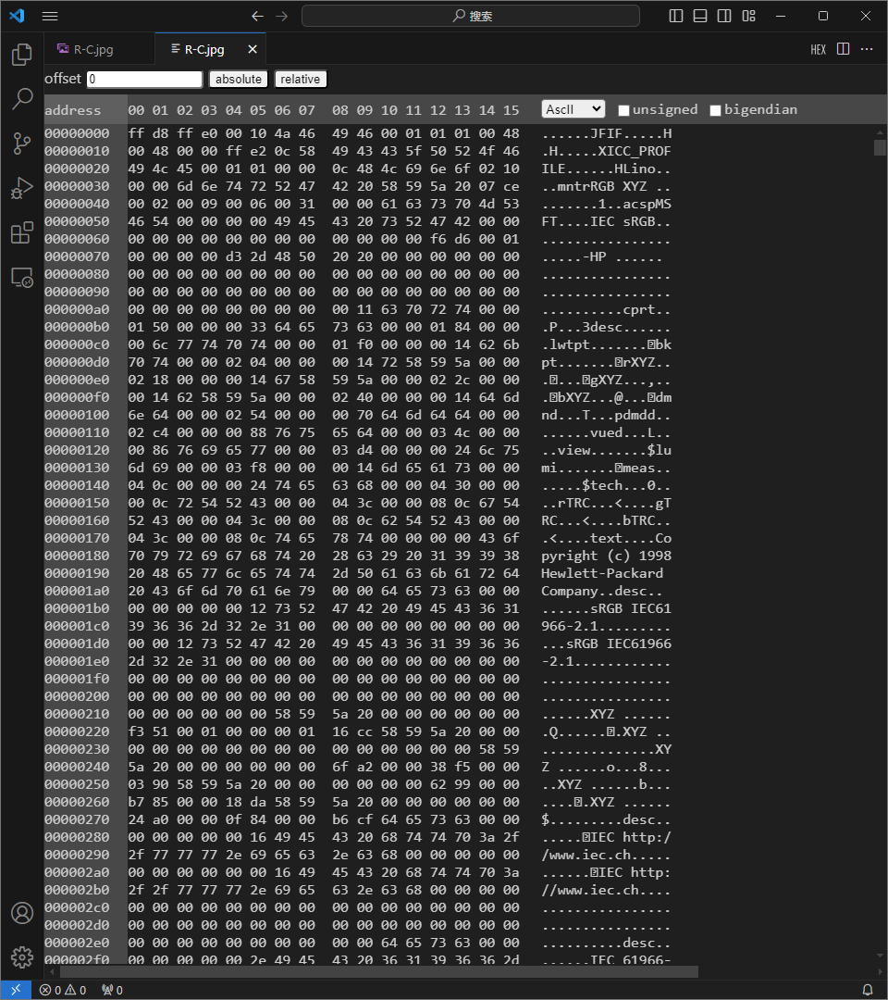
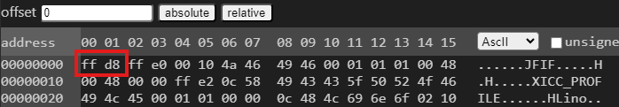
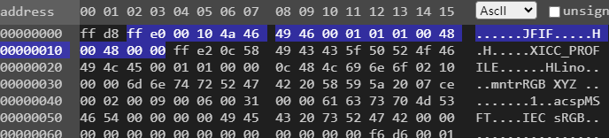
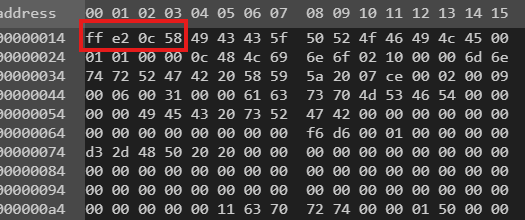

#### 简介

JPEG的全称是JointPhotographicExpertsGroup（联合图像专家小组），它是一种常用的图像存储格式， jpg/jpeg是24位的图像文件格式，也是一种高效率的压缩格式，文件格式是JPEG（联合图像专家组）标准的产物，该标准由ISO与CCI TT（国际电报电话咨询委员会）共同制定，是面向连续色调静止图像的一种压缩标准。其最初目的是使用64Kbps的通信线路传输720×576 分辨率压缩后的图像。通过损失极少的分辨率，可以将图像所需存储量减少至原大小的10％。由于其高效的压缩效率和标准化要求，目前已广泛用于彩色传真、静止图像、电话会议、印刷及新闻图片的传送上。但那些被删除的资料无法在解压时还原，所以* .jpg/.jpeg文件并不适合放大观看，输出成印刷品时品质也会受到影响。不过，普通用户不必担心，因为.jpg/.jpeg的压缩算法十分先进，它对图形图像的损失影响不是很大，一幅1 6 M（24位）的.jpg/.jpeg图像看上去与照片没有多大差别，非专业人士甚至无法分辨。同样一幅画面，用.jpg/.jpeg格式储存的文件是其他类型图形文件的1 /10～1/20。一般情况下，.jpg/*.jpeg文件只有几十KB，而色彩数最高可达到24位，所以它被广泛运用在Internet上，以节约宝贵的网络传输资源。同样，为了在一张光盘上储存更多的图形图像，C D出版商也乐意采用jpg/jpeg格式。

JPEG的文件格式一般有两种文件扩展名：.jpg和.jpeg，这两种扩展名的实质是相同的，我们可以把.jpg的文件改名为.jpeg，而对文件本身不会有任何影响。严格来讲，JPEG的文件扩展名应该为.jpeg，由于DOS时代的8.3文件名命名原则，就使用了.jpg的扩展名，这种情况类似于.htm和.html的区别。

JPEG格式可以分为标准JPEG、渐进式JPEG和JPEG2000三种格式。

标准JPEG:该类型的图片文件，在网络上应用较多，只有图片完全被加载和读取完毕之后，才能看到图片的全貌；它是一种很灵活的图片压缩方式，用户可以在压缩比和图片品质之间进行权衡。不过，通常来讲，其压缩比在10:1到40:1之间，压缩比越大，品质就越差，压缩比越小，品质就越好。JPEG格式压缩的主要是高频信息，对色彩的信息保留较好，适合应用于互联网，可减少图像的传输时间，可以支持24bit真彩色，也普遍应用于需要连续色调的图像。JPEG由于可以提供有损压缩，因此压缩比可以达到其他传统压缩算法无法比拟的程度。其压缩模式有以下几种：顺序式编码（SequentialEncoding），递增式编码（ProgressiveEncoding），无失真编码（LosslessEncoding）和阶梯式编码（HierarchicalEncoding）

JPEG的压缩，分为四个步骤：

（1）颜色转换：由于JPEG只支持YUV颜色模式，而不支持RGB颜色模式，所以在将彩色图像进行压缩之前，必须先对颜色模式进据转换。转换完成之后还需要进行数据采样。一般采用的采样比例是2：1：1或4：2：2。由于在执行了此项工作之后，每两行数据只保留一行，因此，采样后图像数据量将压缩为原来的一半。

（2）DCT变换：DCT（DiscreteConsineTransform）是将图像信号在频率域上进行变换，分离出高频和低频信息的处理过程。然后再对图像的高频部分（即图像细节）进行压缩，以达到压缩图像数据的目的。首先将图像划分为多个8*8的矩阵。然后对每一个矩阵作DCT变换（变换公式此略）。变换后得到一个频率系数矩阵，其中的频率系数都是浮点数。

（3）量化：由于在后面编码过程中使用的码本都是整数，因此需要对变换后的频率系数进行量化，将之转换为整数。由于进行数据量化后，矩阵中的数据都是近似值，和原始图像数据之间有了差异，这一差异是造成图像压缩后失真的主要原因。

（4）编码：编码采用两种机制：一是0值的行程长度编码；二是熵编码（EntropyCoding）。在JPEG中，采用曲徊序列，即以矩阵对角线的法线方向作“之”字排列矩阵中的元素。这样做的优点是使得靠近矩阵左上角、值比较大的元素排列在行程的前面，而行程的后面所排列的矩阵元素基本上为0值。行程长度编码是非常简单和常用的编码方式，在此不再赘述。编码实际上是一种基于统计特性的编码方法。在JPEG中允许采用HUFFMAN编码或者算术编码。

渐进式JPEG：该类型的图片是对标准JPEG格式的改进，当在网页上下载渐进式JPEG图片时，首先呈现图片的大概外貌，然后再逐渐呈现具体的细节部分，因而被称之为渐进式JPEG。

JPEG2002：一种全新的图片压缩发，压缩品质更好，并且改善了无线传输时，因信号不稳定而造成的马赛克及位置错乱等问题。另外，作为JPEG的升级版，JPEG2000的压缩率比标准JPEG高约30%，同时支持有损压缩和无损压缩。它还支持渐进式传输，即，先传输图片的粗略轮廓，然后，逐步传输细节数据，使得图片由模糊到清晰逐步显示。此外，JPEG2000还支持感兴趣区域，也就是说，可以指定图片上感兴趣区域的压缩质量，还可以选择指定的部分先进行解压。

#### android是如何识别JEPG文件的

其实很简单，就是判断前面3个字节是什么，如果发现是**FF D8 FF**开始，那就认为它是JEPG图片。(注意android不是根据后缀名来判断是什么文件的，当然你必须是图片的后缀名文件管理器才可以打开)

```c
//SkImageDecoder_libjpeg.cpp (external\skia\src\images)
static bool is_jpeg(SkStream* stream) {
    //需要匹配的字节
    static const unsigned char gHeader[] = { 0xFF, 0xD8, 0xFF };
    static const size_t HEADER_SIZE = sizeof(gHeader);

    char buffer[HEADER_SIZE];
    //从数据源中读取3个字节
    size_t len = stream->read(buffer, HEADER_SIZE);

    if (len != HEADER_SIZE) {
        return false;   // can't read enough
    }
    //只有完全匹配才会认为是jpeg图片
    if (memcmp(buffer, gHeader, HEADER_SIZE)) {
        return false;
    }
    return true;
}
```

#### JPEG图片格式详解

JPEG图片格式组成部分：SOI（文件头）+APP0（图像识别信息）+ DQT（定义量化表）+ SOF0（图像基本信息）+ DHT（定义Huffman表） + DRI（定义重新开始间隔）+ SOS（扫描行开始）+ EOI（文件尾），其中DRI是非必须的

##### 数据源


以二进制格式打开jpeg图片，vscode插件Binary Viewer



##### JEPG的段结构

JPEG 文件的格式是分为一个一个的段来存储的，段的多少和长度并不是一定的。只要包含了足够的信息，该JPEG文件就能够被打开，呈现给人们。JPEG文件的每个段都一定包含两部分一个是段的标识，它由两个字节构成：第一个字节是十六进制0xFF，第二个字节对于不同的段，这个值是不同的。紧接着的两个字节存放的是这个段的长度（除了前面的两个字节0xFF和0xXX，X表示不确定。他们是不算到段的长度中的）

段结构

| 名称   | 字节数     | 数据 | 说明                                        |
| ------ | ---------- | ---- | ------------------------------------------- |
| 段标识 | 1          | FF   | 每个新段的开始标识                          |
| 段类型 | 1          |      | 类型编码（称作“标记码”）                    |
| 段长度 | 2          |      | 包括段内容和段长度本身,不包括段标识和段类型 |
| 段内容 | ≤65533字节 |      |                                             |

-   JPG 文件中所有关于宽度高度长度间隔这一类数据，凡是＞１字节的，均采用Motorola格式，即：高位在前，低位在后
-   有些段没有长度描述也没有内容，只有段标识和段类型。文件头和文件尾均属于这种段
-   段与段之间无论有多少FF都是合法的，这些FF称为“填充字节”，必须被忽略掉

##### 段类型

| 名称 | 标记码 | 说明                       |
| ---- | ------ | -------------------------- |
| SOI  | D8     | 文件头                     |
| EOI  | D9     | 文件尾                     |
| SOF0 | C0     | 帧开始（标准 JPEG）        |
| SOF1 | C1     | 帧开始（标准 JPEG）        |
| DHT  | C4     | 定义 Huffman 表            |
| SOS  | DA     | 扫描行开始                 |
| DQT  | DB     | 定义量化表                 |
| DRI  | DD     | 定义重新开始间隔           |
| APP0 | E0     | 定义交换格式和图像识别信息 |
| COM  | FE     | 注释                       |

段类型有30种，但只有10种是必须被所有程序识别的，其它的类型都可以忽略。所以下面只列出这10种类型

##### SOI文件头

JPEG文件的开始2个字节都是FF D8这是JPEG协议规定的

| 名称   | 字节数 | 值   |
| ------ | ------ | ---- |
| 段标识 | 1      | FF   |
| 段类型 | 1      | D8   |



##### APP0图像识别信息

APP0（图像识别信息）段结构如下：

-   段标识：1B，值为FF
-   段类型：1B，值为E0
-   段长度：2B，值为0010，如果有RGB缩略图，那么值为16+3n
-   交换格式：5B，值为4a46 4946 00，是”JFIF“的ASCII码
-   主版本号：1B
-   次版本号：1B
-   密度单位：1B，值为0时代表无单位；1=点数/英寸；2=点数/厘米
-   X像素密度：2B，水平方向的密度，即水平分辨率
-   Y像素密度：2B，垂直方向的密度，即垂直分辨率
-   缩略图X像素：1B，缩略图水平像素的数目
-   缩略图Y像素：1B，缩略图垂直像素的数目
-   RGB缩略图：3nB，n = 缩略图像素总数 = 缩略图X像素 * 缩略图Y像素，当且仅当 缩略图X像素 和 缩略图Y像素 大于 0 才有效

说明：

①JFIF是JPEG File Interchange Forma的缩写，即JPEG文件交换格式，另外还有TIFF等格式，很少用

②“如果有RGB缩略图就＝16＋3n”是什么意思呢？比如说“缩略图X像素”和“缩略图Y像素”的值均为48，就表示有一个48×48像素的缩略图（ｎ＝48×48），缩略图是24位真彩位图，用３个字节来表示一个像素，所以共占用3n个字节。但大多数JPG文件都没有这个“鸡肋”缩略图

对比图片数据



-   图像识别信息头：ff e0
-   段长度：00 10 => 16B
-   交换格式：4a 46 49 46 00 => JFIF
-   主版本号：01
-   次版本号：01
-   密度单位：01 => 使用点数/英寸
-   X像素密度：00 48 => 72
-   Y像素密度：00 48 => 72
-   缩略图X像素：00
-   缩略图Y像素：00

##### APP2图像识别信息

暂不分析



-   段标识（ff e2）：这是一个特殊的标记，用于指示紧随其后的数据是ICC配置文件。这个标记使得解析JPEG文件的人能够快速识别该段的类型
-   段长度：0c 58 => 00 14 + 0c 58 = 0c 6e ，下一段地址

##### DQT定义量化表

-   段标识：1B，值为ff
-   段类型：1B，值为db
-   段长度：2B，值为

[jpeg图片格式详解-CSDN博客](https://blog.csdn.net/yun_hen/article/details/78135122)
