#### 为什么需要加密？

1.  信息保密问题：敏感信息可能被获取
2.  信息篡改问题：传输过程中信息被篡改
3.  通信对象认证问题：伪装收信对象，截取信息

#### 密码系统

信息加密是指将信息转化为任何第三方都无法读懂，只有发送方和接收方能看懂的信息。例如暗号可以看作最简单的加密方式。如果存在一门外语只有通讯双方知道，那么将信息翻译成这种语言也算一种加密方式。当然，今天我们要聊的加密复杂的多

密码系统是由 算法+密钥 所组成。明文和密钥是原材料，算法是加工的方式，产出就是密文

我们都知道密钥是要保密的，那么密码算法是否也需要保密呢？这个问题常常会困扰初学者。事实上，试图通过对密码算法保密来提高安全性的行为（隐蔽式安全性）是非常愚蠢的。因为任何算法最终都会被破解，所以现在流行的密码算法都是公开的，从诞生之初就没想通过保密算法来提高安全。密码学一个重要的原则：杜绝隐蔽式安全性。

#### 简单替换密码

简单替换密码系统中，我们为26个字母建立映射关系，例如s->a、c->d、h->n、o->x、l->y…… 26个字母被映射为另外的字母，那么一个明文的单词被加密后就无法认出了。例如school，按照上面的映射关系，就变成了adnxxy

在这个密码系统中也存在密码算法和密钥

密码算法：26个字母按照固定的映射关系做替换

密钥：26个字母的替换关系

如果想要破解密钥，也就是要找出26个字母的替换关系。a有26种替换可能，b有除a选择替换的字母之外的25种可能。以此类推，存在的替换关系有26x25x24……x1,约为2的88次方。如果计算机可以一秒尝试一亿个密码，运气差的话要尝试1200亿年。因此暴力破解是行不通的。

但是由于密码算法中，替换关系是稳定的，所以可以采用频率分析的方式破解密码。原理是明文中同一个字母出现的频率和密文中被替换的字母出现的频率一致。在英文中，字母出现的频率是相对稳定的。因此可以根据字母出现的频率推算出替换关系，也就是密钥。从而完成破解

这种密码系统不安全的根源在于密码算法，该算法很容易让破解者推测出密钥，因此安全性极低

#### 对称密钥

密钥分为两类，对称密钥和非对称密钥（公钥密钥）

-   对称密钥：指加密和解密使用同样的密钥

-   非对称密钥：指加密和解密使用不同密钥

我们思考一下，简单替换密码是对称密码还是非对称密码呢？简单替换的密钥是字母映射表，加密和解密使用同样的字母映射表，所以是对称密钥

在计算机的世界里，机器直接操作的数据并不是文字，而是0和1组成的比特序列。我们所要加密的对象就是特定顺序的比特序列

二进制数字有一种运算叫做异或，运算符号 XOR。这种运算有一个特性，如果 A XOR B = C ，那么C XOR B =A。这个特性和加解密的过程十分相似，A 可以看作是明文，B 看作密钥，XOR 看作密码算法，C是加密后的密文。用密钥 B 可以将 C 还原为明文 A

异或算法太简单，不能直接用作密码算法。但我们所熟知的对称密钥 DES 和 AES 都是以异或运算作为基础

#### DES（Data Encryption Standard）

DES 曾经是 1977 年美国联邦信息处理标准中所采用的一种对称密码。曾经得到了广泛的使用。不过随着计算机算力的提升，DES 已经不再安全，可以在短时间内通过暴力破解。所以现在 DES 已经不再推荐使用

DES是一种分组加密算法，该算法每次处理固定长度的数据段，称之为分组。DES分组的大小是64位，如果加密的数据长度不是64位的倍数，可以按照某种具体的规则来填充位

从本质上来说，DES的安全性依赖于虚假表象，从密码学的术语来讲就是依赖于“混乱和扩散”的原则。

混乱是指加密算法的设计使得密文与明文或密钥之间的关系变得复杂，以至于通过分析密文无法轻易推导出明文或密钥。混乱的目标是隐藏明文和密文之间的直接关系，增加破解的难度。DES 使用 S-盒（Substitution boxes） 来实现混乱。S-盒是一种替换机制，将输入的部分数据转换为不同的输出，从而打乱明文的结构。由于 S-盒的设计，攻击者无法简单地从密文推导出明文或密钥

扩散是指明文中的每一个比特位都会影响到多个密文比特位的原则。通过扩散，可以确保即使是明文中非常小的变化（例如，改变一个比特位），也会导致密文的重大变化。DES 通过 置换（Permutation） 过程实现扩散。在加密过程中，输入的比特位经过一系列的置换操作，使得每个明文比特都对密文的多个比特产生影响。这意味着，任何小的明文变化都能引起密文中多个比特的变化，从而增强加密的安全性

##### DES根据当前轮次，生成子密钥

1.   根据置换表 temp_key_table ，对64位密钥进行压缩置换，得到56位中间密钥

​	置换表 temp_key_table ，取值范围为 1-64

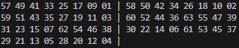

​	根据置换表，由64位原密钥生成56位中间密钥，比如中间密钥的第1位存放原密钥的第57位，第2位存放原密钥的49位，依次类推

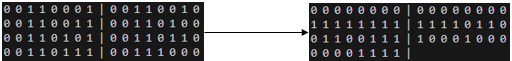

2.   对中间密钥进行循环移位，分为左右两部分分别进行循环移位，左移

     假设当前轮次需要移位为8位

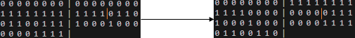

3.   根据置换表 sub_secret_key_table ，对56位中间密钥进行压缩，得到48位子密钥

​	置换表 sub_secret_key_table ，取值范围为 1-56

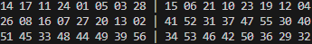

​	根据置换表，由56位中间密钥，生成48位子密钥

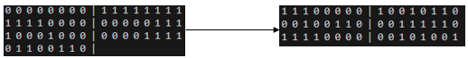

##### DES算法加密过程

1.   初始置换，将数据进行重新排列

​	初始置换表initial_permutation_table，取值范围为 1-64

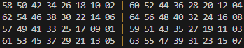

​	根据置换表，将64位数据进行重新排列

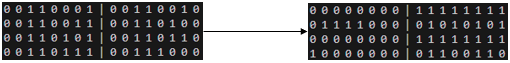

2.   将64位数据划分为左右两部分，各32位

​	上面为左侧数据，下面为右侧数据

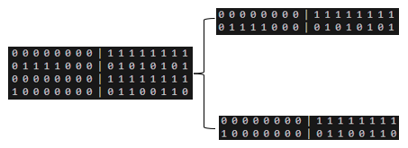

3.   迭代加密16次，每次加密都只加密左侧数据，加密完后左右侧数据互换，继续进行加密。如果是解密，只需要将当前迭代轮次倒转即可

-   3.1 获取迭代轮次，如果是解密就将迭代轮次倒转

-   3.2 生成48位的子密钥，相同的迭代轮次生成的子密钥是一样的，即子密钥确定的话，16个子密钥也确定了

​	当前轮次的子密钥

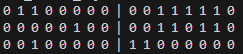

-   3.3 扩展置换，将32位的右侧数据扩展为48位，与子密钥的长度保持一致

​	扩展置换表 extend_table，取值范围为 1-32

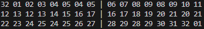

​	对右侧数据进行扩展，由32位扩展为48位

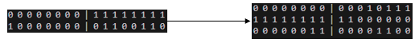

-   3.4 将扩展后的右侧数据与子密钥进行异或操作

    进行异或操作，上面为子密钥，下面为右侧数据

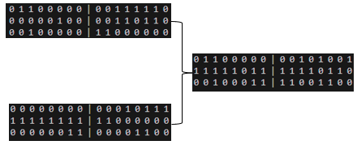

-   3.5 进行S盒压缩，共有8个S盒，每个S盒接受6位输入，返回4位输出，将48位右侧数据重新压缩回32位

​	具体实现是依次从上面异或得到的数据中，选择6位数据，然后进行重新排列（0 5 1 2 3 4），得到对应S盒的索引值，再去取数据作为输出

​	例如，选择前6位数据  0 1 1 0 0 0，重新排列 0 0 1 1 0 0 ，索引值为 12， 对应 0 号S盒的值为 5， 替换成4位二进制，达到压缩的目的

​	最后，压缩得到的数据

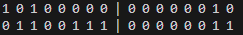

-   3.6进行P盒置换，对数据进行重新排序，得到加密左侧数据的实际密钥

​	p盒置换表，取值范围为 1-32

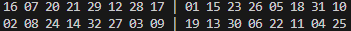

​	对数据进行重新排列

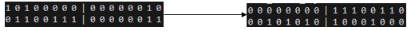

-   3.7 加密左侧数据，与上面的实际密钥进行异或操作

​	进行异或操作，上面为实际密钥，下面为左侧数据

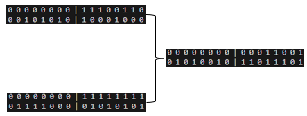

-   3.8 非最后一次迭代，交换左右侧数据，下轮迭代就应该加密右侧数据。在最后一次迭代，不能交换数据，用于解密操作。

​	可以想象，假如只迭代一次，那么右侧数据不会发生改变，只有左侧数据被加密了。那么，在解密时，右侧数据进行上面的迭代操作后，在3.6得到的实际密钥跟加密时得到的数据，是没有任何区别的，因为除了左侧数据，其他任何数据都没有发生改变，那么再一次异或操作，左侧数据就恢复到了之前

​	同理，假设迭代次数为16次，最后一次左右侧数据是不会互相交换的。在解密时，由于迭代次数是倒装的，右侧数据可以得到解密左侧数据的密钥，随后交换，再度进行解密，直到得到明文

4.   合并左右数据

​	上面为左侧数据，下面为右侧数据

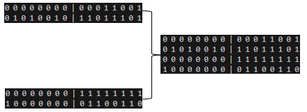

5.   末置换，将数据进行重新排列，得到最终加密的密文

​	末置换表 final_permutation_table ，将数据重新排列，取值范围为 1-64 。而且其取值跟数据初始置换表 initial_permutation_table 有关。即数据如果只经过初始置换表和末置换表，数据不会发生任何改变

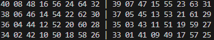

​	根据置换表，对64位数据进行重新排列

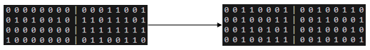

