#### 为什么需要加密？

1.  信息保密问题：敏感信息可能被获取
2.  信息篡改问题：传输过程中信息被篡改
3.  通信对象认证问题：伪装收信对象，截取信息

#### 密码系统

信息加密是指将信息转化为任何第三方都无法读懂，只有发送方和接收方能看懂的信息。例如暗号可以看作最简单的加密方式。如果存在一门外语只有通讯双方知道，那么将信息翻译成这种语言也算一种加密方式。当然，今天我们要聊的加密复杂的多

密码系统是由 算法+密钥 所组成。明文和密钥是原材料，算法是加工的方式，产出就是密文

我们都知道密钥是要保密的，那么密码算法是否也需要保密呢？这个问题常常会困扰初学者。事实上，试图通过对密码算法保密来提高安全性的行为（隐蔽式安全性）是非常愚蠢的。因为任何算法最终都会被破解，所以现在流行的密码算法都是公开的，从诞生之初就没想通过保密算法来提高安全。密码学一个重要的原则：杜绝隐蔽式安全性。

#### 简单替换密码

简单替换密码系统中，我们为26个字母建立映射关系，例如s->a、c->d、h->n、o->x、l->y…… 26个字母被映射为另外的字母，那么一个明文的单词被加密后就无法认出了。例如school，按照上面的映射关系，就变成了adnxxy

在这个密码系统中也存在密码算法和密钥

密码算法：26个字母按照固定的映射关系做替换

密钥：26个字母的替换关系

如果想要破解密钥，也就是要找出26个字母的替换关系。a有26种替换可能，b有除a选择替换的字母之外的25种可能。以此类推，存在的替换关系有26x25x24……x1,约为2的88次方。如果计算机可以一秒尝试一亿个密码，运气差的话要尝试1200亿年。因此暴力破解是行不通的。

但是由于密码算法中，替换关系是稳定的，所以可以采用频率分析的方式破解密码。原理是明文中同一个字母出现的频率和密文中被替换的字母出现的频率一致。在英文中，字母出现的频率是相对稳定的。因此可以根据字母出现的频率推算出替换关系，也就是密钥。从而完成破解

这种密码系统不安全的根源在于密码算法，该算法很容易让破解者推测出密钥，因此安全性极低

#### 对称密钥

密钥分为两类，对称密钥和非对称密钥（公钥密钥）

-   对称密钥：指加密和解密使用同样的密钥

-   非对称密钥：指加密和解密使用不同密钥

我们思考一下，简单替换密码是对称密码还是非对称密码呢？简单替换的密钥是字母映射表，加密和解密使用同样的字母映射表，所以是对称密钥

在计算机的世界里，机器直接操作的数据并不是文字，而是0和1组成的比特序列。我们所要加密的对象就是特定顺序的比特序列

二进制数字有一种运算叫做异或，运算符号 XOR。这种运算有一个特性，如果 A XOR B = C ，那么C XOR B =A。这个特性和加解密的过程十分相似，A 可以看作是明文，B 看作密钥，XOR 看作密码算法，C是加密后的密文。用密钥 B 可以将 C 还原为明文 A

异或算法太简单，不能直接用作密码算法。但我们所熟知的对称密钥 DES 和 AES 都是以异或运算作为基础

#### DES（Data Encryption Standard）

DES 曾经是 1977 年美国联邦信息处理标准中所采用的一种对称密码。曾经得到了广泛的使用。不过随着计算机算力的提升，DES 已经不再安全，可以在短时间内通过暴力破解。所以现在 DES 已经不再推荐使用

DES是一种分组加密算法，该算法每次处理固定长度的数据段，称之为分组。DES分组的大小是64位，如果加密的数据长度不是64位的倍数，可以按照某种具体的规则来填充位

从本质上来说，DES的安全性依赖于虚假表象，从密码学的术语来讲就是依赖于“混乱和扩散”的原则。

混乱是指加密算法的设计使得密文与明文或密钥之间的关系变得复杂，以至于通过分析密文无法轻易推导出明文或密钥。混乱的目标是隐藏明文和密文之间的直接关系，增加破解的难度。DES 使用 S-盒（Substitution boxes） 来实现混乱。S-盒是一种替换机制，将输入的部分数据转换为不同的输出，从而打乱明文的结构。由于 S-盒的设计，攻击者无法简单地从密文推导出明文或密钥

扩散是指明文中的每一个比特位都会影响到多个密文比特位的原则。通过扩散，可以确保即使是明文中非常小的变化（例如，改变一个比特位），也会导致密文的重大变化。DES 通过 置换（Permutation） 过程实现扩散。在加密过程中，输入的比特位经过一系列的置换操作，使得每个明文比特都对密文的多个比特产生影响。这意味着，任何小的明文变化都能引起密文中多个比特的变化，从而增强加密的安全性

##### DES根据当前轮次，生成子密钥

1.   根据置换表 temp_key_table ，对64位密钥进行压缩置换，得到56位中间密钥

​	置换表 temp_key_table ，取值范围为 1-64

​	根据置换表，由64位原密钥生成56位中间密钥，比如中间密钥的第1位存放原密钥的第57位，第2位存放原密钥的49位，依次类推

2.   对中间密钥进行循环移位，分为左右两部分分别进行循环移位，左移

     假设当前轮次需要移位为8位

3.   根据置换表 sub_secret_key_table ，对56位中间密钥进行压缩，得到48位子密钥

​	置换表 sub_secret_key_table ，取值范围为 1-56

​	根据置换表，由56位中间密钥，生成48位子密钥

##### DES算法加密过程

1.   初始置换，将数据进行重新排列

​	初始置换表initial_permutation_table，取值范围为 1-64

​	根据置换表，将64位数据进行重新排列

2.   将64位数据划分为左右两部分，各32位

​	上面为左侧数据，下面为右侧数据

3.   迭代加密16次，每次加密都只加密左侧数据，加密完后左右侧数据互换，继续进行加密。如果是解密，只需要将当前迭代轮次倒转即可

-   3.1 获取迭代轮次，如果是解密就将迭代轮次倒转

-   3.2 生成48位的子密钥，相同的迭代轮次生成的子密钥是一样的，即子密钥确定的话，16个子密钥也确定了

​	当前轮次的子密钥

-   3.3 扩展置换，将32位的右侧数据扩展为48位，与子密钥的长度保持一致

​	扩展置换表 extend_table，取值范围为 1-32

​	对右侧数据进行扩展，由32位扩展为48位

-   3.4 将扩展后的右侧数据与子密钥进行异或操作

    进行异或操作，上面为子密钥，下面为右侧数据

-   3.5 进行S盒压缩，共有8个S盒，每个S盒接受6位输入，返回4位输出，将48位右侧数据重新压缩回32位

​	具体实现是依次从上面异或得到的数据中，选择6位数据，然后进行重新排列（0 5 1 2 3 4），得到对应S盒的索引值，再去取数据作为输出

​	例如，选择前6位数据  0 1 1 0 0 0，重新排列 0 0 1 1 0 0 ，索引值为 12， 对应 0 号S盒的值为 5， 替换成4位二进制，达到压缩的目的

​	最后，压缩得到的数据

-   3.6进行P盒置换，对数据进行重新排序，得到加密左侧数据的实际密钥

​	p盒置换表，取值范围为 1-32

​	对数据进行重新排列

-   3.7 加密左侧数据，与上面的实际密钥进行异或操作

​	进行异或操作，上面为实际密钥，下面为左侧数据

-   3.8 非最后一次迭代，交换左右侧数据，下轮迭代就应该加密右侧数据。在最后一次迭代，不能交换数据，用于解密操作。

​	可以想象，假如只迭代一次，那么右侧数据不会发生改变，只有左侧数据被加密了。那么，在解密时，右侧数据进行上面的迭代操作后，在3.6得到的实际密钥跟加密时得到的数据，是没有任何区别的，因为除了左侧数据，其他任何数据都没有发生改变，那么再一次异或操作，左侧数据就恢复到了之前

​	同理，假设迭代次数为16次，最后一次左右侧数据是不会互相交换的。在解密时，由于迭代次数是倒装的，右侧数据可以得到解密左侧数据的密钥，随后交换，再度进行解密，直到得到明文

4.   合并左右数据

​	上面为左侧数据，下面为右侧数据

5.   末置换，将数据进行重新排列，得到最终加密的密文

​	末置换表 final_permutation_table ，将数据重新排列，取值范围为 1-64 。而且其取值跟数据初始置换表 initial_permutation_table 有关。即数据如果只经过初始置换表和末置换表，数据不会发生任何改变

​	根据置换表，对64位数据进行重新排列

#### AES（Advanced Encryption Standard）

高级加密标准(AES,Advanced Encryption Standard)为非常常见的对称加密算法。对称加密算法也就是加密和解密用相同的密钥，具体的加密流程如下图

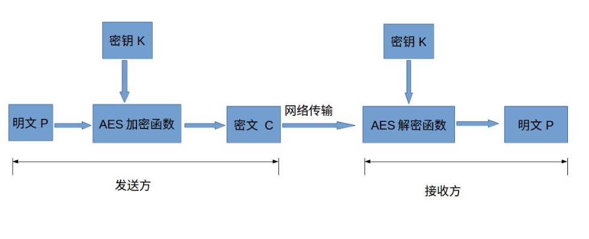

AES为分组密码，分组密码也就是把明文分成一组一组的，每组长度相等，每次加密一组数据，直到加密完整个明文。在AES标准规范中，分组长度只能是128位，也就是说，每个分组为16个字节（每个字节8位）。密钥的长度可以使用128位、192位或256位。密钥的长度不同，推荐加密轮数也不同，如下表所示

| AES     | 密钥长度（32位比特字) | 分组长度(32位比特字) | 加密轮数 |
| ------- | --------------------- | -------------------- | -------- |
| AES-128 | 4                     | 4                    | 10       |
| AES-192 | 6                     | 4                    | 12       |
| AES-256 | 8                     | 4                    | 14       |

以AES-128为例，也就是密钥的长度为128位，加密轮数为10轮。上面说到，AES的加密公式为C = E(K,P)，在加密函数E中，会执行一个轮函数，并且执行10次这个轮函数，这个轮函数的前9次执行的操作是一样的，只有第10次有所不同。也就是说，一个明文分组会被加密10轮。AES的核心就是实现一轮中的所有操作

AES的处理单位是字节，128位的输入明文分组P和输入密钥K都被分成16个字节，分别记为P = P0 P1 … P15 和 K = K0 K1 … K15。一般地，明文分组用字节为单位的正方形矩阵描述，称为状态矩阵。在算法的每一轮中，状态矩阵的内容不断发生变化，最后的结果作为密文输出。该矩阵中字节的排列顺序为从上到下、从左至右依次排列，如下图所示：

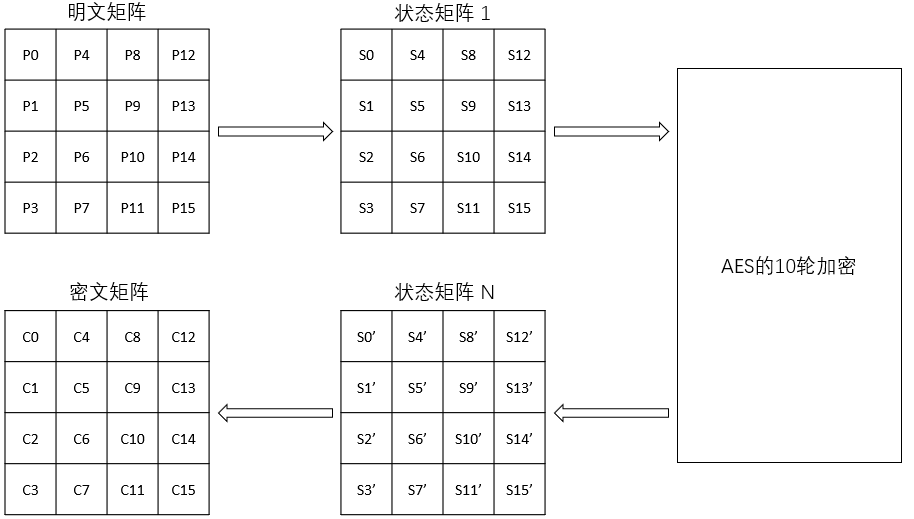

现在假设明文分组P为"abcdefghijklmnop"，则对应上面生成的状态矩阵图如下：

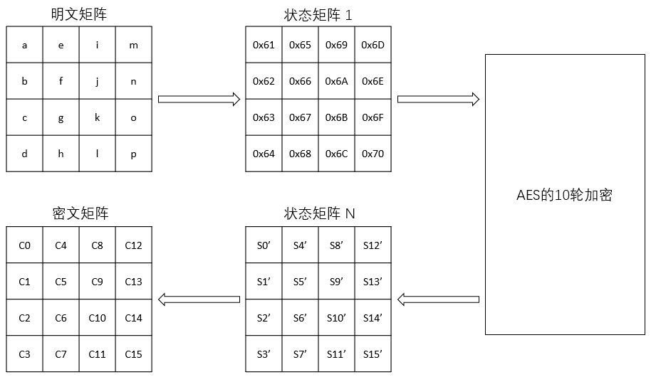

类似地，128位密钥也是用字节为单位的矩阵表示，矩阵的每一列被称为1个32位比特字。通过密钥编排函数，该密钥矩阵被扩展成一个44个字组成的序列W[0],W[1], … ,W[43],该序列的前4个元素W[0],W[1],W[2],W[3]是原始密钥，用于加密运算中的初始密钥加；后面40个字分为10组，每组4个字（128比特）分别用于10轮加密运算中的轮密钥加，如下图所示：

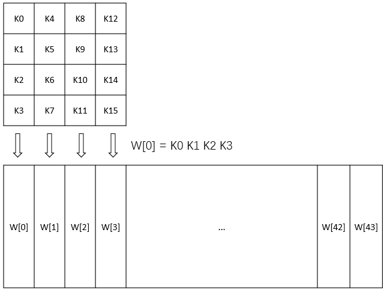

AES的整体结构如下图所示，其中的W[0,3]是指W[0]、W[1]、W[2]和W[3]串联组成的128位密钥。加密的第1轮到第9轮的轮函数一样，包括4个操作：字节代换、行位移、列混合和轮密钥加。最后一轮迭代不执行列混合。另外，在第一轮迭代之前，先将明文和原始密钥进行一次异或加密操作

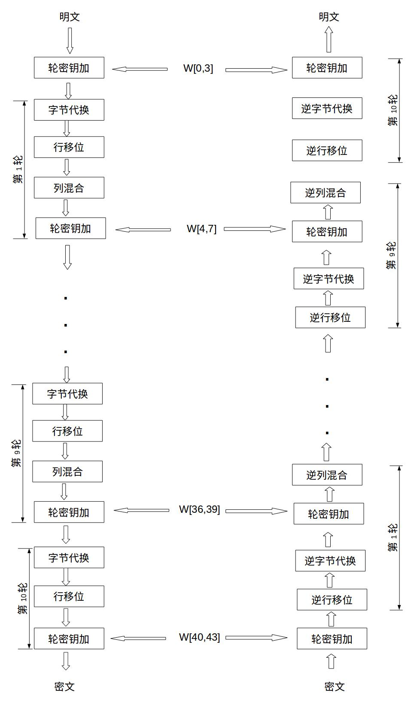

##### 字节代换

AES的字节代换其实就是一个简单的查表操作。AES定义了一个S盒和一个逆S盒。在AES中，S盒的定义是固定的，并不是可以自由选择的

AES的S盒

|  |  0    |  1    |  2    |  3    |  4    |  5    |  6    |  7    |  8    |  9    |  A    |  B    |  C    |  D    |  E    |  F    |
|-------|-------|-------|-------|-------|-------|-------|-------|-------|-------|-------|-------|-------|-------|-------|-------|-------|
|  0    | 0x63 | 0x7c | 0x77 | 0x7b | 0xf2 | 0x6b | 0x6f | 0xc5 | 0x30 | 0x01 | 0x67 | 0x2b | 0xfe | 0xd7 | 0xab | 0x76 |
|  1    | 0xca | 0x82 | 0xc9 | 0x7d | 0xfa | 0x59 | 0x47 | 0xf0 | 0xad | 0xd4 | 0xa2 | 0xaf | 0x9c | 0xa4 | 0x72 | 0xc0 |
|  2    | 0xb7 | 0xfd | 0x93 | 0x26 | 0x36 | 0x3f | 0xf7 | 0xcc | 0x34 | 0xa5 | 0xe5 | 0xf1 | 0x71 | 0xd8 | 0x31 | 0x15 |
|  3    | 0x04 | 0xc7 | 0x23 | 0xc3 | 0x18 | 0x96 | 0x05 | 0x9a | 0x07 | 0x12 | 0x80 | 0xe2 | 0xeb | 0x27 | 0xb2 | 0x75 |
|  4    | 0x09 | 0x83 | 0x2c | 0x1a | 0x1b | 0x6e | 0x5a | 0xa0 | 0x52 | 0x3b | 0xd6 | 0xb3 | 0x29 | 0xe3 | 0x2f | 0x84 |
|  5    | 0x53 | 0xd1 | 0x00 | 0xed | 0x20 | 0xfc | 0xb1 | 0x5b | 0x6a | 0xcb | 0xbe | 0x39 | 0x4a | 0x4c | 0x58 | 0xcf |
|  6    | 0xd0 | 0xef | 0xaa | 0xfb | 0x43 | 0x4d | 0x33 | 0x85 | 0x45 | 0xf9 | 0x02 | 0x7f | 0x50 | 0x3c | 0x9f | 0xa8 |
|  7    | 0x51 | 0xa3 | 0x40 | 0x8f | 0x92 | 0x9d | 0x38 | 0xf5 | 0xbc | 0xb6 | 0xda | 0x21 | 0x10 | 0xff | 0xf3 | 0xd2 |
|  8    | 0xcd | 0x0c | 0x13 | 0xec | 0x5f | 0x97 | 0x44 | 0x17 | 0xc4 | 0xa7 | 0x7e | 0x3d | 0x64 | 0x5d | 0x19 | 0x73 |
|  9    | 0x60 | 0x81 | 0x4f | 0xdc | 0x22 | 0x2a | 0x90 | 0x88 | 0x46 | 0xee | 0xb8 | 0x14 | 0xde | 0x5e | 0x0b | 0xdb |
|  A    | 0xe0 | 0x32 | 0x3a | 0x0a | 0x49 | 0x06 | 0x24 | 0x5c | 0xc2 | 0xd3 | 0xac | 0x62 | 0x91 | 0x95 | 0xe4 | 0x79 |
|  B    | 0xe7 | 0xc8 | 0x37 | 0x6d | 0x8d | 0xd5 | 0x4e | 0xa9 | 0x6c | 0x56 | 0xf4 | 0xea | 0x65 | 0x7a | 0xae | 0x08 |
|  C    | 0xba | 0x78 | 0x25 | 0x2e | 0x1c | 0xa6 | 0xb4 | 0xc6 | 0xe8 | 0xdd | 0x74 | 0x1f | 0x4b | 0xbd | 0x8b | 0x8a |
|  D    | 0x70 | 0x3e | 0xb5 | 0x66 | 0x48 | 0x03 | 0xf6 | 0x0e | 0x61 | 0x35 | 0x57 | 0xb9 | 0x86 | 0xc1 | 0x1d | 0x9e |
|  E    | 0xe1 | 0xf8 | 0x98 | 0x11 | 0x69 | 0xd9 | 0x8e | 0x94 | 0x9b | 0x1e | 0x87 | 0xe9 | 0xce | 0x55 | 0x28 | 0xdf |
|  F    | 0x8c | 0xa1 | 0x89 | 0x0d | 0xbf | 0xe6 | 0x42 | 0x68 | 0x41 | 0x99 | 0x2d | 0x0f | 0xb0 | 0x54 | 0xbb | 0x16 |

状态矩阵中的元素按照下面的方式映射为一个新的字节：把该字节的高4位作为行值，低4位作为列值，取出S盒或者逆S盒中对应的行的元素作为输出。例如，加密时，输出的字节S1为0x12,则查S盒的第0x01行和0x02列，得到值0xc9,然后替换S1原有的0x12为0xc9。状态矩阵经字节代换后的图如下：

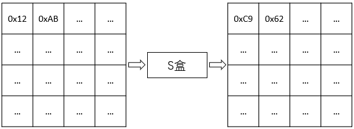

##### 字节代换逆操作

|      | 0    | 1    | 2    | 3    | 4    | 5    | 6    | 7    | 8    | 9    | A    | B    | C    | D    | E    | F    |
| ---- | ---- | ---- | ---- | ---- | ---- | ---- | ---- | ---- | ---- | ---- | ---- | ---- | ---- | ---- | ---- | ---- |
| 0    | 0x52 | 0x09 | 0x6a | 0xd5 | 0x30 | 0x36 | 0xa5 | 0x38 | 0xbf | 0x40 | 0xa3 | 0x9e | 0x81 | 0xf3 | 0xd7 | 0xfb |
| 1    | 0x7c | 0xe3 | 0x39 | 0x82 | 0x9b | 0x2f | 0xff | 0x87 | 0x34 | 0x8e | 0x43 | 0x44 | 0xc4 | 0xde | 0xe9 | 0xcb |
| 2    | 0x54 | 0x7b | 0x94 | 0x32 | 0xa6 | 0xc2 | 0x23 | 0x3d | 0xee | 0x4c | 0x95 | 0x0b | 0x42 | 0xfa | 0xc3 | 0x4e |
| 3    | 0x08 | 0x2e | 0xa1 | 0x66 | 0x28 | 0xd9 | 0x24 | 0xb2 | 0x76 | 0x5b | 0xa2 | 0x49 | 0x6d | 0x8b | 0xd1 | 0x25 |
| 4    | 0x72 | 0xf8 | 0xf6 | 0x64 | 0x86 | 0x68 | 0x98 | 0x16 | 0xd4 | 0xa4 | 0x5c | 0xcc | 0x5d | 0x65 | 0xb6 | 0x92 |
| 5    | 0x6c | 0x70 | 0x48 | 0x50 | 0xfd | 0xed | 0xb9 | 0xda | 0x5e | 0x15 | 0x46 | 0x57 | 0xa7 | 0x8d | 0x9d | 0x84 |
| 6    | 0x90 | 0xd8 | 0xab | 0x00 | 0x8c | 0xbc | 0xd3 | 0x0a | 0xf7 | 0xe4 | 0x58 | 0x05 | 0xb8 | 0xb3 | 0x45 | 0x06 |
| 7    | 0xd0 | 0x2c | 0x1e | 0x8f | 0xca | 0x3f | 0x0f | 0x02 | 0xc1 | 0xaf | 0xbd | 0x03 | 0x01 | 0x13 | 0x8a | 0x6b |
| 8    | 0x3a | 0x91 | 0x11 | 0x41 | 0x4f | 0x67 | 0xdc | 0xea | 0x97 | 0xf2 | 0xcf | 0xce | 0xf0 | 0xb4 | 0xe6 | 0x73 |
| 9    | 0x96 | 0xac | 0x74 | 0x22 | 0xe7 | 0xad | 0x35 | 0x85 | 0xe2 | 0xf9 | 0x37 | 0xe8 | 0x1c | 0x75 | 0xdf | 0x6e |
| A    | 0x47 | 0xf1 | 0x1a | 0x71 | 0x1d | 0x29 | 0xc5 | 0x89 | 0x6f | 0xb7 | 0x62 | 0x0e | 0xaa | 0x18 | 0xbe | 0x1b |
| B    | 0xfc | 0x56 | 0x3e | 0x4b | 0xc6 | 0xd2 | 0x79 | 0x20 | 0x9a | 0xdb | 0xc0 | 0xfe | 0x78 | 0xcd | 0x5a | 0xf4 |
| C    | 0x1f | 0xdd | 0xa8 | 0x33 | 0x88 | 0x07 | 0xc7 | 0x31 | 0xb1 | 0x12 | 0x10 | 0x59 | 0x27 | 0x80 | 0xec | 0x5f |
| D    | 0x60 | 0x51 | 0x7f | 0xa9 | 0x19 | 0xb5 | 0x4a | 0x0d | 0x2d | 0xe5 | 0x7a | 0x9f | 0x93 | 0xc9 | 0x9c | 0xef |
| E    | 0xa0 | 0xe0 | 0x3b | 0x4d | 0xae | 0x2a | 0xf5 | 0xb0 | 0xc8 | 0xeb | 0xbb | 0x3c | 0x83 | 0x53 | 0x99 | 0x61 |
| F    | 0x17 | 0x2b | 0x04 | 0x7e | 0xba | 0x77 | 0xd6 | 0x26 | 0xe1 | 0x69 | 0x14 | 0x63 | 0x55 | 0x21 | 0x0c | 0x7d |

经过逆S盒操作后，可以恢复经过S盒代换后的数据

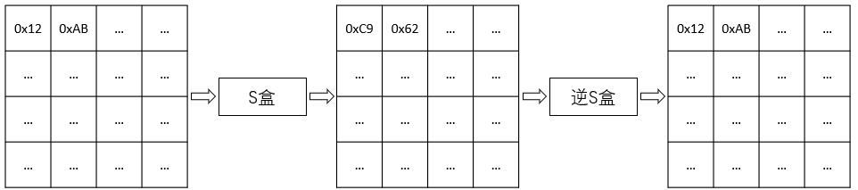

##### 行移位

行移位是一个简单的左循环移位操作。当密钥长度为128比特时，状态矩阵的第0行左移0字节，第1行左移1字节，第2行左移2字节，第3行左移3字节，如下图所示：

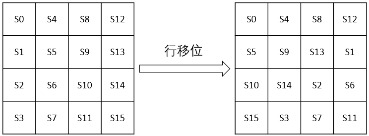

行移位的逆变换是将状态矩阵中的每一行执行相反的移位操作，例如AES-128中，状态矩阵的第0行右移0字节，第1行右移1字节，第2行右移2字节，第3行右移3字节，如下图所示：

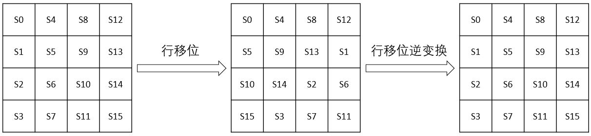

##### 列混合

列混合变换是通过矩阵相乘来实现的，经行移位后的状态矩阵左乘固定的矩阵，得到混淆后的状态矩阵，如下图的公式所示：

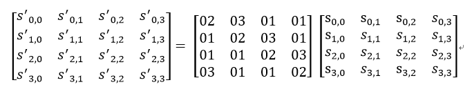

状态矩阵中的第j列(0 ≤j≤3)的列混合可以表示为下图所示：

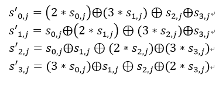

其中，矩阵元素的乘法和加法都是定义在基于GF(2^8)上的二元运算,并不是通常意义上的乘法和加法。其实这种二元运算的加法等价于两个字节的异或，乘法则复杂一点。

设S1 = (a7 a6 a5 a4 a3 a2 a1 a0)，0x02 * S1如下图所示：

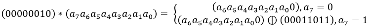

类似地，乘以(00000100)可以拆分成两次乘以(00000010)的运算：

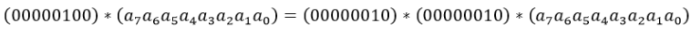

乘以(0000 0011)可以拆分成先分别乘以(0000 0001)和(0000 0010)，再将两个乘积异或：

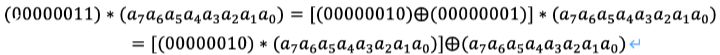

因此，我们只需要实现乘以2的函数，其他数值的乘法都可以通过组合来实现
