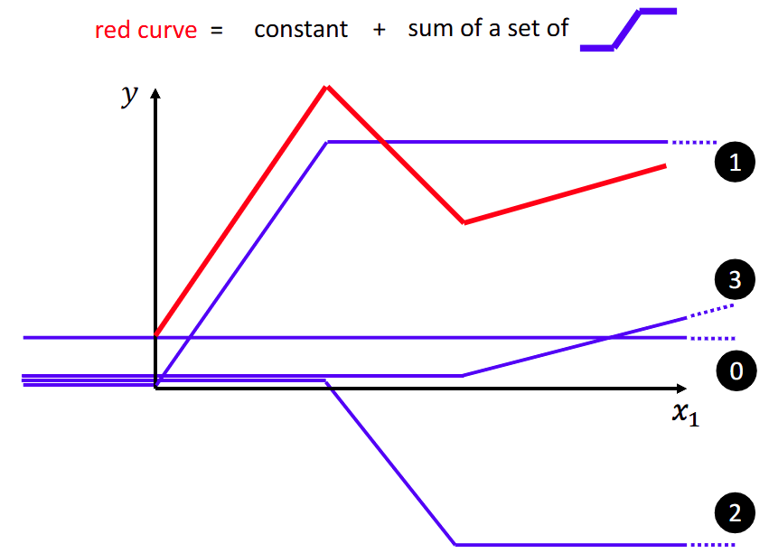
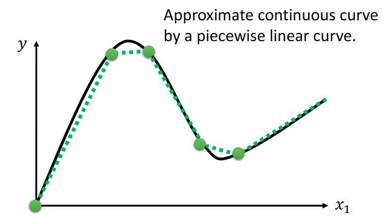
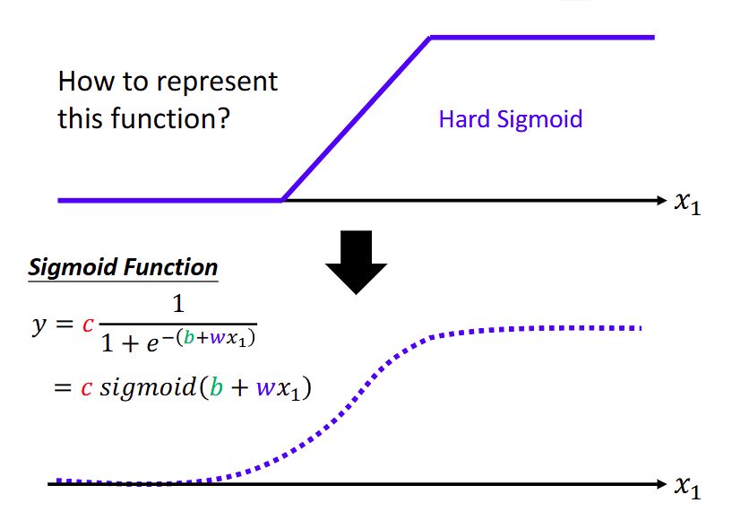
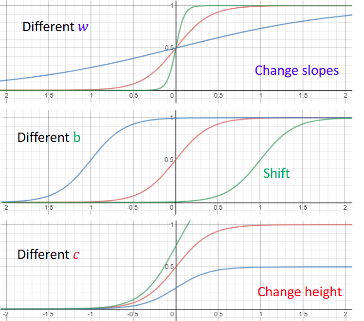

## 机器学习基本概念

机器学习，就是在寻找一个函数，使得输入的结果与输出之间的loss尽可能小

函数的输出种类：

-   regression：回归，输出一个具体的数字
-   classification：分类，输出类别的信息
-   structured learning：输出复杂的结构，比如图像、文档

#### 如何找到函数

1.   选择一个带有未知数的参数，`y = b + w * x_1`
2.   确定损失函数 Loss，常用的 Loss 有 MAE (mean absolute error) 和 MSE (mean square error)
3.   优化，可以选择梯度下降算法

经过多次优化迭代后，可以找到一个尽可能好的函数，使得 loss 尽可能小，以上的步骤称为 “训练”

但是，上面的函数是线性函数，不管怎么优化，都很难预测得到准确的结果，需要更加精确的函数

首先观察下图

红色的线可以被一个常数加上多个阶梯函数进行拟合，不管是多么复杂的分段函数，都可以用这种方式来进行表示。即使是曲线函数，也可以在其上截取足够多的点，将这些点互相连接，得到一个分段函数

而这种阶梯式的函数称之为 Hard Sigmoid 函数，其中 Sigmoid 函数的定义如下，其中 c 决定其高度，b 决定其在 x 轴的偏移，而 w 决定其斜度

