## 机器学习基本概念

### 简介

机器学习，就是在寻找一个函数，该函数的输出结果——预测值，其与真实值之间的 loss 尽可能小

模型的种类：

-   regression：回归模型，输出一个具体的数字
-   classification：分类模型，输出类别的信息
-   structured learning：输出复杂的结构，比如图像、文档

### 如何找到函数

主要分为以下三步

1.   确定一个带有未知参数的函数，`y = b + w * x_1`
2.   确定损失函数 loss，常用的 loss 有 MAE (mean absolute error) 和 MSE (mean square error)
3.   通过预测值与真实值计算 loss ，根据 loss 对参数进行优化，一般选择梯度下降算法

在第三步进行多次迭代，不断优化函数的参数，使得其计算的 loss 尽可能小，上述的步骤称为 `训练`

### 将线性函数推到深度学习

我们可以看到，先前使用的是一个线性函数，而线性函数无论怎么改变其参数，对于复杂的问题都很难做到拟合，得到一个好的预测结果。所以，在真正的深度学习中，是不可能会用线性函数来做拟合的。那么，我们应该选择一个怎样的函数作为基准，可以对任何复杂的函数都可以做到拟合

#### sigmoid 函数

首先观察下图，红色的线是我们需要拟合的函数，它可以被一个常数加上多个阶梯状的函数所拟合。由此，我们可以推论任何分段函数都可以被这样表示

那么，曲线函数，比如二次函数，是否可以用这种方法来表示呢？类比割圆法，我们可以用无穷多的直线互相连接，来表示一个圆形。那么，我们只要在曲线函数上选择足够多的点，将其互相连接，就可以得到和原曲线函数足够逼近的分段函数了，而分段函数可以被一个常数加上多个阶梯状的函数进行拟合

那么，上述那个神奇的阶梯函数，我们应该用什么方式来表示呢？在数学界，这种函数被称为 `hard sigmoid` 函数。既然被称为 `hard sigmoid` ，那我们首先研究 `sigmoid` 函数的数学形式先，`sigmoid` 函数的定义如下：

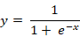

可以看到，其输出被限制在`0-1`之间，且当 x 趋近负无穷时，y 趋近0，当 x 趋近正无穷时，y 趋近 1

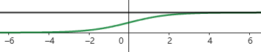

但是，这个被限定好的原 `sigmoid` 函数很明显不符合我们的需要，我们需要的是一个高度不定，斜度不定，且中心点不定的函数。那么也很简单，添加三个参数进行控制即可，如下，其中 c 控制函数的高度，b 控制函数的中心点（x 轴的偏移），而 w 控制函数的斜度

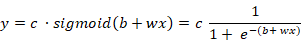

所以，这时候我们得到了 `sigmoid` 函数的通用形式，可以用来对任意复杂的函数进行拟合了

#### 使用 sigmoid 函数进行模型构建

使用 Sigmoid 函数的方式进行拟合，将原先的线性函数进行修订，如下图所示，这个函数基本可以拟合任意一元函数了

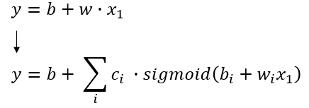

但是，在现实生活中，很少有通过一个输入就可以进行预测的简单模型的。所以，一元函数还是不足以作为模型构建的函数的。将上述的函数改为多元函数，如下，其有 j 个输入，每个输入的权重由对于的 w 表示

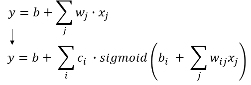

将上述干巴巴的数学式子用图形方式表示，如下，这就是最最简单的神经网络了

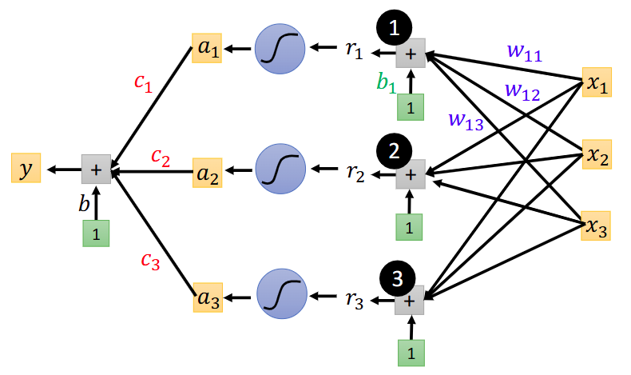

而上述的数学式子看起来还是有点复杂，通过矩阵运算的知识，可以对上面的式子进行简化，如下，其中标红部分为矩阵，符号代表激活函数，我们可以选择任意的函数作为激活函数，而不是仅仅 `sigmoid` 函数

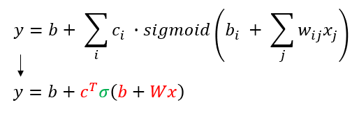

接下来将所有的未知参数进行拉伸，填充成一个向量，这就是我们需要求解的问题了

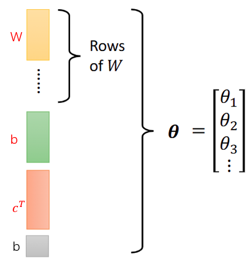

通过计算 loss 后，可以对这些参数进行梯度下降了

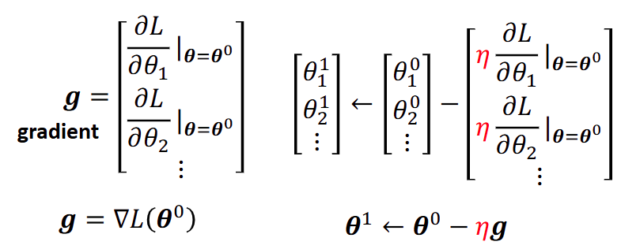

那么，我们又可以提出一个问题，神经网络是否只能用一层来表示。虽然根据数学公式，我们可以仅用一层网络就可以拟合任意复杂的函数，但是经过实验，往往多层的网络的效果会更加好。而多层网络的表现形式也仅仅是将前一层的输出作为当前层的输入，如下所示，这就是一个二层的网络。只要我们愿意，以及 GPU 够的话，我们可以构建任意多层的神经网络。但是，存在一个问题，我们为什么一定要用 `deep learning`（多层神经网络），而不是 `fat learning` （一层网络，但参数足够庞大），因为我们知道只要参数够多，先前的函数可以拟合任意复杂的函数的。这问题在之后的章节解答

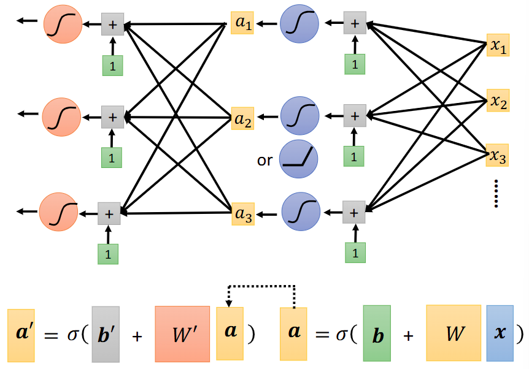

#### RELU 激活函数

之前不是有介绍 `hard sigmoid` 函数吗，其实 `hard sigmoid` 函数我们也可以用式子进行表示的，如下，一个阶梯式可以表达为两个 `RELU` 函数的相加

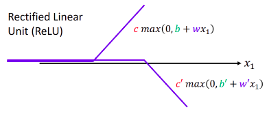

同理，进行激活函数的替换之后，我们新的神经网络的函数如下

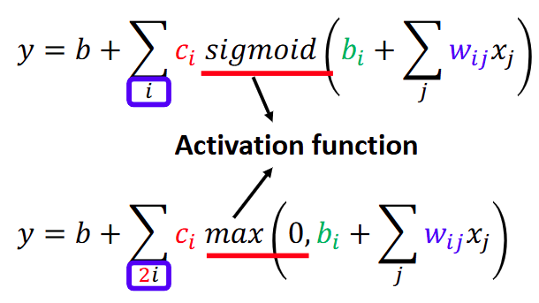