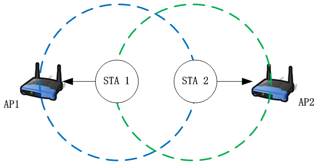

### 简介

在90年代，IEEE成立著名的802.11工作组，同时也定义了802.11的标准（Wi-Fi的核心技术标准）。最终形成了IEEE802.11标准版本

Wi-Fi，又称“无线网络”，是Wi-Fi联盟的商标，一个基于IEEE802.11标准的无线局域网技术。“Wi-Fi”常写作“WiFi”或“Wifi”，但是这些写法并没有被Wi-Fi联盟认可。

#### Wi-Fi世代

为了让消费者易于区分Wi-Fi采用的协议，Wi-Fi联盟于2018年发起了“Wi-Fi世代”的项目，Wi-Fi联盟没有为Wi-Fi 4之前的Wi-Fi世代分配编号

Wi-Fi与IEEE 802.11存在区别，IEEE 802.11是一种无线局域网标准，而Wi-Fi是IEEE 802.11标准的一种实现

#### 技术简述

##### 网络成员及结构

-   站点（Station）：网络最基本的组成部分

-   基本服务单元（Basic Service Set, BSS）：最基本的服务单元。最简单的服务单元可以只由两个站点组成，站点可动态连结到基本服务单元中

-   分配系统（Distribution System, DS）：用于连结不同的基本服务单元。在逻辑上，分配系统使用的介质与基本服务单元使用的介质完全不同，但物理上是可能相同的

-   接入点（Access Point, AP）：接入点既有普通站点的身份，又可以连接到分配系统

-   扩展服务单元（Extended Service Set, ESS）：由分配系统和基本服务单元组合而成，这种组合是逻辑上的

-   关口（Portal）：逻辑成分，用于将无线局域网和有线局域网或其他网络联系起来

##### 提供的服务

5种服务属于分配系统的任务，分别为，连接（Association）、结束连接（Diassociation）、分配（Distribution）、集成（Integration）、再连接（Reassociation）。

4种服务属于站点的任务，分别为，鉴权（Authentication）、结束鉴权（Deauthentication）、隐私（Privacy）、MAC数据传输（MSDUdelivery）

##### 运作原理

Wi-Fi的设置至少需要一个接入点和一个或一个以上的客户端用户。无线AP每一100ms都会将SSID（Service Set Identifier）经由beacons（信号台）数据包广播一次，beacons数据包的传输速率是1 Mbit/s，并且长度相当的短，所以这个广播动作对网络性能的影响不大。因此Wi-Fi规定其最低传输速率为1 Mbit/s，以确保所有的Wi-Fi client端都能收到这个SSID广播数据包，client可以借此决定是否要和这一个SSID的AP连线。

### 802.11 帧

802.11帧共有三种类型，即数据帧、控制帧和管理帧。

数据帧的组成：

-   MAC首部，共30字节。帧的复杂性都在MAC首部。
-   帧主体，即帧的数据部分，不超过2312字节。它比以太网的最大长度长很多。
-   帧检验序列FCS是尾部，共4字节。

#### 数据帧格式

-   Frame Control 帧控制字段，含有许多标识位，表示本帧的一些类型等信息。 该字段将在下文中详细
-   Duration ID 持续时间和ID位，本字段一共有16bit，根据第14bit和15bit的取值，本字段有以下三种类型的含义：
    -   当第15bit被设置为0时，该字段表示一个持续时间值（Duration），用于定义网络分组在信道上保留的时间。单位通常为微秒 (μs)。
    -   当第15bit被设置为1，第14bit也为0时，该字段表示一个 ID 值（ID），通常是用来表示 PS-Poll（省电轮询）帧的 Association ID (AID)。此时，前 14 位为 AID 值
    -   当第15bit被设置为1，第14bit为1时，该字段表示持续时间值 (Duration)，用于定义无线网络中 NAV（网络分配向量）的持续时间
-   Address 与802.3以太网传输机制不同，802.11无线局域网数据帧一共可以有4个MAC地址，这些地址根据帧的不同而又不同的含义，需要具体情况进行分析
-   Seq-ctl 序列控制字段，用于管理数据帧的顺序和分片。Seq-ctl 字段由两个子字段组成：用于指示帧的分片序号。
    -   Fragment Number（分片编号）：4 位（Seq-ctl 字段的低 4 位），在数据较大时，IEEE 802.11 数据帧可以被分片（即分成多个部分）以便于传输。每个分片帧都有一个不同的分片编号，从 0 开始递增，最大为15。对于未分片的帧，这 4 位通常设置为 0。
    -   Sequence Number（序列编号）：12 位（Seq-ctl 字段的高 12 位），用于标识帧的序列号。这是一个累积的编号，用于确保帧按顺序接收，并用于检测丢失或重复的帧，取值范围 0-4095。每发送一帧，该序列号递增（滚动使用，即达到 4095 后又从 0 开始）。
-   Frame Body 帧所包含的数据包。
-   FCS 帧校验和，主要用于检查帧的完整性。

#### 帧控制字段

-   Protocol Version (协议版本)：指定协议的版本号。当前标准版本通常为 00。
-   Type (帧类型)：指定帧的主要类别。00-管理帧，01-控制帧，10-数据帧，11-扩展帧
-   Subtype (子类型)：进一步指明帧的具体类型，这与帧类型字段结合使用。在管理帧中，`0000` 表示关联请求 (Association Request)，`1000` 表示信标帧 (Beacon)；在控制帧中，`1011` 表示 RTS 帧，`1100` 表示 CTS 帧；在数据帧中，`0000` 表示普通数据帧
-   To DS (发往分布系统)：指示帧是否要发送到分布式系统（例如，无线到有线网络的转换），常用于区分帧的流向，1-发往 DS
-   From DS (来自分布系统)：1-来自 DS
-   More Fragments (更多分片)：如果帧被分片传输，此位指示是否有更多的分片数据帧即将到来，1-有更多分片
-   Retry (重传)：指示该帧是否为先前帧的重传，1-是重传
-   Power Management (电源管理)：如果此bit为1，则表示STA在发送完本帧后，将关闭天线处于休眠状态。（AP不允许关闭天线休眠，只有STA可以，因此AP发送的数据帧该字段恒为0）
-   More Data (更多数据)：表明发送方是否有更多的数据需要发送给接收方，通常在接入点向客户端发送数据时使用，此bit只用于管理数据帧，在控制帧中此bit恒为0
-   Protected Frame (受保护的帧)：指示帧的负载部分是否受保护（加密）。在启用安全机制（如 WEP, WPA, WPA2）时，这个位通常为 1
-   Order (严格顺序)：表示接收方是否需要以严格的顺序来处理帧。在 QoS（服务质量）帧中，这个字段通常使用

#### Address字段

### CSMA/CA机制

[802.11协议精读2：DCF与CSMA/CA](https://zhuanlan.zhihu.com/p/20721272)

在初始802.11的MAC层中，分成了两种基本工作模式：

-   DCF（Distributed Coordination Function）
-   PCF（Point Coordination Function）

其中，由于DCF具有良好的分布式特性，从而应用更加广泛，而PCF模式则较为少用。在802.11e协议中，DCF被扩展为EDCA模式，PCF模式被扩展为HCCA模式。

由于无线信道只有一个冲突域的特性，所以需要设置一种随机接入机制，以避免多个节点同时访问网络所带来的冲突问题，在WiFi协议中，该随机接入机制即是CSMA/CA。CSMA/CA的全称是Carrier Sense Multiple Access with Collision Avoidance，即载波侦听多路访问／冲突避免。

理解CSMA/CA的工作机制所需要的四个概念：

-   DIFS与SIFS：这两者都属于Inter-frame Spacing（IFS），即帧间间隙。DIFS全称为Distributed Inter-frame Spacing，即分布式帧间间隙，SIFS称为Short inter-frame space，即短帧间间隔。在CSMA/CA中，发一个帧之前，都需要 "等待" （节点并非什么都不做）一个相应的帧间间隔，比如发送数据之前至少要等待DIFS时间，发送ACK之前需要等待SIFS时间。

-   Slot time：时隙是指的一个时间片段，在CSMA/CA中，节点竞争接入信道之前需要经过相应的随机回退（backoff）过程，其中backoff过程就是由很多个时隙所组成的。

-   Contention window：竞争窗口是用来让节点选择随机回退计数值（backoff counter）的范围（假设初始窗口是802.11b机制下，即最大31，在802.11a这种，初始窗口就是15）

-   Backoff：随机回退过程是指每一个节点在竞争信道时，所经历的随机退避过程。在这一过程开始时，节点首先在竞争窗口中选择一个随机数为基准的随机回退计数值，同时每一个时隙，节点为 "监听" 信道是否空闲，若信道空闲，那么进行一次倒数，即计数值减1，若信道忙，则不进行相应倒数。当该随机回退计数值回退到0时，节点可以发送数据。

#### CSMA/CA 具体工作机制

CSMA/CA时序图

（1）  当STA 1与STA 2都需要发送数据时候，都需要等待DIFS时长

（2）  进入backoff过程后，从竞争窗口选择一个随机数，在802.11b协议中，默认的初始竞争窗口为31，即随机回退数的范围是[0, 31]

（3）  在backoff过程中，每经过一个slot time，都监听一次信道，如果信道空闲，则随机回退数减1

（4）  在节点的随机回退数减到0后，节点竞争获得信道，从而可以发送数据。STA 2获得信道后，发送包Packet A。在该过程中，STA 1监听到此时信道忙，进入接收状态（即节点由于在物理层无法判定该帧是否是给自己的，所以默认所有的无线帧都需要进行接收）。在解包后，STA 1发现不是自己的包，无需反馈ACK。在等待SIFS时间后，同样进行ACK的接收，作为同步信号，进行下一轮的竞争

（5）  同理，AP在接收到数据包后，做CRC校验。如果校验通过，在SISF时间后，反馈ACK确认帧

（6）  如果AP校验不通过，不反馈确认帧，AP等待EIFS时间后重新进行下一轮的backoff。而STA 2在发送完数据后，等待SIFS时间准备接收ACK确认，如果没有收到，最多等待EIFS时间后（该等待从发送完数据帧开始），进行下一轮backoff（EIFS=SIFS+ACK+DIFS）

#### BEB机制

Binary Exponential Back off，即二进制指数退避算法。在CSMA/CA的机制中，还是存在发生冲突的可能性，从而为了避免在CSMA/CA机制下的再次冲突，故这里引入了BEB机制。

如果没有收到AP发送回来的ACK，认为是发生了冲突，节点在进入backoff之前，需要对竞争窗口CW采用BEB机制。如先前所示，CW取值范围为[0, 31]，发生冲突需要扩大竞争窗口CW。发生一次冲突后，那么CW范围就会从[0,31]变化到[0,63]，在802.11中，一共允许回退6次，第7次不倍增窗口，再次尝试重发，若再次失败，则丢包

#### RTS/CTS模式

在DCF模式下，我们还需要知道存在两种子模式：Basic模式与RTS/CTS模式。在之前CSMA/CA讨论中，我们所描述的都是Basic模式，这一章我们理解RTS/CTS模式

为了更好的理解RTS/CTS模式，我们首先要介绍无线网络中著名的隐藏终端问题（hidden terminal problem）

上图中，只有一个AP和两个节点，其中虚线部分代表节点数据的发送范围

从图中，我们可以得知，由于两个节点的发送范围无法互相覆盖，从而两者在发送数据时，是无法通过物理监听的方法，探测对方是否有发送数据。从而按照我们之前所述的CSMA/CA机制，STA 1和STA 2一直会误认为信道空闲，从而不断倒数，当计时器到0时，则发送数据，如下图：

在上图中，由于STA 1与STA 2无法互相监听，即STA 2发送数据后，STA 1还继续进行backoff过程，从而继续倒数。当STA 1的随机回退计数值倒数至0时，STA 1也会发送数据。由于STA 1与STA 2的发送存在重叠区域，即也是发生了冲突，AP无法正确接收数据，即不会反馈ACK，最终这一轮传输失败。这一轮失败之后，STA 1与STA 2采用BEB算法重新选择随机数进行回退，但是由于两者没有办法互相监听，所以很容易再次出现同时传输的现象。所以在隐藏终端的情况下，网络性能最差时是无法传递数据包的，换言之，STA 1与STA 2的吞吐量都趋近于0。

为了解决这个问题，故在DCF中，引入了RTS/CTS机制。

-   RTS：Request To Send，即请求发送。RTS帧是一个单播帧，没有加密，其duration字段中填充包含后续发送过程中总体所需要时间。
-   CTS：Clear To Send，即信道清除帧。节点在收到CTS后，确认信道是空闲的，可以发送。CTS也是一个单播帧，没有加密，其duration字段包含除去RTS以及一个SIFS后，发送过程总体所需要时间。

采用下图解释RTS/CTS具体的工作方法：

在上图中，STA 2已经倒数至0，其首先发送RTS数据帧给AP。若在AP处没有冲突，即AP成功解调出STA 2的RTS，AP会在等待SIFS之后发送CTS帧给STA 2。由于无线信道是一个广播信道，要是帧没有加密的话，那么所有节点都是可以解析其信息的，所以这里AP虽然是发送CTS给STA 2，不过STA 1也可以解析该CTS信息，这也是很多书上写，RTS/CTS都是一个广播过程的原因。

-   当STA 1接收到CTS之后，该CTS不是我所请求所获得的，或者说，该CTS不是对应发给我的CTS。从而STA 1会将CTS数据帧的duration给提出，并设置在自己本地的NAV（Network Allocation Vector）上。若NAV没有倒数到0，那么其会主动悬挂其随机回退计数值，在NAV没有倒数到0之前，其随机回退计数值不再继续倒数。
-   当STA 2接收到CTS后，其发现该其是之前发送RTS的反馈。故节点已知信道空闲，在等待SIFS后，STA 2发送数据。当数据传输完成之后，AP向STA 2反馈ACK，从而最终完成一次传输。

RTS/CTS工作机制对应的时序图如下：

在上图中，我们可以发现，NAV的部分和我们在CSMA/CA的流程图中的Busy medium是一样的，其区别在于一者是物理载波监听（即之前的Busy medium是由于物理载波监听所引起的），而另者是虚拟载波监听（即NAV是由虚拟载波监听所引起的）

在实际的路由器中，RTS/CTS模式不是以开关的形式存在，而是以RTS_threshold的形式存在的。RTS/CTS另外一个思维就是 "采用小的数据包碰撞，来避免大的数据包碰撞" ，从而如果数据包太小，那么则不需要采用RTS/CTS机制。设置RTS_threshold的范围一般为2347，其单位是byte，即如果数据包大小如果大于2347 byte，那么才会采用RTS/CTS模式，在现实应用中，可以根据具体的情况，设置一个最适合的值。

#### 物理载波监听和虚拟载波监听

从该图中，我们可以明显看出，物理载波监听和虚拟载波监听是同时执行判断的，其中只要有一个是出于Busy状态，那么就不会触发随机回退计数值减1的过程，换言之，即是挂起了随机回退计数值。从该图中，我们可以明显得知，虚拟载波监听就是对应的NAV机制，而物理载波监听则是对应到了CCA（Clear Channel Assessment）机制。下面我们着重关注物理载波监听的CCA机制：

在CSMA/CA中，CCA由能量检测和载波检测一起完成：

-   能量检测（Energy Detection）：是直接用物理层接收的能量来判断是否有信号进行接入，若信号强度大于ED_threshold，则认为信道是忙，若小于ED_threshold，则认为信道是闲。同时该ED_threshold的设置与发送功率有关，比如发送功率大于100mW，那么ED_threhold约为-80dBm，发送功率在50mW至100mW之间，那么ED_threshold应该为-76dBm。不过至于具体的数值，需要查看其具体所对应版本的802.11协议。
-   载波侦听（Carrier Sense）：载波监听的方法指的是用来识别802.11数据帧的物理层头部（PLCP header）中的preamble部分。简单的说，802.11中的preamble部分采用特定的序列所构造，该序列对于发送方和接收方都是已知的，其用来做帧同步以及符号同步。在实际监听过程中，节点会不断采样信道信号，用其做自相关或者互相关运算，其中自相关在基于OFDM的802.11技术中常用，比如802.11a，而互相关在基于DSSS技术中常用，比如802.11b。与能量检测类似，相关计算值需要与一个阈值进行判断，若大于，则认为检测到了一个信号，若小于则没有检测到。

协议中规定，两种检测方式同时采用，且只要两者检测方式中，有一种判断信道是busy的话，那么就认为信道是busy的，只有两者都认为信道空闲时，那么再判断虚拟载波监听机制是否为0，以上条件都满足时，那么才可以进行backoff倒数。

#### DIFS，SIFS与Slot time

最后我们浅谈下DIFS，SIFS与Slot time的具体功能。在前面的叙述中，我们使用 **"等待"** 这一词来描述节点在DIFS与SIFS过程中的动作，同时我们描述slot time内持续监听信道。在实际过程中，DIFS与SIFS不是纯粹的等待动作，而slot time也不是整个周期都是监听信道。我们首先谈谈slot time的构造，由于笔者这一部分没有详细翻阅协议，参考一篇论文《WiFi-Nano: Reclaiming WiFi Efficiency Through 800 ns Slots》，其举例一个9us的slot time的组成如下：

即Slot time由电磁波传播时延（Propagation），信道检测CCA时间（Clear Channel Assessment）以及天线的发送/接收切换（Rx/Tx Hardware Turnaround）组成。故这里就明确回答了，在一个slot time内不是整个周期都在监听信道，而只有CCA时间这一部分在监听信道。而最后一个天线发送转换也好理解一些，这里我们在说CCA监听信道的过程中，除了为了之前我们所述的backoff过程，实际上节点也在利用CCA来监听，是不是有给我的数据包。如果该数据包不是给我的，那么CCA监听结果就是忙，然后等一个slot以后继续监听。如果监听该数据包是给我的，那么就直接转换到接收状态，而不是继续进行每一个slot监听的动作了。

同时，这里我们之所以将DIFS，SIFS与Slot time放在一起讨论，是由于DIFS = SIFS + 2*Slot time。SIFS的功能我们可以理解成，包含天线发送接收转换，以及上层处理数据所需要的延迟时间。而DIFS中，由于正巧包含了两倍的Slot time，所以很大程度上，在DIFS内，应该执行了两次信道监听过程，但是这两次的监听过程没有触发backoff。只有监听到连续两次信道空闲后，那么DIFS之后才会进行backoff过程，该设计思想应该是源于P坚持-CSMA的，同时，这个思路也是和我们在讨论物理载波监听和虚拟载波监听中的插图所符合的。类似的，在802.11协议中，其他的部分帧间间隔也是基于slot time和SIFS计算所得，比如PIFS = SIFS + SLOT，EIFS = ACK time + SIFS + DIFS。

笔者重新查了下协议，在协议中SIFS和Slot time的组成被定义如下：

aSIFSTime= aRXRFDelay（射频延迟）＋aRXPLCPDelay（物理层头部接收延迟）＋aMACProcessingDelay（MAC层处理延迟） + aRxTxTurnaroundTime（发送接收天线转换时间）

aSlotTime= aCCATime（CCA时间）＋aRxTxTurnaroundTime（发送接收天线转换时间）＋aAirPropagationTime（传播延迟）＋aMACProcessingDelay（MAC层处理延迟）

### 隐藏终端和暴露终端

在无线通信中，有两个典型的问题，即隐藏终端和暴露终端问题。在802.11中，这些问题也是存在，同时也衍生出了一些新类型的隐藏和暴露终端问题。在前面描述DCF模式中，我们已经谈论了的隐藏终端问题。

实际上，隐藏终端和暴露终端都是由于CSMA/CA中所采用的LBT机制所引起。隐藏终端是由于监听到的信道空闲而不是真的空闲，故引发冲突。而暴露终端是由于监听到的信道忙而不是真的忙，故其可以传输而不传输。

在这里，综合之前的论述，我们对一般性的隐藏终端和暴露终端做一个简单的整理

#### 隐藏终端问题

隐藏终端问题可以简单定义为：节点之间无法互相监听对方。但当其不可以同时传输时，其同时传输，从而导致冲突发生。隐藏终端在单个AP（或者单个Receiver）时就有可能发生。

我们基于以上拓扑讨论基本的隐藏终端问题，在该拓扑中，STA 1与STA 2为两个节点，这两个节点都是关联在AP身上。图中蓝色虚线代表STA 1的发送范围，绿色虚线代表STA 2的发送范围。

由于图中STA 1与STA 2发送范围无法互相覆盖，即无法通过物理载波监听的方法，探测对方是否有发送数据。从而STA 1与STA 2可能会误以为信道空闲，从而同时发送，继而造成冲突。

如上图所述，根据DCF中CSMA/CA的工作机制，STA 1与STA 2在等待DIFS之后，分别选取一个随机数进行Backoff。STA 2由于随机数选择较少，从而首先倒数至0，并发送数据。当STA 2发送数据后，由于STA 1监听不到STA 2已经占用信道，其依旧误以为信道是空闲的，从而继续进行backoff。当STA 1的随机回退计数值倒数至0时，STA 1也会发送数据。

由于STA 1与STA 2的同时发送，即AP接收时存在重叠区域，即也是发生了冲突，最终这一轮传输失败。当这一轮传输失败之后，STA 1与STA 2采用BEB算法重新选择随机数进行回退，但后续过程中两者依旧无法互相监听，所以很容易再次出现同时传输的现象。在隐藏终端的情况下，网络是近似瘫痪的，换言之，STA 1与STA 2的吞吐量都趋近于0。

PS：除了RTS/CTS模式是在协议层面解决隐藏终端问题，实际情况下还有很多解决隐藏终端的问题，比如增加客户端功率，消除中间的障碍物，将造成隐藏终端问题的节点或者AP移动个位置之类的，实在不行的话，那么控制下原始AP的功率，再添加入一个新的接入点也行，不过最后个方法需要小心一些，因为搞不好会引起下面所述的暴露终端问题。

#### 暴露终端问题

暴露终端问题可以简单定义为：节点之间能够互相监听对方。但其可以同时传输时，其不传输，从而造成浪费。暴露终端在多个AP（或者多个Receiver）时才有可能发生。

我们基于以上拓扑讨论基本的隐藏终端问题，在该拓扑中，STA 1与STA 2为两个节点，其中STA 1关联在AP1上，STA 2关联在AP2上。图中蓝色虚线代表STA 1的发送范围，绿色虚线代表STA 2的发送范围。

图中AP1处于STA 1的覆盖范围内，而不再STA 2的覆盖范围内。AP2处于STA 2的覆盖范围，而不在STA 1的覆盖范围内。换言之，AP1只能接受到STA 1的数据，AP2也只能接收到STA 2的数据。当STA 1与STA 2同时发送时，接受节点AP1或者AP2处均不会发生冲突，故其是可以同时传输的。但是由于这样的拓扑特殊性以及DCF中CSMA/CA的工作机制，造成STA 1与STA 2无法同时传输，该问题则是暴露终端问题。

在CSMA/CA中，接入是遵守LBT（Listen Before Talk）机制的。我们在DCF的介绍中所述，每一个节点在接入信道之前需要进行backoff。在该过程内，若信道空闲，则每经过1个slot，随机倒数计数器进行一次倒数。若信道非空闲，则节点不会对随机倒数计数器进行倒数，并对其进行悬挂。只有当其倒数至0时，才可以发起传输。其中信道空闲与否是通过载波监听机制进行判断的，而在DCF中，存在物理载波监听和虚拟载波监听两种模式，这两种监听方式都有可能引起暴露终端问题，以下我们分两种情况进行讨论。 

-   物理载波监听引起的暴露终端

如上图所示，由于STA 1与STA 2可以互相监听。由于STA 2选择了较小的随机数进行倒数，从而其最先倒数至0，并进行发送。当STA 2首先发送数据包给STA 2后，STA 1监听信道为忙状态，从而无法发送信息。故根据拓扑而言，STA 1是可以传数据给AP1的，但是由于监听STA 2正在传输，导致信道忙，故STA1悬挂随机倒数计数器，无法继续倒数，从而无法传输。

这里实际上我们还可以更深入了解一下，实际上STA1为什么需要在别人传输的时候，悬挂自己的随机倒数计数器。在CSMA/CD中，实际上是没有悬挂过程的，只有在CSMA/CA中才存在。在CSMA/CD中，若信道忙，节点就不停的去监听信道，一旦发现空闲就传输。而在CSMA/CA中，节点在中间实际上不是监听信道，而是接收数据。其主要原因在于，STA 1在检测到STA 2正在传输造成信道忙时，其立刻开始接收该STA 2的数据，因为STA 1不知道该数据是否是发给自己的。只有当完整接收数据，CRC校验通过后，STA 1才可以检查帧MAC头部所对应的目的BSSID地址，看是否是自己的数据包，若不是才可以丢包。换言之，CSMA/CA中，悬挂实际上是为了接收，从而导致的现象是悬挂而已。

-   虚拟载波监听引起的暴露终端

如上图所示，在暴露终端场景中，若STA 2不仅选择了较小的随机数进行优先倒数，并且其发送的数据包是RTS数据包。当STA 1识别到该RTS数据包后，其就会被设置为NAV状态，无法在后面的过程主动竞争信道，进而无法传输。与之前描述用RTS/CTS解决隐藏终端问题时不同，在解决隐藏终端问题中，NAV是由AP所反馈的CTS帧所进行保护。而这里由于STA 1与STA 2能够互相监听，换言之，在暴露终端情况下，STA 1的NAV是被STA 2所发送的RTS帧进行保护的。在STA 1被NAV保护后，其也无法传输，最终导致暴露终端问题。