### 第1章 概述

#### 分层

TCP/IP通常被认为是一个四层协议系统

-   链路层：通常包括操作系统中的设备驱动程序和计算机中对应的网卡，它们一起处理与传输介质相关的物理接口细节
-   网络层：处理分组在网络中的活动，网络层协议包括IP、ICMP、IGMP
-   运输层：为两台主机上的应用程序提供端到端的通信，主要有两个传输协议：TCP、UDP
-   应用层：处理特定的应用程序细节，主要提供的协议有Telnet、FTP、SMTP、SNMP

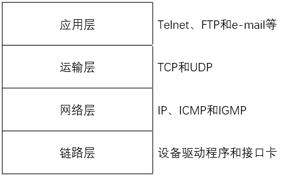

#### 互联网地址划分

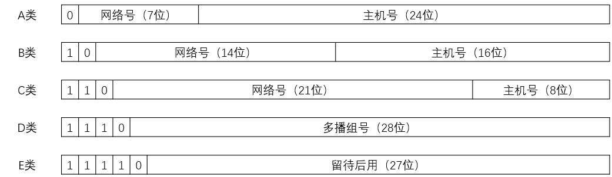

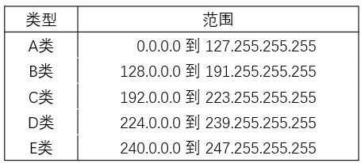

多接口主机可以具有多个IP地址，但每个接口只对应一个IP地址

#### 端口号

大多数Unix系统的文件 /etc/services 里存放着常用服务的端口号。服务端一般都是通过知名端口号（1 ~ 1023）进行识别的，而客户端对分配的端口号并不关心，只要保证该端口号在本机上是唯一即可

#### RFC

所有关于Internet的正式标准都以RFC（Request for Comment）文档出版，RFC每一项都以数字进行标识，数字越大说明RFC文档越新

#### internet / Internet

internet：用一个共同的协议将多个网络连接在一起的网络

Internet：世界范围内通过TCP/IP互相通信的所有的主机的集合

### 第2章 链路层

#### 以太网和IEEE 802封装

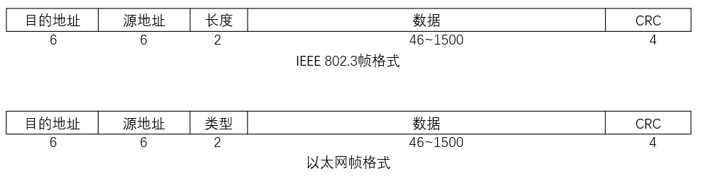

IEEE 802.3帧格式中，长度字段是指它后续数据的字节长度，但不包括CRC校验码

#### SLIP：串行线路IP

一种在串行线路上对IP数据报进行封装的简单形式

帧格式如下：

-   IP数据报以一个称作END（0xc0）的特殊字符结束。同时，为了防止数据报到来之前的线路噪声被当成数据报内容，大多数实现在数据报的开始处也传一个END字符
-   如果IP报文中某个字符为END，那么就要连续传输两个字节0xdb和0xdc来取代它。0xdb这个特殊字符被称作SLIP的ESC字符
-   如果IP报文中某个字符为SLIP的ESC字符，那么就要连续传输两个字节0xdb和0xdd来取代它

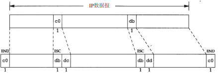

#### PPP：点对点协议

每一帧都以标志字符0x7e开始和结束。紧接着是一个地址字节，值始终是0xff，然后是一个值为0x03的控制字节

接下来是协议字段，类似于以太网中类型字段的功能。当它的值为 0x0021时，表示信息字段是一个IP数据报；值为0xc021时，表示信息字段是链路控制数据；值为0x8021时，表示信息字段是网络控制数据

采用特殊字符0x7d作为转义字符，紧接其后的字符的第6个比特取其反码，具体如下

-   当遇到字符0x7e时，需连续传送两个字符： 0x7d和0x5e
-   当遇到转义字符0x7d时，需连续传送两个字符：0x7d和0x5d
-   默认情况下，如果字符的值小于0x20（比如，一个ASCII控制字符），一般都要进行转义。例如，遇到字符0x01时需连续传送0x7d和0x21两个字符（这时，第6个比特取补码后变为1，而前面两种情况均把它变为0）

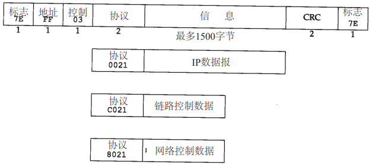

#### 环回接口

A类网络号127就是为环回接口预留的。根据惯例，大多数系统把IP地址127.0.0.1分配给这个接口，并命名为localhost。一个传给环回接口的IP数据报不能在任何网络上出现。

-   传给环回地址（一般是127.0.0.1）的任何数据均作为IP输入
-   传给广播地址或多播地址的数据报复制一份传给环回接口，然后送到以太网上。这是因为广播传送和多播传送的定义包含主机本身
-   任何传给该主机IP地址的数据均送到环回接口

### 第3章 IP：网际协议

IP提供不可靠、无连接的数据报传送服务

-   不可靠：不能保证IP数据报能成功地到达目的地
-   无连接：IP并不维护任何关于后续数据报的状态信息

#### IP首部

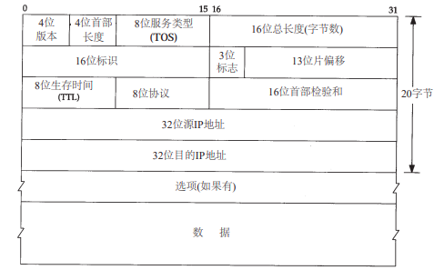

-   版本：标识IP协议的版本。对于IPv4，这个字段的值是4
-   首部长度：IP首部的长度，以4字节为单位，最小值为5，表示20字节的首部长度
-   服务类型：指定数据包的优先级和服务质量
-   总长度：整个IP数据报（包括首部和数据）的长度，单位是字节
-   标识：唯一地标识主机发送的每一份数据报。通常每发送一份报文它的值就会加1
-   标志：用于控制和标记数据包是否分片。包括：
    -   第一个位保留为0
    -   第二个位为DF，DF=1代表不能分片
    -   第三个位为MF，MF=1代表后面还有分片的数据报
-   片偏移：13位，表示该片数据部分相对于原始数据包的起始位置的偏移量，以8字节为单位
-   生存时间：用于限制数据包在网络中的生命周期，防止因路由循环而无限传播。每经过一个路由器，TTL值会减1，当TTL值减至0时，数据包被丢弃
-   协议：表示数据包负载所使用的上层协议。例如，1表示ICMP，6表示TCP，17表示UDP
-   首部校验和：对IP首部进行校验和计算，用于检测首部在传输过程中是否出现错误。如果出错，那么IP就丢弃收到的数据报。但是不生成差错报文，由上层去发现丢失的数据报并进行重传
-   源IP地址：数据包的源IP地址
-   目的IP地址：数据包的目的IP地址
-   选项：可选字段，长度可变，提供了用于调试和测量的额外功能。常见选项包括时间戳、记录路由等。选项字段的存在由首部长度字段决定。为了确保IP首部的长度是32位的倍数。通常在选项字段之后填充0

#### 特殊IP地址

0表示所有的比特位全为0；-1表示所有的比特位全为1；netid、subnetid和hostid分别表示不为全0或全1的对应字段。子网号栏为空表示该地址没有进行子网划分

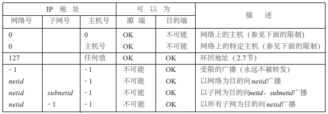

### 第4章 ARP：地址解析协议

ARP的功能是在32bit的IP地址和采用不同网络技术的硬件地址之间提供动态映射

#### ARP分组格式

ARP协议是二层协议，不涉及IP层。对于ARP请求或应答来说，以太网的类型字段的值为0x0806

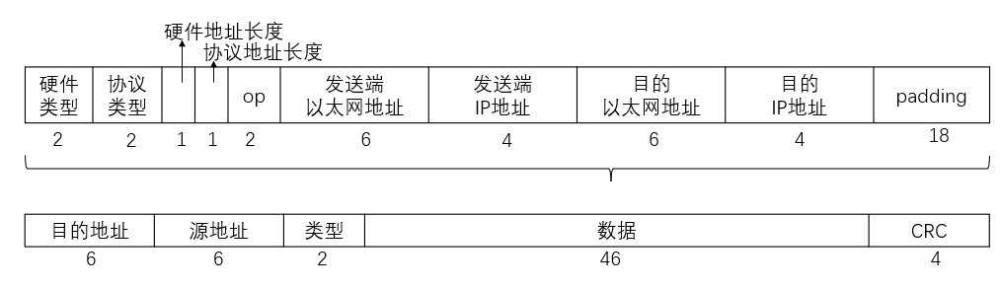

-   硬件类型：硬件地址的类型。它的值为1即表示以太网地址
-   协议类型：要映射的协议地址类型。它的值为0x0800即表示IP地址，有意设计成与包含IP数据报的以太网数据帧中的类型字段的值相同
-   硬件地址长度：硬件地址的长度，以字节为单位
-   协议地址长度：协议地址的长度，以字节为单位
-   操作字段：四种操作类型，它们是ARP请求（值为1）、ARP应答（值为2）、RARP请求（值为3）和RARP应答（值为4）。这个字段必需的，因为ARP请求和ARP应答的帧类型字段值是相同的。

#### ARP代理

如果ARP请求是从一个网络的主机发往另一个网络上的主机，那么连接这两个网络的路由器就可以回答该请求，这个过程称作委托ARP或ARP代理(ProxyARP)。这样可以欺骗发起ARP请求的发送端，使它误以为路由器就是目的主机，而事实上目的主机是在路由器的“另一边”。路由器的功能相当于目的主机的代理，把分组从其他主机转发给它。

#### 免费ARP

主机发送ARP查找自己的IP地址，用作IP地址冲突检测，其中arp报文内源地址IP和目的地址IP都是本机

如果发送免费ARP的主机正好改变了硬件地址（很可能是主机关机了，并换了一块接口卡，然后重新启动），那么这个分组就可以使其他主机高速缓存中旧的硬件地址进行相应的更新。一个比较著名的ARP协议事实是，如果主机收到某个IP地址的ARP请求，而且它已经在接收者的高速缓存中，那么就要用ARP请求中的发送端硬件地址（如以太网地址）对高速缓存中相应的内容进行更新。主机接收到任何ARP请求都要完成这个操作（ARP请求是在网上广播的，因此每次发送ARP请求时网络上的所有主机都要这样做）

### 第5章 RARP：逆地址解析协议

RARP协议是许多无盘系统在引导时用来获取IP地址的。RARP分组格式基本上与ARP分组一致。一个RARP请求在网络上进行广播，它在分组中标明发送端的硬件地址，以请求相应IP地址的响应。应答通常是单播传送的

### 第6章 ICMP：Internet控制报文协议

ICMP经常被认为是IP层的一个组成部分。它传递差错报文以及其他需要注意的信息。

### 第14章 DNS: 域名系统

域名系统（DNS）是一种用于TCP/IP应用程序的分布式数据库，它提供主机名字和IP地址之间的转换及有关电子邮件的选路信息

#### DNS命名空间

DNS的名字空间和Unix的文件系统相似，也具有层次结构。

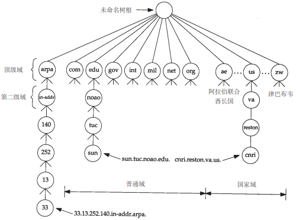

顶级域名被分为三个部分：

-   arpa是一个用作地址到名字转换的特殊域
-   7个3字符长的普通域（组织域）
-   所有2字符长的域都是基于ISO3166中定义的国家代码，这些域被称为国家域（地理域）

其中普通域的描述如下：

-   com：商业组织
-   edu：教育机构
-   gov：美国政府部门
-   int：国际组织
-   mil：美国军事网点
-   net：网络
-   org：其他组织

#### DNS授权

即网络信息中心NIC负责分配顶级域和委派 其他指定地区域的授权机构。一旦一个区域的授权机构被委派后，由它负责向该区域提供多个名字服务器。当一个新系统加入到一个区域中时，该区域的DNS管理者为该新系统申请一个域名和一个IP地址，并将它们加到名字服务器的数据库中。

一个区域的管理者必须为该区域提供一个主名字服务器和至少一个辅助名字服务器。主、辅名字服务器的主要区别在于主名字服务器从磁盘文件中调入该区域的所有信息，而辅名字服务器则从主服务器调入所有信息。我们将辅名字服务器从主服务器调入信息称为区域传送。

#### DNS报文格式

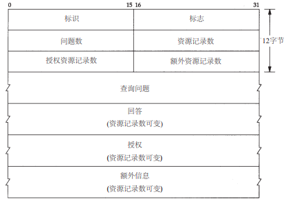

-   标识：客户程序设置并由服务器返回结果，客户程序通过它来确定响应和查询是否匹配

-   标志位：协商具体的通信方式和反馈通信状态
    -   QR（Query/Response）： 0-查询（Query），1-响应（Response）
    -   opcode：指示DNS查询的类型。常见的值包括：
        -   0000: 标准查询（Standard Query）
        -   0001: 反向查询（Inverse Query）
        -   0010: 服务器状态请求（Server Status Request）
    -   AA（Authoritative answer）：0-非权威回答，1-权威回答，仅应答报文可用。如果该名字服务器是授权于该域的，则是权威回答
    -   TC（Truncation）：0-不截断，1-截断。使用UDP时，它表示当应答的总长度超过512字节时，只返回前512个字节
    -   RD（Recursion Desired）：0-不希望递归，1-希望递归
    -   RA（Recursion Available，1位）：0-不支持递归，1-支持递归，仅应答报文可用
    -   Z：保留位，应该设置为0。用于将来扩展或其他用途。
    -   AD（Answer authenticated）：AD 位被设置，则意味着服务器已确认数据是经过安全认证的
    -   CD（Non-authenticated data）：当解析器在查询中设置 CD 位时，它表示不希望服务器检查数据的有效性，并且愿意接受更快的响应，而不必等待服务器执行验证。这可以减少延迟，因为服务器可以更快地返回响应。如果 CD 位没有设置，服务器将会验证数据，并且只有在能够确认数据的真实性时才会返回经过认证的响应
    -   rcode（Reply Code）：指示响应的状态码。常见的值包括：
        -   0000: 无错误（No Error）
        -   0001: 格式错误（Format Error）
        -   0010: 服务器失败（Server Failure）
        -   0011: 名称错误（Name Error）
        -   0100: 查询被拒绝（Query Refused）

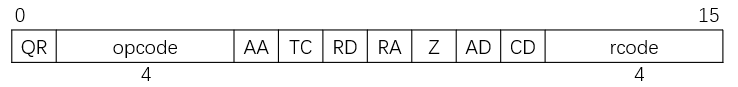

-   随后的4个16bit 字段说明最后4个变长字段中包含的条目数。

#### DNS查询报文中的问题部分

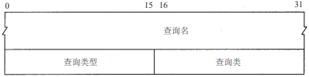

-   查询名：需要查询的域名，是一个或多个标识符的序列。每个标识符以首个字节的计数值来说明随后标识符的字节长度，长度为0的标识符是根标识符，标记查询名的结束。如果计数字节的的最高两比特为1，将用于压缩格式，剩下的14位则说明域名在该DNS报文中所在的位置（从标识字段的第一字节起算）

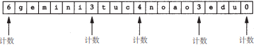

-   查询类型：标记问题查询的类型。最常用的查询类型是 A类型，表示期望获得查询名的IP地址

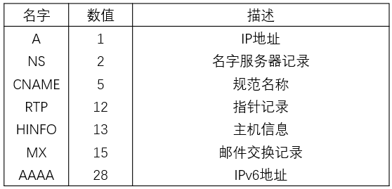

-   查询类：通常为1，指互联网地址

#### DNS响应报文中的资源记录部分

DNS报文中最后三个字段，回答字段、授权字段和附加信息字段，都采用一种称为资源记录RR（Resource Record）的相同格式

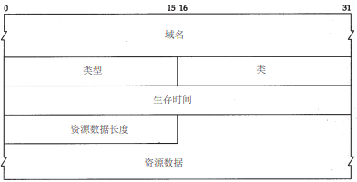

域名：记录中资源数据对应的名字。它的格式和前面介绍的查询名字段格式一致

类型：与查询报文中的查询类型值一致

类：通常为1，指互联网地址

生存时间：客户程序保留该资源记录的秒数

资源数据长度：对于类型A的资源数据——IP地址，其长度为4

### 第27章 FTP：文件传送协议

用于文件传输的Internet标准，由FTP提供的文件传送是将一个完整的文件从一个系统复制到另一个系统中

#### FTP协议

采用两个TCP连接来传输一个文件

-   控制连接以通常的客户服务器方式建立。服务器以被动方式打开众所周知的用于FTP的端口（21），等待客户的连接。客户则以主动方式打开TCP端口21，来建立连接。控制连接始终等待客户与服务器之间的通信。该连接将命令从客户传给服务器，并传回服务器的应答
-   每当一个文件在客户与服务器之间传输时，就创建一个数据连接

#### 数据表示

FTP协议规范提供了控制文件传送与存储的多种选择

-   文件类型
    -   ASCII码文件类型：文本文件以NVTASCII码形式在数据连接中传输
    -   EBCDIC文件类型：该文本文件传输方式要求两端都是EBCDIC系统
    -   二进制文件类型：数据发送呈现为一个连续的比特流。通常用于传输二进制文件
    -   本地文件类型：该方式在具有不同字节大小的主机间传输二进制文件。每一字节的比特数由发方规定

-   格式控制（该选项只对ASCII和EBCDIC文件类型有效）
    -   非打印：文件中不含有垂直格式信息
    -   远程登录格式控制：文件含有向打印机解释的远程登录垂直格式控制
    -   Fortran回车控制：每行首字符是Fortran格式控制符

-   结构
    -   文件结构：文件被认为是一个连续的字节流，不存在内部的文件结构
    -   记录结构：该结构只用于文本文件（ASCII或EBCDIC）
    -   页结构：每页都带有页号发送，以便收方能随机地存储各页

-   传输方式（规定文件在数据连接中如何传输）
    -   流方式：文件以字节流的形式传输。对于文件结构，发方在文件尾提示关闭数据连接。对于记录结构，有专用的两字节序列码标志记录结束和文件结束
    -   块方式：文件以一系列块来传输，每块前面都带有一个或多个首部字节
    -   压缩方式：一个简单的全长编码压缩方法，压缩连续出现的相同字节。